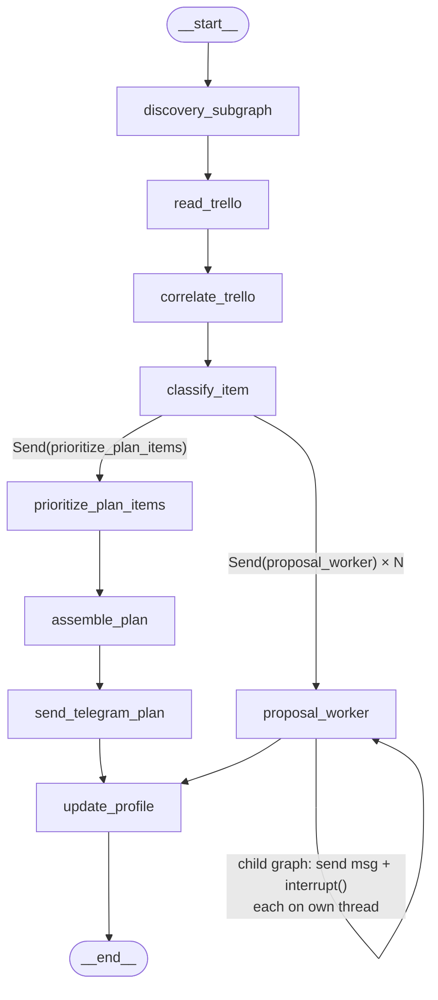

# LangGraph Weekly Intelligence Agent

A content intelligence agent built on [LangGraph](https://github.com/langchain-ai/langgraph) that monitors AI/ML engineering content throughout the day, scores it against a learned taste profile using Claude, and delivers a curated digest over Telegram. On Sundays it goes further: correlating new content against a real Trello project board, routing genuinely new project ideas through a human-in-the-loop approval step, and producing a short, priority-ordered weekly plan rather than a list of everything that happened to be technically relevant that week. It runs unattended on a schedule via GitHub Actions, with all durable state — checkpoints, taste profile history, dedup history, cost accounting — backed by Postgres.

## What it does

**Daily runs (Monday–Saturday):** discover new content from RSS feeds, newsletters, and Hacker News; score it against a taste profile using Claude; filter near-duplicates (both within the run and against the last several days); send a short Telegram digest.

**Sunday runs** do all of the above, plus:
- Correlate each kept item against a connected Trello board to see if it relates to existing tracked work.
- Classify each item as routine reading material vs. a genuinely new project idea. New ideas are sent to Telegram for a real approve/reject decision before anything touches Trello, using LangGraph's `interrupt()`, resumed later by a separate polling job that checks for a reply.
- Re-check the current state of every Trello card surfaced the previous week — did it move lists, get archived, or ship — as ground truth from Trello's own API, not a self-reported flag.
- Run one dedicated LLM call that weighs this week's new content against that board state (including cards that have simply gone idle, with no new content prompting them) to select a short, honestly-prioritized "Existing Project Work" list, bounded to a handful of items rather than everything that technically matched.
- Assemble and send the full weekly plan — Reading & Learning, Courses, and that curated Existing Project Work section — over Telegram.

**Nightly polling:** a lightweight job checks Telegram for replies to any pending approval and resumes the paused Sunday run accordingly.

## Architecture

Both entry points share one **discovery subgraph** (search/scrape → cluster & dedupe → score) with a runtime-routed conditional entry point that decides which sources fire based on whether it's a daily or Sunday invocation.

**Daily graph** — generated directly from the real compiled graph (`build_daily_graph().compile().get_graph().draw_mermaid()`):


**Sunday graph** — same source, `build_sunday_graph().get_graph().draw_mermaid()`. LangGraph's drawer can't resolve the `Send()`-based dynamic fan-out out of `classify_item` (it renders those two branches as a single dead-end edge to `__end__`), so those two edges are labeled manually to reflect what the real code does; every other node and edge below is exactly what the tool generated:



Key architectural pieces:

- **Postgres-backed checkpointing.** All checkpoints, human-in-the-loop interrupts, and durable state (taste profile history, seen-item dedup history, Trello correlation history, run/node observability) live in a real Postgres database via `langgraph-checkpoint-postgres` — not in-memory or on-disk state — so a paused approval survives across separate GitHub Actions runs.
- **Human-in-the-loop approval via `interrupt()`.** Each new project-idea candidate is dispatched to its own child graph on a dedicated checkpointer thread, which sends a Telegram message and pauses on `interrupt()`. The parent Sunday run completes normally; the approval is resumed hours later, from a completely separate process, by the nightly polling job.
- **LangSmith tracing.** Every node execution traces through to a LangSmith project when tracing is configured, with a pointer to the real trace URL recorded alongside each node's durable summary.
- **Per-run cost and latency accounting.** Every node records token counts, cost, and latency as a first-class part of its output, not a side effect bolted on after the fact.
- **One shared Telegram bot** for both paths — digest/plan delivery, project-proposal approval, and ad-hoc message intake all route through the same bot and the same reply-parsing logic.

## Tech stack

| Piece | What it's used for |
|---|---|
| **[LangGraph](https://github.com/langchain-ai/langgraph)** | The whole pipeline — `StateGraph`, conditional/dynamic (`Send`) fan-out, a `PostgresSaver` checkpointer, and `interrupt()` for human-in-the-loop approval |
| **[LangSmith](https://www.langchain.com/langsmith)** | Tracing for every node execution, referenced from each run's durable observability record |
| **[Anthropic Claude](https://www.anthropic.com/) (Haiku)** | Scoring content against the taste profile, Trello correlation, plan-item classification, and the bounded weekly prioritization call |
| **[Supabase](https://supabase.com/) Postgres** | Checkpointer backend + `BaseStore` for every durable namespace (taste profile history, seen-item dedup, plan history, run/node observability, feedback) |
| **[NVIDIA NIM](https://build.nvidia.com/)** (`nemotron-3-embed-1b`) | Embeddings for cross-source/cross-run semantic dedup and a taste-similarity pre-filter, run before any paid Anthropic call |
| **Telegram Bot API** | Digest/plan delivery, and the approval channel for new project proposals |
| **Trello REST API** | Project-board correlation, staleness, and cross-week movement tracking (no third-party SDK — a thin stdlib `urllib` client) |
| **[AgentMail](https://agentmail.to/)** | Reads a handful of Substack newsletters over email, for sources GitHub Actions runners can't reach directly via RSS |
| **GitHub Actions** | Scheduling (daily, Sunday, and a nightly approval-poll job) and secrets |

## Setup

1. **Install dependencies**
   ```
   pip install -r requirements.txt
   ```

2. **Copy `.env.example` to `.env`** and fill in real values. Every variable is read by real code:

   | Variable | What it's for |
   |---|---|
   | `PYTHONPATH=.` | So `from core.state import ...` resolves from any subdirectory |
   | `LANGSMITH_TRACING`, `LANGSMITH_API_KEY`, `LANGSMITH_PROJECT` | Tracing (optional but recommended) |
   | `ANTHROPIC_API_KEY` | Every LLM call in the pipeline |
   | `NVIDIA_API_KEY` | Embeddings (`nemotron-3-embed-1b` via NVIDIA NIM) for dedup + taste pre-filter |
   | `TWILLOT_JSON_PATH` | Bookmark bootstrap source (one-time/manual use, gated off scheduled runs) |
   | `TELEGRAM_BOT_TOKEN`, `TELEGRAM_CHAT_ID` | Digest/plan delivery and approval replies |
   | `TRELLO_API_KEY`, `TRELLO_TOKEN`, `TRELLO_BOARD_ID` | Trello board read/write |
   | `DB_URI` | Postgres connection string (checkpointer + store) |
   | `AGENTMAIL_API_KEY` | The shared inbox used for RSS-unreachable newsletter sources |

3. **Set up source configs.** Copy `discovery/config/agentmail_sources.yaml.example` to `discovery/config/agentmail_sources.yaml` and fill in real sender addresses (this file is gitignored — subscription data, same category as `.env`).

## Usage

Run any of the three entry points directly:

```
python scripts/run_daily.py    # one daily discovery + digest run
python scripts/run_sunday.py   # one Sunday run (prints pending-approval instructions if any proposals come up)
python scripts/run_poll.py     # checks Telegram once for approval replies and resumes any paused run
```

In production this runs unattended via the three workflows in `.github/workflows/`: `daily.yml` (Monday–Saturday mornings), `sunday.yml` (Sunday), and `poll.yml` (nightly, to resume any paused approval). All three also support manual `workflow_dispatch` triggering from the Actions tab.

```
pytest tests/
```

Unit coverage spans the Trello client, dedup, the taste-vector pre-filter, plan assembly, cross-week movement detection, and the prioritization node — all mocking their external calls (Anthropic, Trello, the store) rather than skipping coverage, backed in several cases by real live-verification runs.

## Design decisions worth highlighting

**Postgres over SQLite for checkpointing.** This repository is public. A local SQLite checkpoint file would either vanish between GitHub Actions runs (ephemeral runners, no persistent disk) or, if committed to survive between runs, leak Trello and taste-profile content into public commit history. A real external Postgres instance is the only option that's both durable across runs and never touches the repo itself.

**Per-proposal child graphs instead of one long-lived run.** A naive design would hold the Sunday run open waiting for a Telegram reply. Instead, each project-idea candidate gets its own child graph on its own checkpointer thread, pauses on `interrupt()`, and the parent run exits normally once every proposal has been dispatched. Resuming happens later, from an entirely separate scheduled process, keyed off the paused thread — so a human decision that takes hours (or days) never holds a compute job open.

**A hard recursion-limit ceiling, not dollar-based cost tooling.** The only runaway-loop guardrail is a fixed `recursion_limit` set at graph-invoke time. At this project's scale — a handful of scheduled runs a day, not a multi-tenant or high-throughput system — a step ceiling is a sufficient backstop against an infinite loop, without the operational overhead of a dollar-based circuit breaker built for a different class of problem.

**Semantic dedup ahead of the paid scoring call.** Before any item reaches the Claude scoring step, it passes through two cosine-similarity tiers against a rolling embedding window: a near-verbatim threshold for exact cross-run/within-run repeats, and a lower, separately-calibrated threshold for the same announcement covered by two differently-worded articles. Both run on a cheap embedding call, catching redundant content before it costs an LLM call.

**Cost and latency accounting from the first phase.** Every node returns a token count, cost, and latency figure as part of its normal output — including nodes with no real LLM call yet, where the values are simply zero. Built in from day one rather than retrofitted once real spend existed to worry about.

**Checkpoint-layer hardening.** `LANGGRAPH_STRICT_MSGPACK` is set explicitly on the checkpointer, and no user-controlled or external input is ever passed into the checkpointer's history/list filters — closing off a known deserialization-vulnerability class in LangGraph's checkpoint layer as a standing practice, not an afterthought.

## Known limitations & roadmap

- **Roundup-style content overlap is a known, deliberately deferred gap.** Cross-run semantic dedup catches the same story covered by two different dedicated articles, but a multi-story aggregator digest that mentions a story only in passing isn't reliably caught by whole-document embedding similarity — real calibration data showed no threshold that separates that case from unrelated content. Catching it properly needs per-story chunking of the aggregator's text, not built yet.
- **No numeric relevance score.** Scored items carry a boolean keep decision, free-text reasoning, and tags — no numeric confidence or relevance value. When more items are kept than a digest's display limit allows, the items shown are whatever order scoring happened to emit them in, not a ranked "most relevant first."
- **Taste profile is a plain YAML file**, not yet backed by LangMem (listed as a dependency, not yet wired in).
- **GEPA/DSPy-based prompt optimization** is a deliberately parked idea — not implemented.
- **A labeled-set eval harness** for the scoring/classification nodes is scaffolded (`eval/`) but not fully built out.

## More detail

[`docs/WORKFLOW.md`](docs/WORKFLOW.md) is the incrementally-maintained build history for this project: a file-by-file reference, the full store-namespace registry, and a checkpoint-by-checkpoint log of what was built, what was decided and why, and what real evidence backs each piece.
