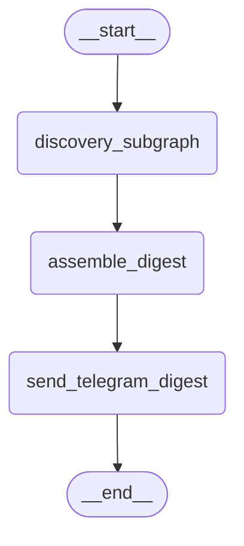

# LangGraph Weekly Intelligence Agent

An autonomous, taste-driven content agent for an AI/ML engineer working this project as a side effort alongside a full-time job — built to reclaim time that job doesn't otherwise give her. It discovers AI/agentic-engineering content across the day, filters it against a learned taste profile, and delivers a curated digest over Telegram. On Sundays it goes further: it correlates that content against a real Trello project board, routes genuinely new ideas through a human-in-the-loop approval step, and runs a dedicated LLM pass that weighs new content honestly against stale, idle project work to produce a short, priority-ordered plan — not a list of everything that happened to be relevant that week.

It's built entirely on [LangGraph](https://github.com/langchain-ai/langgraph), runs unattended on a schedule via GitHub Actions, and is also used deliberately as a vehicle for practicing disciplined, sub-phase-gated agentic engineering with Claude Code — every checkpoint's real build history, decisions, and verification evidence live in [`docs/WORKFLOW.md`](docs/WORKFLOW.md).

## What it actually does

**Every weekday morning (Mon–Sat):** a *daily* run discovers new content from RSS feeds, newsletters, and Hacker News, scores it against a taste profile using Claude, filters near-duplicates (both within the run and against the last several days), and sends a short Telegram digest.

**Every Sunday evening:** a deeper *Sunday* run does all of the above, plus:
- Correlates each kept item against her real Trello board to see if it relates to existing tracked work.
- Classifies each item as routine reading material vs. a genuinely new project idea — new ideas are sent to Telegram for a real approve/reject decision before anything touches Trello (LangGraph's `interrupt()`, resumed by a separate polling job that checks for her reply).
- Re-checks the real, current state of every Trello card that was surfaced the previous week — did it move lists, get archived, or ship — as ground truth from Trello's own API, not a self-reported flag.
- Runs one dedicated LLM call that weighs this week's new content against that real board state (including cards that have simply gone idle, with no new content prompting them) to select a short, honestly-prioritized "Existing Project Work" list, bounded to a handful of items rather than everything that technically matched.
- Assembles and sends the full weekly plan — Reading & Learning, Courses, and that curated Existing Project Work section — over Telegram.

**Every night:** a lightweight polling job checks Telegram for replies to any pending approval and resumes the paused Sunday run accordingly.

## Architecture

Both entry points share one **discovery subgraph** (search/scrape → cluster & dedupe → score) with a runtime-routed entry point that decides which sources fire based on whether it's a daily or Sunday invocation — see `docs/WORKFLOW.md` for that subgraph's own diagram and full source list.

**Daily graph** — generated directly from the real compiled graph (`build_daily_graph().compile().get_graph().draw_mermaid()`):



**Sunday graph** — same source, `build_sunday_graph().get_graph().draw_mermaid()`. LangGraph's drawer can't resolve the `Send()`-based dynamic fan-out out of `classify_item` (it renders those two branches as a single dead-end edge to `__end__`), so those two edges are labeled manually to reflect what the real code does; every other node and edge below is exactly what the tool generated:


Persistence (checkpoints, human-in-the-loop interrupts, and all durable state — taste profile, seen-item dedup history, Trello correlation history, run/node observability) lives in a real Postgres database via `langgraph-checkpoint-postgres`, not in-memory or on-disk state — so a paused approval survives across separate GitHub Actions runs.

## Tech stack

| Piece | What it's used for |
|---|---|
| **[LangGraph](https://github.com/langchain-ai/langgraph)** | The whole pipeline — `StateGraph`, conditional/dynamic (`Send`) fan-out, a `PostgresSaver` checkpointer, and `interrupt()` for the human-in-the-loop Trello-proposal approval |
| **[Anthropic Claude](https://www.anthropic.com/) (Haiku)** | Scoring content against the taste profile, Trello correlation, plan-item classification, and the bounded weekly prioritization call |
| **[Supabase](https://supabase.com/) Postgres** | Checkpointer backend + `BaseStore` for every durable namespace (taste profile history, seen-item dedup, plan history, run/node observability, feedback) |
| **[sentence-transformers](https://www.sbert.net/)** (`all-MiniLM-L6-v2`, local, CPU) | Embeddings for cross-source/cross-run semantic dedup and a taste-similarity pre-filter, run entirely offline before any paid LLM call |
| **Telegram Bot API** | Digest/plan delivery, and the approval channel for new project proposals |
| **Trello REST API** | Real project-board correlation, staleness, and cross-week movement tracking (no third-party SDK — a thin stdlib `urllib` client) |
| **[AgentMail](https://agentmail.to/)** | Reads a handful of Substack newsletters over email, for sources GitHub Actions runners can't reach directly via RSS |
| **GitHub Actions** | Scheduling (daily, Sunday, and the nightly approval-poll job) and secrets |

## Setup

1. **Install dependencies**
   ```
   pip install -r requirements.txt
   ```

2. **Copy `.env.example` to `.env`** and fill in real values. Every variable below is read by real code (cross-checked against the actual `os.environ` calls, not assumed):

   | Variable | What it's for |
   |---|---|
   | `PYTHONPATH=.` | So `from state import ...` resolves from any subdirectory |
   | `LANGSMITH_TRACING`, `LANGSMITH_API_KEY`, `LANGSMITH_PROJECT` | Tracing (optional but recommended) |
   | `ANTHROPIC_API_KEY` | Every LLM call in the pipeline |
   | `TWILLOT_JSON_PATH` | Bookmark bootstrap source (one-time/manual use, gated off scheduled runs) |
   | `TELEGRAM_BOT_TOKEN`, `TELEGRAM_CHAT_ID` | Digest/plan delivery and approval replies |
   | `TRELLO_API_KEY`, `TRELLO_TOKEN`, `TRELLO_BOARD_ID` | Trello board read/write |
   | `DB_URI` | Supabase Postgres connection string (checkpointer + store) |
   | `AGENTMAIL_API_KEY` | The shared inbox used for RSS-unreachable newsletter sources |

3. **Set up source configs.** Copy `discovery/config/agentmail_sources.yaml.example` to `discovery/config/agentmail_sources.yaml` and fill in real sender addresses (this file is gitignored — personal subscription data, same category as `.env`).

4. **Run it locally:**
   ```
   python scripts/run_daily.py    # one daily discovery + digest run
   python scripts/run_sunday.py   # one Sunday run (prints pending-approval instructions if any proposals come up)
   python scripts/run_poll.py     # checks Telegram once for approval replies and resumes any paused run
   ```

In production this runs unattended via the three workflows in `.github/workflows/`: `daily.yml` (Mon–Sat mornings), `sunday.yml` (Sunday evenings), and `poll.yml` (nightly, to resume any paused approval). All three also support manual `workflow_dispatch` triggers.

## Tests

```
pytest tests/
```

Real unit coverage throughout — Trello client, dedup, taste-vector pre-filter, plan assembly, cross-week movement detection, and the prioritization node all mock their external calls (Anthropic, Trello, the store) rather than skipping coverage, and several tests are further backed by real live verification runs documented in `docs/WORKFLOW.md`.

## More detail

`docs/WORKFLOW.md` is the full, incrementally-maintained build history for this project: a file-by-file reference, the real store-namespace registry, and a checkpoint-by-checkpoint log of what was built, what was decided and why, and what real evidence backs each piece.
