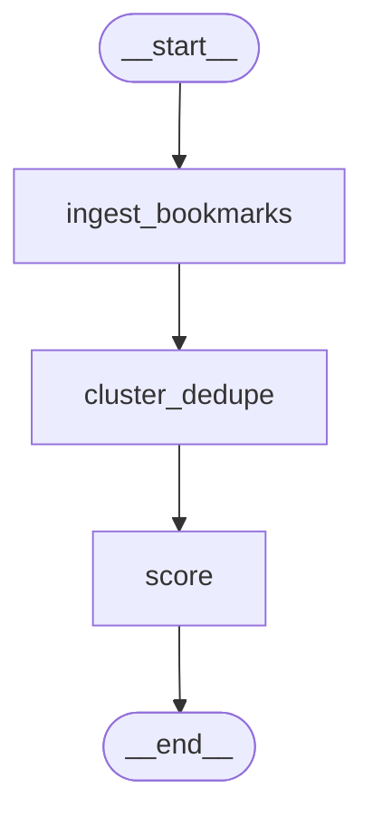
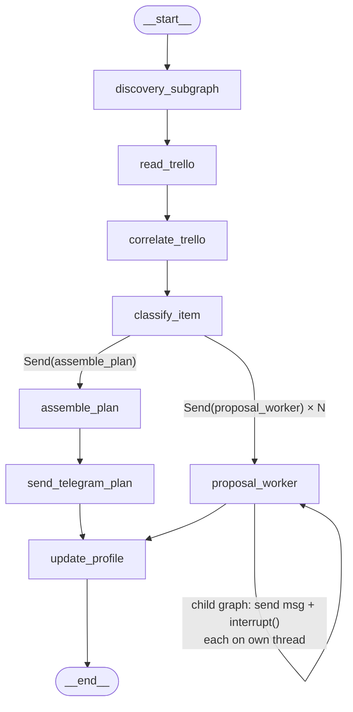
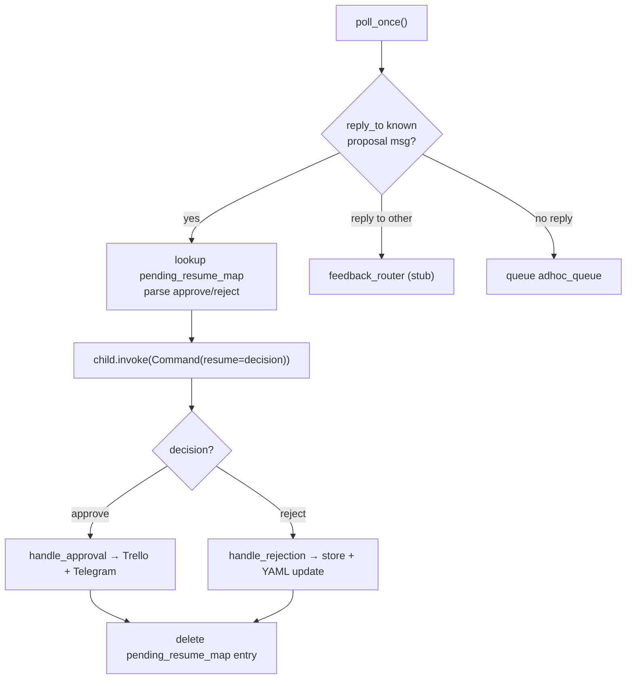

# Workflow Map

Last updated: Checkpoint 3 (resume + ad-hoc polling)

## Scheduled runs (GitHub Actions)

- **`.github/workflows/daily.yml`** — `30 2 * * 1-6` (02:30 UTC / 08:00 IST,
  Monday-Saturday; Sunday is skipped since the Sunday workflow's discovery
  subgraph already covers that day). Runs `scripts/run_daily.py`.
- **`.github/workflows/sunday.yml`** — `30 13 * * 0` (13:30 UTC / 19:00 IST,
  Sunday only). Runs `scripts/run_sunday.py`.
- **`.github/workflows/poll.yml`** _(new, Checkpoint 3)_ — `0 3 * * *` (03:00
  UTC / 08:30 IST, **every day including Sunday** — unlike `daily.yml`, which
  skips Sunday, this must run all 7 days since resumes/feedback/ad-hoc input
  can arrive any day). Runs `scripts/run_poll.py`, which calls
  `telegram.polling.poll_once()`. Reuses the same secrets as `sunday.yml`
  (Trello + Telegram + Anthropic + `DB_URI`) — no new secrets needed, since a
  resume can trigger `handle_approval`/`handle_rejection`.
- All three also have `workflow_dispatch:` for manual triggering (Actions tab →
  select the workflow → "Run workflow"), and a `concurrency` group
  (`cancel-in-progress: false`) so a manual trigger can't stack with an
  already-running scheduled job — the newer run queues instead of
  cancelling the older one, since killing a run mid-Anthropic-call would
  waste the API cost already spent.
- The Sunday job does NOT stay alive waiting for Telegram approve/reject
  replies — each proposal pauses on its own dedicated checkpointer thread in
  Postgres (per-proposal `interrupt()`, verified in Parts 1-7), and the job
  itself exits normally once every proposal has been sent, whether or not any
  are still pending. Resuming a paused proposal happens later, in a separate
  process, via `telegram/polling.py`'s `poll_once()`, now scheduled daily via
  `poll.yml` (Checkpoint 3). `timeout-minutes: 20` on daily/sunday and
  `timeout-minutes: 10` on poll (lighter job, no LLM calls of its own beyond
  what a resume/feedback path triggers) are safety nets against a genuine
  hang, not a wait for replies.
- **Blocker found and resolved this session:** `.github/` had been added to
  `.gitignore` in an uncommitted working-tree change that predated Checkpoint
  3 (bundled with unrelated changes). `daily.yml` and `sunday.yml` had in
  fact **never been committed, in any commit, at any point in this repo's
  history** before now. Flagged to Pooja rather than silently edited; she
  chose to un-ignore `.github/` and commit all three workflows (commit
  `77bc623`). All three now show up under `git ls-files .github/` and will
  actually run on GitHub once their secrets are confirmed configured.
- All three workflows require these repo secrets to be configured under Settings →
  Secrets and variables → Actions (this workflow file only *references* them
  — adding the actual values is a manual step, not something committed code
  can do): `DB_URI`, `ANTHROPIC_API_KEY`, `TELEGRAM_BOT_TOKEN`,
  `TELEGRAM_CHAT_ID`, plus for Sunday/poll `TRELLO_API_KEY`, `TRELLO_TOKEN`,
  `TRELLO_BOARD_ID`. `LANGSMITH_TRACING`/`LANGSMITH_API_KEY`/`LANGSMITH_PROJECT`
  are passed through to all three if set, for tracing parity with local runs.
- **Known gap, not worked around:** `ingest_bookmarks` reads
  `TWILLOT_JSON_PATH` (default `data/tweets.json`), but `data/` is
  gitignored — that file doesn't exist in a fresh Actions checkout, so both
  workflows will currently fail at `ingest_bookmarks` until this is resolved
  (e.g. committing a bookmarks export despite the gitignore, fetching it from
  external storage in a workflow step, or making `ingest_bookmarks` tolerate
  a missing file in automated contexts). Flagged rather than guessed around.
- `requirements.txt` was missing `python-dotenv` and
  `langgraph-checkpoint-postgres` (both entrypoint scripts need the former;
  `checkpointer_config.py`/`memory_store_config.py` need the latter) — added
  both; `pyproject.toml` already listed them correctly, `requirements.txt` had
  drifted out of sync.

## How data flows through this project

**Daily pipeline** — `python scripts/run_daily.py` ingests bookmarks, scores them,
formats a digest, and sends it to Telegram. No checkpointer; no interrupts.

**Sunday pipeline** — `python scripts/run_sunday.py` runs the full Sunday graph,
which:
1. Runs the discovery subgraph (ingest → cluster_dedupe → score)
2. Reads open Trello cards from the Brain board
3. Correlates scored items against Trello cards (filters to `keep=True` items only)
4. Classifies each kept item: `plan_item` or `project_proposal`
5. **Fans out** via `Send`: simultaneously assembles the plan and dispatches each
   proposal to a `proposal_worker` node
6. `assemble_plan` → `send_telegram_plan` sends the weekly plan to Telegram
7. Each `proposal_worker` invokes a **per-proposal child graph** on its own dedicated
   checkpointer thread (hash of proposal URL). The child graph sends a Telegram message
   and calls `interrupt()`. The parent completes normally — proposals sit paused on
   independent threads, fully decoupled from the parent run's lifecycle.
8. `update_profile` fires once all branches complete (fan-in): logs per-run cost summary
   to `data/cost_log.csv`.

**Proposal resume flow** (happens hours later, separate process) — `telegram/polling.py`:
1. Calls Telegram `getUpdates`, persisting the offset in the Postgres store
2. For each update that is a reply to a known proposal message:
   - Looks up `{thread_id, proposal_id, run_id}` from `pending_resume_map` in store
   - Parses "approve"/"reject" from reply text (case-insensitive + common synonyms)
   - Resumes the proposal's child graph with `Command(resume=decision)`
   - Calls `approval_actions.handle_approval` or `handle_rejection` with the resolved item
   - Deletes the `pending_resume_map` entry
3. Other replies → `feedback_router.handle_feedback` (stub — daily feedback path not yet built)
4. Non-reply messages → queued in `("weekly_intel", "adhoc_queue")` for next Sunday's
   `process_adhoc_input` node

State handoff: `DailyGraphState` and `SundayGraphState` share `run_id`, `scored_items`,
`costs`, and `errors` with `DiscoverySubgraphState` by key intersection. `raw_items`,
`clustered_items`, and `stage` stay internal to the subgraph.

---

## File-by-file reference

### `state.py`
- **What it does:** Defines all shared TypedDicts for LangGraph state.
- **Key schemas:**
  - `RawItem`, `ClusteredItem`, `ScoredItem`, `NodeCost`, `DiscoverySubgraphState`,
    `DailyGraphState`, `make_daily_initial_state()`
  - `SundayGraphState` — contains `pending_resumes: Annotated[list[dict], operator.add]`
    (populated by `proposal_worker` per fan-out branch: `{proposal_id, thread_id, message_id}`).
    `approval_results` removed — proposals now resolve async, outside the Sunday run.
- **Key exports:** all TypedDicts + `make_sunday_initial_state()`, `make_daily_initial_state()`
- **Depended on by:** every node file and both graph files

### `connection_pool.py`  _(added Parts 1-7)_
- **What it does:** Singleton `psycopg_pool.ConnectionPool` shared by both
  `checkpointer_config.py` and `memory_store_config.py`. Prevents each config
  module from opening its own raw connection. Pool kwargs: `autocommit=True`,
  `prepare_threshold=0`.
- **Key exports:** `get_connection_pool() -> ConnectionPool`
- **Depended on by:** `checkpointer_config.py`, `sunday/memory_store_config.py`

### `checkpointer_config.py`  _(updated Parts 1-7)_
- **What it does:** Creates a `PostgresSaver` using a connection borrowed from
  `get_connection_pool()` (was: raw `psycopg.connect`). Sets `LANGGRAPH_STRICT_MSGPACK=true`.
  `DEFAULT_RECURSION_LIMIT = 50`.
- **Key exports:** `get_checkpointer() -> PostgresSaver`, `DEFAULT_RECURSION_LIMIT`
- **Depended on by:** `sunday/graph.py`, `sunday/nodes/await_approval.py`, `scripts/run_sunday.py`

### `sunday/memory_store_config.py`  _(updated Parts 1-7)_
- **What it does:** Creates a `PostgresStore` using a connection borrowed from
  `get_connection_pool()` (was: raw `psycopg.Connection.connect`).
- **Key exports:** `get_store() -> PostgresStore`
- **Depended on by:** `sunday/nodes/update_profile.py`, `sunday/nodes/await_approval.py`,
  `sunday/nodes/process_adhoc_input.py`, `telegram/polling.py`

### `sunday/approval_actions.py`  _(added Parts 1-7)_
- **What it does:** Plain functions (no LangGraph) for writing proposal outcomes.
  Called from `polling.py` at resume time — NOT from the Sunday graph.
  - `handle_approval(item, thread_id)` — creates or updates Trello card + sends Telegram confirmation
  - `handle_rejection(item, run_id)` — writes `rejection_event` to Postgres store
    + calls `_update_yaml_for_rejection` (incremental Haiku-based taste profile update)
  Moved from `write_outputs.py` (approval path) and `update_profile.py` (rejection path).
  Per-resolution timing instead of batched-at-Sunday-end — a tighter fit with the
  project's incremental-update philosophy.
- **Key exports:** `handle_approval(item, thread_id)`, `handle_rejection(item, run_id)`
- **Depended on by:** `telegram/polling.py`

### `telegram/polling.py`  _(added Parts 1-7)_
- **What it does:** Standalone poller for Telegram updates. `poll_once()` fetches new
  updates since last stored offset, routes each:
  - Reply to known proposal message → resumes child graph via `Command(resume=...)`,
    calls `approval_actions`, deletes `pending_resume_map` entry
  - Reply to unknown message → `feedback_router.handle_feedback` (stub)
  - Non-reply → queued as ad-hoc in `("weekly_intel", "adhoc_queue")`
  Persists update offset in `("weekly_intel", "polling_state")` store.
  Unrecognized decision text → sends a re-prompt to Telegram (doesn't consume the update).
- **Key exports:** `poll_once()`
- **Depended on by:** `scripts/run_polling.py` (not yet built — needs a scheduler)

### `telegram/feedback_router.py`  _(added Parts 1-7 — stub)_
- **What it does:** Stub for routing non-approval Telegram replies to the daily
  feedback path. Currently logs only — daily feedback handling not yet built.
- **Key exports:** `handle_feedback(message: dict)`
- **Depended on by:** `telegram/polling.py`

### `sunday/nodes/await_approval.py`  _(rewritten Parts 1-7)_
- **What it does:** Per-proposal child graph with its own dedicated checkpointer thread.
  `thread_id_for(proposal_id)` hashes the proposal URL. `send_proposal_message` captures
  the real Telegram `message_id` from the API response. `proposal_worker` stores
  `pending_resume_map[str(message_id)] = {thread_id, proposal_id, run_id}` in the Postgres
  store so `polling.py` can look up resume targets by reply message ID.
  `ProposalState` now includes `run_id` so it flows through to the store entry.
- **Key exports:** `ProposalState`, `thread_id_for`, `get_proposal_graph()`,
  `route_to_approvals(state) -> list[Send]`, `proposal_worker(state) -> dict`
- **Depended on by:** `sunday/graph.py`, `telegram/polling.py`

### `sunday/nodes/write_outputs.py`  _(gutted Parts 1-7)_
- **What it does:** Empty — logic moved to `sunday/approval_actions.py`. Node removed
  from `sunday/graph.py`.
- **Depended on by:** nothing (no longer a graph node)

### `sunday/nodes/update_profile.py`  _(simplified Parts 1-7)_
- **What it does:** Cost-summing and `data/cost_log.csv` append only. Rejection writes
  and YAML preference update moved to `approval_actions.handle_rejection`. CSV schema
  change: `rejections` column removed (not knowable at Sunday-run time; rejections now
  resolve async via polling).
- **Key exports:** `update_profile(state) -> dict`
- **Depended on by:** `sunday/graph.py`

### `sunday/nodes/process_adhoc_input.py`  _(added Parts 1-7)_
- **What it does:** Node function — reads all queued ad-hoc messages from
  `("weekly_intel", "adhoc_queue")`, converts each to a `RawItem` (source `"adhoc_telegram"`,
  url `"adhoc:<key>"`), deletes each key after consuming. Zero-cost node (no LLM calls).
  **Graph wiring in `discovery/graph.py` is Pooja's** — this file provides the function only.
- **Key exports:** `process_adhoc_input(state) -> dict`
- **Depended on by:** `discovery/graph.py` (once wired — pending Pooja)

### `discovery/parsers/scrape_blogs.py`  _(scaffolding only — Parts 1-7)_
- **What it does:** Parser stub for RSS/Atom blog feed scraping. `BLOG_FEEDS` list is
  empty; `fetch_blog_entries()` raises `NotImplementedError` until confirmed blog URLs
  are added. Matches `bookmarks_json.py` pattern: no langgraph imports, returns
  `ParseResult(rows, errors)`.
- **Key exports:** `fetch_blog_entries(feed_urls) -> ParseResult`, `BLOG_FEEDS`
- **Depended on by:** `discovery/nodes/scrape_blogs.py`

### `discovery/nodes/scrape_blogs.py`  _(scaffolding only — Parts 1-7)_
- **What it does:** Node wrapper for `fetch_blog_entries`. Matches `ingest_bookmarks`
  pattern: maps rows to `RawItem`s (source `"blog_scrape"`), stamps `NodeCost`.
- **Key exports:** `scrape_blogs(state) -> dict`
- **Depended on by:** `discovery/graph.py` (once wired — pending Pooja + source confirmation)

### `discovery/parsers/search_web.py`  _(scaffolding only — Parts 1-7)_
- **What it does:** Parser stub for web search. `run_searches(queries)` raises
  `NotImplementedError` until search provider is confirmed. Matches `bookmarks_json.py`
  pattern.
- **Key exports:** `run_searches(queries: list[str]) -> ParseResult`
- **Depended on by:** `discovery/nodes/search_web.py`

### `discovery/nodes/search_web.py`  _(scaffolding only — Parts 1-7)_
- **What it does:** Node wrapper for `run_searches`. `SEARCH_QUERIES` list is empty —
  pending confirmation of query sourcing strategy. Matches `ingest_bookmarks` pattern.
- **Key exports:** `search_web(state) -> dict`
- **Depended on by:** `discovery/graph.py` (once wired — pending Pooja + source confirmation)

### `discovery/__init__.py`
- **What it does:** Empty package marker.

### `discovery/graph.py`
- **What it does:** Compiles the discovery subgraph: `ingest_bookmarks → cluster_dedupe → score`.
  `process_adhoc_input`, `scrape_blogs`, `search_web` are NOT yet wired — those fan-out
  branches are Pooja's to add once sources are confirmed.
- **Key exports:** `build_discovery_subgraph()`, `make_initial_state()`
- **Depended on by:** `daily/graph.py`, `sunday/graph.py`

### `discovery/parsers/bookmarks_json.py`
- **What it does:** Standalone JSON parser for Twillot bookmark exports.
- **Key exports:** `parse_bookmarks_json(path) -> ParseResult`
- **Depended on by:** `discovery/nodes/ingest_bookmarks.py`

### `discovery/nodes/ingest_bookmarks.py`
- **What it does:** LangGraph node — reads bookmarks JSON, returns `raw_items` + `NodeCost`.
- **Key exports:** `ingest_bookmarks(state) -> dict`
- **Depended on by:** `discovery/graph.py`

### `discovery/nodes/cluster_dedupe.py`
- **What it does:** URL-heuristic deduplication node.
- **Key exports:** `cluster_dedupe_node(state) -> dict`
- **Depended on by:** `discovery/graph.py`

### `discovery/nodes/score.py`
- **What it does:** Scores `ClusteredItem`s against taste profile using Claude Haiku.
- **Key exports:** `score_node(state) -> dict`
- **Depended on by:** `discovery/graph.py`

### `sunday/__init__.py`, `sunday/nodes/__init__.py`
- **What it does:** Empty package markers.

### `sunday/trello_client.py`
- **What it does:** Pure-stdlib HTTP wrapper for Trello REST API.
- **Key exports:** `fetch_board_cards`, `get_dump_list_id`, `create_trello_card`,
  `update_trello_card`
- **Depended on by:** `sunday/nodes/read_trello.py`, `sunday/approval_actions.py`

### `sunday/nodes/read_trello.py`
- **What it does:** LangGraph node — calls `fetch_board_cards()`, returns `trello_cards`.
- **Key exports:** `read_trello(state) -> dict`

### `sunday/nodes/correlate_trello.py`
- **What it does:** LangGraph node — matches scored items against Trello cards via Haiku.
- **Key exports:** `correlate_trello(state) -> dict`

### `sunday/nodes/classify_item.py`
- **What it does:** LangGraph node — classifies items as `plan_item` or `project_proposal`.
- **Key exports:** `classify_item(state) -> dict`

### `sunday/nodes/assemble_plan.py`
- **What it does:** `format_plan()` + `assemble_plan` node wrapper. Produces weekly plan text.
- **Key exports:** `format_plan(...)`, `assemble_plan(state) -> dict`

### `sunday/nodes/send_telegram_plan.py`
- **What it does:** Posts `state["plan_text"]` to Telegram.
- **Key exports:** `send_telegram_plan(state) -> dict`

### `sunday/graph.py`  _(updated Parts 1-7)_
- **What it does:** Builds and compiles the Sunday parent graph. `write_outputs` node
  removed — `proposal_worker` edges directly to `update_profile`.
- **Key exports:** `build_sunday_graph() -> CompiledStateGraph`
- **Depended on by:** `scripts/run_sunday.py`

### `telegram/__init__.py`
- **What it does:** Empty package marker.

### `telegram/bot_client.py`
- **What it does:** Stdlib HTTP wrapper for Telegram `sendMessage`. Returns full API
  response dict (`{"ok": true, "result": {"message_id": int, ...}}`).
- **Key exports:** `send_message(text, parse_mode="Markdown") -> dict`

### `daily/__init__.py`, `daily/nodes/__init__.py`
- **What it does:** Empty package markers.

### `daily/nodes/assemble_digest.py`
- **What it does:** Formats the daily Telegram digest.
- **Key exports:** `format_digest(...)`, `assemble_digest(state) -> dict`

### `daily/nodes/send_telegram_digest.py`
- **What it does:** Posts digest to Telegram.
- **Key exports:** `send_telegram_digest(state) -> dict`

### `daily/graph.py`
- **What it does:** Daily parent graph — discovery subgraph → assemble_digest → send_telegram_digest.
- **Key exports:** `build_daily_graph()`

### `scripts/run_daily.py`
- **What it does:** Daily run entry point.

### `scripts/run_sunday.py`
- **What it does:** Sunday run entry point. Prints pending proposals + resume instructions.

## Current state of the graph

**Daily parent graph:**

**Discovery subgraph** (shared):

**Sunday parent graph** (Parts 1-7 — `write_outputs` removed, `proposal_worker` → `update_profile` directly):

**Proposal resume flow** (separate process, driven by `telegram/polling.py`):

## Part 7 additions (cross-run dedup, daily/Sunday sources, source-discovery, digest feedback)

### `discovery/seen_items.py`  _(new)_
- **What it does:** Cross-run dedup against `("weekly_intel", "seen_items")`, keyed
  by item URL. "Seen" = already scored (keep=True or False), no expiry.
  `filter_unseen(items)` is called from `cluster_dedupe_node` (check side, done).
  `mark_seen(urls)` needs a one-line call at the end of `score_node`, after the
  scoring loop completes — **not yet wired; that edit is inside score.py, Pooja's
  LLM-calling file, flagged rather than done.**
- **Key exports:** `filter_unseen(items) -> (unseen, seen_urls)`, `mark_seen(urls)`
- **Depended on by:** `discovery/nodes/cluster_dedupe.py`

### `discovery/nodes/cluster_dedupe.py`  _(updated)_
- Now calls `filter_unseen()` right after building `clustered_items`, before
  returning — an already-seen item never reaches `score_node`'s paid Haiku call.
  Also passes through `has_video`/`video_url` if present on the representative item.

### `discovery/parsers/rss_common.py`  _(new)_
- **What it does:** Shared stdlib-only RSS 2.0 fetch+parse helper (urllib +
  `xml.etree.ElementTree`). Strips XML-illegal control characters before parsing
  (found genuinely malformed control bytes in the real Smol AI News feed — this
  guards against that class of real-world feed defect generally, not just that feed).
  Detects a companion YouTube link in the description (`has_video`/`video_url`).
- **Key exports:** `fetch_rss_feed(feed_url, source_name, limit=30) -> ParseResult`

### `discovery/parsers/scrape_blogs.py`  _(implemented — was a stub)_
- **What it does:** `BLOG_FEEDS` populated with 4 confirmed, verified-live Sunday-only
  feeds: LangChain blog, JamWithAI, DecodingML/DecodingAI, Latent Space. Applies a
  keyword heuristic to drop LangChain customer case-study/success-story posts (no
  `<category>` signal exists in that feed to filter on structurally — heuristic
  only, `score_node`'s own taste-profile scoring is the second line of defense).
  **Anthropic's developer blog is NOT included** — confirmed no official RSS
  (`/engineering/rss.xml`, `/news/rss.xml`, `/research/rss.xml`, `/index.xml` all
  404), and the page is client-side-rendered (Next.js) so a plain HTML scrape finds
  no post links either. Flagged, not guessed around.
- **Key exports:** `fetch_blog_entries(feed_urls) -> ParseResult`, `BLOG_FEEDS`

### `discovery/nodes/tldr_ai.py`, `discovery/nodes/smol_ai_news.py`, `discovery/nodes/hacker_news.py`  _(new)_
- **What they do:** Daily-cadence source nodes, one per source, following
  `ingest_bookmarks`'s pattern exactly. Feed URLs verified live: `tldr.tech/api/rss/ai`,
  `news.smol.ai/rss.xml`, `news.ycombinator.com/rss`.
- **Depended on by:** `discovery/graph.py` (once wired — Pooja's; needs to be included
  in BOTH daily and Sunday discovery subgraph invocations)

### `discovery/candidate_search.py`  _(new)_
- **What it does:** DuckDuckGo unofficial HTML-endpoint search (no key/card), stdlib
  only. Observed real rate-limiting/anti-bot throttling under repeated rapid testing
  in this session (returns a challenge page instead of results after several quick
  calls) — worked fine on the first real call. Weekly, low-volume production usage is
  unlikely to hit this, but there's no hard guarantee; worth knowing about.
- **Key exports:** `search_duckduckgo(query, limit=10) -> list[{"title","url"}]`

### `discovery/cadence.py`  _(new)_
- **What it does:** Fetches a candidate feed, filters out one-off pages (too few
  items = not an ongoing publication), classifies "daily" vs "sporadic" by median
  gap between item timestamps.
- **Key exports:** `detect_cadence(feed_url, source_name) -> "daily"|"sporadic"|None`

### `discovery/source_config.py`  _(new)_
- **What it does:** Persisted, editable source list — `data/sources.json` (JSON, not
  YAML — no `yaml` package installed, and JSON is explicitly allowed by the spec),
  `{"daily": [...], "sunday": [...]}`. `add_source()` is idempotent by feed_url.
- **Key exports:** `load_sources() -> dict`, `add_source(bucket, name, feed_url)`
- **Depended on by:** `discovery/nodes/discovered_sources.py`

### `discovery/nodes/discovered_sources.py`  _(new)_
- **What it does:** Generic node reading `data/sources.json` per bucket at runtime —
  `discovered_daily_sources`/`discovered_sunday_sources`. This is how NEWLY-approved
  sources (Part C) get ingested without a code change; the 8 originally-confirmed
  sources keep their own dedicated node files (Part B) per the spec's "each source is
  its own node" instruction. Currently a no-op (empty config) until sources are approved.
- **Depended on by:** `discovery/graph.py` (once wired — Pooja's)

### `discovery/candidate_discovery.py`  _(new)_
- **What it does:** Orchestrates search → feed-guess → cadence filter → sample →
  score via the EXISTING `score_node` (no new scoring mechanism authored). Returns
  qualifying candidates (`sample_keep_rate >= 1.0`, i.e. every sampled item kept).
  **Does NOT build the actual Send-based per-candidate proposal subgraph (Part C
  step 4)** — that reuses `await_approval.py`'s dedicated-thread `interrupt`/`Send`
  pattern and is Pooja's, per this project's LangGraph-authorship line. This module
  produces the candidate list that subgraph would fan out over.
- **Key exports:** `find_candidates(taste_domain_query, search_limit=10) -> list[dict]`

### `sunday/source_discovery_actions.py`  _(new)_
- **What it does:** Plain functions mirroring `approval_actions.py`'s split —
  `handle_source_approval` (writes to `data/sources.json`, sends Telegram
  confirmation), `handle_source_rejection` (records to
  `("weekly_intel", "rejected_source_candidates")`, keyed by feed_url, so it's never
  re-proposed), `is_already_rejected(feed_url)`.

### `sunday/approval_actions.py`  _(generalized)_
- `handle_rejection(item, run_id)` is now a thin wrapper over a new
  `handle_feedback(item, feedback_text, sentiment, run_id)`, which reuses the exact
  same incremental Haiku-YAML-update mechanism (prompt now framed as "new signal
  (sentiment, count)" rather than rejection-only). Writes to
  `("weekly_intel", "feedback_events")` (renamed from `rejection_events` — broader
  scope now covers both digest/plan feedback and proposal rejections).

### `state.py`  _(updated)_
- `RawItem`/`ClusteredItem`/`ScoredItem` gained optional `has_video`/`video_url`
  (`NotRequired`) for Part B's video-link detection.
- `DailyGraphState` gained `digest_item_map: dict[int, dict]`; `SundayGraphState`
  gained `plan_item_map: dict[int, dict]` — populated by `assemble_digest`/
  `assemble_plan`, persisted (keyed by the sent message_id, alongside `run_id`) by
  `send_telegram_digest`/`send_telegram_plan` into `("weekly_intel", "digest_item_map")`.

### `daily/nodes/assemble_digest.py`, `sunday/nodes/assemble_plan.py`  _(updated)_
- `format_digest`/`format_plan` now return `(text, item_map)` instead of just text —
  `item_map` is `{number: {url, title, text, tags, reasoning}}`, matching the numbers
  shown in the sent message.

### `daily/nodes/send_telegram_digest.py`, `sunday/nodes/send_telegram_plan.py`  _(updated)_
- Capture the real `message_id` from `send_message`'s response and persist
  `{run_id, items: item_map}` to `("weekly_intel", "digest_item_map")`, keyed by that
  message_id — this is what lets a reply hours/days later resolve back to real items.

### `telegram/feedback_router.py`  _(built out — was a stub)_
- **What it does:** `handle_feedback(message)` (the existing entry point polling.py
  already calls) now checks `reply_to_message.message_id` against
  `digest_item_map`; if found, resolves each numbered item and calls
  `approval_actions.handle_feedback` per item — NOT gated behind approval.
  **`_parse_numbered_feedback(text)` is a stub** (`NotImplementedError`) — turning
  free-form reply text into structured `[{item_number, feedback_text, sentiment}]`
  is a direct Haiku call, Pooja's per the LangGraph/LLM authorship line. Sentiment
  inference is folded into that same call rather than a second LLM round-trip.
  Falls through safely to the existing unrouted-log behavior if the parse isn't
  implemented yet or the reply isn't a match.
- Verified end-to-end except for the one stubbed call: a real digest was sent, a
  real Telegram reply was correctly matched back to it via `reply_to_message`, and
  a stand-in parse output was used to prove resolution + real dual-directional
  `taste_profile.yaml` updates (both a positive and a negative signal landed
  correctly in one test run).

## Ownership-line pieces (explicitly handed to Claude Code, built + verified real)

Pooja explicitly authorized building all four previously-flagged pieces directly
(overriding the standing LangGraph/LLM-authorship split in CLAUDE.md Section 6 for
these specific items):

### `discovery/nodes/score.py` -- `mark_seen()` call added
End of `score_node`, after the scoring loop: `mark_seen([item["url"] for item in all_scored])`.
Verified real: cluster_dedupe -> score_node -> rerun cluster_dedupe with the same
input now returns 0 clustered_items automatically, no manual call needed.

### `discovery/graph.py` -- full daily/Sunday wiring
`build_discovery_subgraph(include_sunday_only: bool = False)`. Daily
(`daily/graph.py`, default) fans out `ingest_bookmarks`, `tldr_ai`, `smol_ai_news`,
`hacker_news`, `discovered_daily_sources` -> `cluster_dedupe` -> `score`. Sunday
(`sunday/graph.py`, `include_sunday_only=True`) adds `scrape_blogs`,
`anthropic_blog`, `process_adhoc_input`, `discovered_sunday_sources` on top.
`search_web` is NOT wired in -- still an unconfigured `NotImplementedError` stub,
out of scope (X dropped from V1); wiring it in would break every run.
Required a real fix along the way: `errors` in `DiscoverySubgraphState` wasn't a
reducer, so multiple parallel source nodes writing to it in one superstep hit a
genuine `InvalidUpdateError` -- changed to `Annotated[list[str], operator.add]`.
Verified real: ran both subgraphs live. Daily: 88 real items (HN, Twillot,
Smol AI News, TLDR AI), $0.009290. Sunday: 182 raw items across 6 sources,
deduped to 94 clustered (the 88 daily-source items were correctly filtered as
already-seen from the daily run moments earlier -- an unplanned but real
cross-invocation proof of Part A working).

### `discovery/parsers/anthropic_blog.py`, `discovery/nodes/anthropic_blog.py`  _(new)_
Pooja corrected an earlier finding of mine: anthropic.com/engineering IS
server-side rendered with the full post list, when fetched with a real browser
User-Agent (a request without one gets served a JS-only shell -- that's what
caused the original "needs headless browser" conclusion). Scrapes the listing
page's `<article>` blocks (href/h3/date) via regex matched on DOM structure, not
Next.js's hashed CSS module class names (which can change on redeploy). Verified
real: 24 real posts with correct titles/dates/URLs.

### `telegram/markdown.py`  _(new)_
`escape_markdown_v2()` extracted out of `await_approval.py` (which now imports it)
since `discover_sources.py` needed the identical escaping.

### `sunday/nodes/discover_sources.py`  _(new)_
Mirrors `await_approval.py`'s exact verified pattern: `SourceProposalState`,
`thread_id_for` (prefixed `source-proposal-` to avoid thread_id collisions with
content proposals), `get_source_proposal_graph()` (own checkpointer, own
compiled child graph), `route_to_source_discovery` (conditional-edge fan-out,
mirroring `classify_item` -> `_fan_out_after_classify`'s two-step shape),
`source_proposal_worker` (writes to a SEPARATE store namespace,
`pending_source_resume_map`, not `pending_resume_map` -- keeps source proposals
fully decoupled from content proposals). `discover_sources` node calls
`find_candidates()` (Part C, already built) with a hardcoded query
(`DISCOVERY_QUERY = "AI agent engineering newsletter blog"`).
Wired into `sunday/graph.py`: fans out from START in parallel with
`discovery_subgraph`, `source_proposal_worker` edges into `update_profile`
alongside `proposal_worker`.
`telegram/polling.py` updated: checks `pending_source_resume_map` (in addition to
the existing `pending_resume_map`) on a reply, and a new
`_handle_source_approval_reply` resumes `get_source_proposal_graph()` and calls
`handle_source_approval`/`handle_source_rejection` instead of the content-proposal
action functions.
Verified real, both directions: sent 2 real Telegram source proposals, approved
one (landed in `data/sources.json`'s bucket + real Telegram confirmation sent),
rejected the other (`is_already_rejected` confirmed `True` afterward --
won't be re-proposed). `pending_source_resume_map` confirmed empty after both
resolved.

### `telegram/feedback_router.py` -- `_parse_numbered_feedback` implemented
Real Haiku call, same structured-output pattern as `classify_item.py` (prompt with
item context -> JSON parse -> retry-on-malformed -> defensive validation of
`item_number`/`sentiment`). Verified real: given the exact reply text
"1. I really liked this\n2. Not interested", correctly parsed to
`[{item_number: 1, sentiment: positive}, {item_number: 2, sentiment: negative}]`,
and both directions landed correctly in `taste_profile.yaml` in one run.

## Checkpoint 3 additions (resume scheduling + ad-hoc test coverage)

Scope: `await_approval.py`'s message_id capture and `telegram/polling.py`'s
three-way routing and `process_adhoc_input.py` were all already implemented
(committed in a prior session) but had no test coverage and no scheduled
trigger. This checkpoint added both, and treated the existing code as
unverified per CLAUDE.md Section 5 rather than assuming it was already
correct.

### `tests/test_await_approval.py`  _(new)_
- Mocked unit tests for `proposal_worker`: confirms the `store.put()` call
  after a proposal's child graph returns has the correct
  namespace/key/value, and that the child graph is invoked on the right
  dedicated `thread_id`. 3/3 passing.

### `scripts/test_pending_resume_map_roundtrip.py`  _(new)_
- Real-store smoke test, same pattern as `scripts/test_companion_store_roundtrip.py`:
  mocks only the Telegram send + child graph invoke, writes/reads/deletes a
  real `pending_resume_map` entry against the live Supabase Postgres store.
  Run and passing (see `feature_list.json` evidence for output).

### `tests/test_polling.py`  _(new)_
- Mocked unit tests for `poll_once()`'s three routing outcomes (resume /
  feedback / ad-hoc) in a single call, plus reject-path, unrecognized-decision,
  offset-advancement, and empty-updates coverage. 5/5 passing.

### `tests/test_process_adhoc_input.py`  _(new)_
- Mocked unit tests for the node (one-item, empty-queue, blank-text-skipped,
  multi-item) plus a graph-structure test confirming `process_adhoc_input` is
  present in `build_discovery_subgraph(include_sunday_only=True)` and absent
  from the daily-only graph. 5/5 passing. Found and flagged (did not silently
  fix) a spec-vs-code discrepancy: the node uses `source="adhoc_telegram"`,
  not the literal `"adhoc"` in the original checkpoint-3 spec text — already
  true before this checkpoint and already documented above.

### `scripts/run_poll.py`, `.github/workflows/poll.yml`  _(new)_
- See "Scheduled runs" above. `run_poll.py` mirrors `run_daily.py`'s
  load_dotenv/setup_logging/invoke shape. Ran live once against production
  Telegram/Postgres via Bash — completed cleanly with no pending items to
  process.

## What does NOT exist yet

- **`search_web` provider** — `run_searches` raises `NotImplementedError`. Out of
  scope per Part 7 (X/search dropped from V1); not wired into `discovery/graph.py`.
- **Taste profile in LangMem** — currently a static string in `score.py`.
- Numeric score field on `ScoredItem`, tag feedback loop — deferred.
- **`resume-live-check`** (Checkpoint 3) — a real Telegram approve/reject
  round-trip against a real paused Sunday proposal, confirming `poll.yml`'s
  next run actually resumes the graph and writes the correct Trello outcome.
  Human-only per `feature_list.json` — Claude Code must not and did not mark
  this passing.
