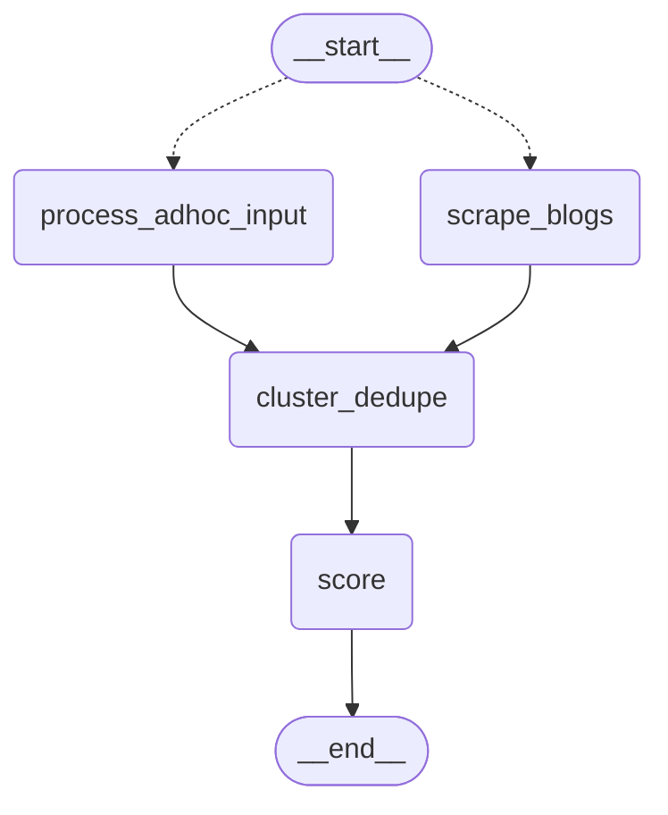
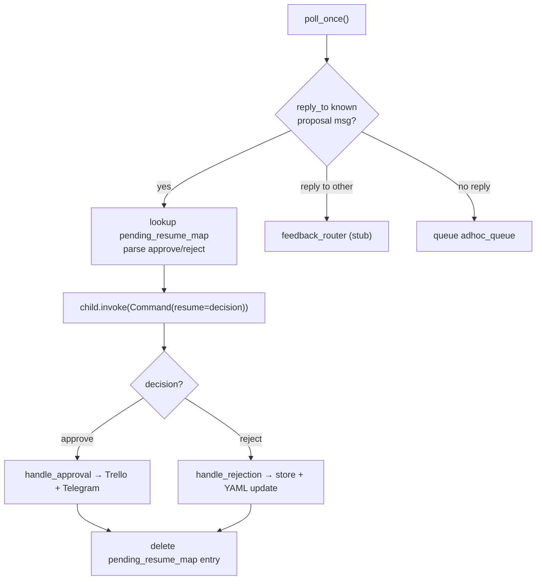

# Workflow Map

Last updated: origin/main deployment-gap finding (see bottom sections) -- local main unpushed, 19 commits ahead

## Scheduled runs (GitHub Actions)

- **`.github/workflows/daily.yml`** — `30 2 * * 1-6` (02:30 UTC / 08:00 IST,
  Monday-Saturday; Sunday is skipped since the Sunday workflow's discovery
  subgraph already covers that day). Runs `scripts/run_daily.py`.
- **`.github/workflows/sunday.yml`** — `30 13 * * 0` (13:30 UTC / 19:00 IST,
  Sunday only). Runs `scripts/run_sunday.py`.
- **`.github/workflows/poll.yml`** _(new, Checkpoint 3)_ — `0 3 * * *` (03:00
  UTC / 08:30 IST, **every day including Sunday** — unlike `daily.yml`, which
  skips Sunday, this must run all 7 days since resumes/feedback/ad-hoc input
  can arrive any day). Runs `scripts/run_poll.py`, which calls
  `telegram.polling.poll_once()`. Reuses the same secrets as `sunday.yml`
  (Trello + Telegram + Anthropic + `DB_URI`) — no new secrets needed, since a
  resume can trigger `handle_approval`/`handle_rejection`.
- All three also have `workflow_dispatch:` for manual triggering (Actions tab →
  select the workflow → "Run workflow"), and a `concurrency` group
  (`cancel-in-progress: false`) so a manual trigger can't stack with an
  already-running scheduled job — the newer run queues instead of
  cancelling the older one, since killing a run mid-Anthropic-call would
  waste the API cost already spent.
- The Sunday job does NOT stay alive waiting for Telegram approve/reject
  replies — each proposal pauses on its own dedicated checkpointer thread in
  Postgres (per-proposal `interrupt()`, verified in Parts 1-7), and the job
  itself exits normally once every proposal has been sent, whether or not any
  are still pending. Resuming a paused proposal happens later, in a separate
  process, via `telegram/polling.py`'s `poll_once()`, now scheduled daily via
  `poll.yml` (Checkpoint 3). `timeout-minutes: 20` on daily/sunday and
  `timeout-minutes: 10` on poll (lighter job, no LLM calls of its own beyond
  what a resume/feedback path triggers) are safety nets against a genuine
  hang, not a wait for replies.
- **Blocker found and resolved this session:** `.github/` had been added to
  `.gitignore` in an uncommitted working-tree change that predated Checkpoint
  3 (bundled with unrelated changes). `daily.yml` and `sunday.yml` had in
  fact **never been committed, in any commit, at any point in this repo's
  history** before now. Flagged to Pooja rather than silently edited; she
  chose to un-ignore `.github/` and commit all three workflows (commit
  `77bc623`). All three now show up under `git ls-files .github/` and will
  actually run on GitHub once their secrets are confirmed configured.
- All three workflows require these repo secrets to be configured under Settings →
  Secrets and variables → Actions (this workflow file only *references* them
  — adding the actual values is a manual step, not something committed code
  can do): `DB_URI`, `ANTHROPIC_API_KEY`, `TELEGRAM_BOT_TOKEN`,
  `TELEGRAM_CHAT_ID`, plus for Sunday/poll `TRELLO_API_KEY`, `TRELLO_TOKEN`,
  `TRELLO_BOARD_ID`. `LANGSMITH_TRACING`/`LANGSMITH_API_KEY`/`LANGSMITH_PROJECT`
  are passed through to all three if set, for tracing parity with local runs.
- **Known gap, not worked around:** `ingest_bookmarks` reads
  `TWILLOT_JSON_PATH` (default `data/tweets.json`), but `data/` is
  gitignored — that file doesn't exist in a fresh Actions checkout, so both
  workflows will currently fail at `ingest_bookmarks` until this is resolved
  (e.g. committing a bookmarks export despite the gitignore, fetching it from
  external storage in a workflow step, or making `ingest_bookmarks` tolerate
  a missing file in automated contexts). Flagged rather than guessed around.
- `requirements.txt` was missing `python-dotenv` and
  `langgraph-checkpoint-postgres` (both entrypoint scripts need the former;
  `checkpointer_config.py`/`memory_store_config.py` need the latter) — added
  both; `pyproject.toml` already listed them correctly, `requirements.txt` had
  drifted out of sync.

## How data flows through this project

**Daily pipeline** — `python scripts/run_daily.py` ingests bookmarks, scores them,
formats a digest, and sends it to Telegram. No checkpointer; no interrupts.

**Sunday pipeline** — `python scripts/run_sunday.py` runs the full Sunday graph,
which:
1. Runs the discovery subgraph (ingest → cluster_dedupe → score)
2. Reads open Trello cards from the Brain board
3. Correlates scored items against Trello cards (filters to `keep=True` items only)
4. Classifies each kept item: `plan_item` or `project_proposal`
5. **Fans out** via `Send`: simultaneously assembles the plan and dispatches each
   proposal to a `proposal_worker` node
6. `assemble_plan` → `send_telegram_plan` sends the weekly plan to Telegram
7. Each `proposal_worker` invokes a **per-proposal child graph** on its own dedicated
   checkpointer thread (hash of proposal URL). The child graph sends a Telegram message
   and calls `interrupt()`. The parent completes normally — proposals sit paused on
   independent threads, fully decoupled from the parent run's lifecycle.
8. `update_profile` fires once all branches complete (fan-in): logs per-run cost summary
   to `data/cost_log.csv`.

**Proposal resume flow** (happens hours later, separate process) — `telegram/polling.py`:
1. Calls Telegram `getUpdates`, persisting the offset in the Postgres store
2. For each update that is a reply to a known proposal message:
   - Looks up `{thread_id, proposal_id, run_id}` from `pending_resume_map` in store
   - Parses "approve"/"reject" from reply text (case-insensitive + common synonyms)
   - Resumes the proposal's child graph with `Command(resume=decision)`
   - Calls `approval_actions.handle_approval` or `handle_rejection` with the resolved item
   - Deletes the `pending_resume_map` entry
3. Other replies → `feedback_router.handle_feedback` (stub — daily feedback path not yet built)
4. Non-reply messages → queued in `("weekly_intel", "adhoc_queue")` for next Sunday's
   `process_adhoc_input` node

State handoff: `DailyGraphState` and `SundayGraphState` share `run_id`, `scored_items`,
`costs`, and `errors` with `DiscoverySubgraphState` by key intersection. `raw_items`,
`clustered_items`, and `stage` stay internal to the subgraph.

---

## File-by-file reference

### `state.py`
- **What it does:** Defines all shared TypedDicts for LangGraph state.
- **Key schemas:**
  - `RawItem`, `ClusteredItem`, `ScoredItem`, `NodeCost`, `DiscoverySubgraphState`,
    `DailyGraphState`, `make_daily_initial_state()`
  - `SundayGraphState` — contains `pending_resumes: Annotated[list[dict], operator.add]`
    (populated by `proposal_worker` per fan-out branch: `{proposal_id, thread_id, message_id}`).
    `approval_results` removed — proposals now resolve async, outside the Sunday run.
- **Key exports:** all TypedDicts + `make_sunday_initial_state()`, `make_daily_initial_state()`
- **Depended on by:** every node file and both graph files

### `connection_pool.py`  _(added Parts 1-7)_
- **What it does:** Singleton `psycopg_pool.ConnectionPool` shared by both
  `checkpointer_config.py` and `memory_store_config.py`. Prevents each config
  module from opening its own raw connection. Pool kwargs: `autocommit=True`,
  `prepare_threshold=0`.
- **Key exports:** `get_connection_pool() -> ConnectionPool`
- **Depended on by:** `checkpointer_config.py`, `sunday/memory_store_config.py`

### `checkpointer_config.py`  _(updated Parts 1-7)_
- **What it does:** Creates a `PostgresSaver` using a connection borrowed from
  `get_connection_pool()` (was: raw `psycopg.connect`). Sets `LANGGRAPH_STRICT_MSGPACK=true`.
  `DEFAULT_RECURSION_LIMIT = 50`.
- **Key exports:** `get_checkpointer() -> PostgresSaver`, `DEFAULT_RECURSION_LIMIT`
- **Depended on by:** `sunday/graph.py`, `sunday/nodes/await_approval.py`, `scripts/run_sunday.py`

### `sunday/memory_store_config.py`  _(updated Parts 1-7)_
- **What it does:** Creates a `PostgresStore` using a connection borrowed from
  `get_connection_pool()` (was: raw `psycopg.Connection.connect`).
- **Key exports:** `get_store() -> PostgresStore`
- **Depended on by:** `sunday/nodes/update_profile.py`, `sunday/nodes/await_approval.py`,
  `sunday/nodes/process_adhoc_input.py`, `telegram/polling.py`

### `sunday/approval_actions.py`  _(added Parts 1-7)_
- **What it does:** Plain functions (no LangGraph) for writing proposal outcomes.
  Called from `polling.py` at resume time — NOT from the Sunday graph.
  - `handle_approval(item, thread_id)` — creates or updates Trello card + sends Telegram confirmation
  - `handle_rejection(item, run_id)` — writes `rejection_event` to Postgres store
    + calls `_update_yaml_for_rejection` (incremental Haiku-based taste profile update)
  Moved from `write_outputs.py` (approval path) and `update_profile.py` (rejection path).
  Per-resolution timing instead of batched-at-Sunday-end — a tighter fit with the
  project's incremental-update philosophy.
- **Key exports:** `handle_approval(item, thread_id)`, `handle_rejection(item, run_id)`
- **Depended on by:** `telegram/polling.py`

### `telegram/polling.py`  _(added Parts 1-7)_
- **What it does:** Standalone poller for Telegram updates. `poll_once()` fetches new
  updates since last stored offset, routes each:
  - Reply to known proposal message → resumes child graph via `Command(resume=...)`,
    calls `approval_actions`, deletes `pending_resume_map` entry
  - Reply to unknown message → `feedback_router.handle_feedback` (stub)
  - Non-reply → queued as ad-hoc in `("weekly_intel", "adhoc_queue")`
  Persists update offset in `("weekly_intel", "polling_state")` store.
  Unrecognized decision text → sends a re-prompt to Telegram (doesn't consume the update).
- **Key exports:** `poll_once()`
- **Depended on by:** `scripts/run_polling.py` (not yet built — needs a scheduler)

### `telegram/feedback_router.py`  _(added Parts 1-7 — stub)_
- **What it does:** Stub for routing non-approval Telegram replies to the daily
  feedback path. Currently logs only — daily feedback handling not yet built.
- **Key exports:** `handle_feedback(message: dict)`
- **Depended on by:** `telegram/polling.py`

### `sunday/nodes/await_approval.py`  _(rewritten Parts 1-7)_
- **What it does:** Per-proposal child graph with its own dedicated checkpointer thread.
  `thread_id_for(proposal_id)` hashes the proposal URL. `send_proposal_message` captures
  the real Telegram `message_id` from the API response. `proposal_worker` stores
  `pending_resume_map[str(message_id)] = {thread_id, proposal_id, run_id}` in the Postgres
  store so `polling.py` can look up resume targets by reply message ID.
  `ProposalState` now includes `run_id` so it flows through to the store entry.
- **Key exports:** `ProposalState`, `thread_id_for`, `get_proposal_graph()`,
  `route_to_approvals(state) -> list[Send]`, `proposal_worker(state) -> dict`
- **Depended on by:** `sunday/graph.py`, `telegram/polling.py`

### `sunday/nodes/write_outputs.py`  _(gutted Parts 1-7)_
- **What it does:** Empty — logic moved to `sunday/approval_actions.py`. Node removed
  from `sunday/graph.py`.
- **Depended on by:** nothing (no longer a graph node)

### `sunday/nodes/update_profile.py`  _(simplified Parts 1-7)_
- **What it does:** Cost-summing and `data/cost_log.csv` append only. Rejection writes
  and YAML preference update moved to `approval_actions.handle_rejection`. CSV schema
  change: `rejections` column removed (not knowable at Sunday-run time; rejections now
  resolve async via polling).
- **Key exports:** `update_profile(state) -> dict`
- **Depended on by:** `sunday/graph.py`

### `sunday/nodes/process_adhoc_input.py`  _(added Parts 1-7)_
- **What it does:** Node function — reads all queued ad-hoc messages from
  `("weekly_intel", "adhoc_queue")`, converts each to a `RawItem` (source `"adhoc_telegram"`,
  url `"adhoc:<key>"`), deletes each key after consuming. Zero-cost node (no LLM calls).
  **Graph wiring in `discovery/graph.py` is Pooja's** — this file provides the function only.
- **Key exports:** `process_adhoc_input(state) -> dict`
- **Depended on by:** `discovery/graph.py` (once wired — pending Pooja)

### `discovery/parsers/scrape_blogs.py`  _(scaffolding only — Parts 1-7)_
- **What it does:** Parser stub for RSS/Atom blog feed scraping. `BLOG_FEEDS` list is
  empty; `fetch_blog_entries()` raises `NotImplementedError` until confirmed blog URLs
  are added. Matches `bookmarks_json.py` pattern: no langgraph imports, returns
  `ParseResult(rows, errors)`.
- **Key exports:** `fetch_blog_entries(feed_urls) -> ParseResult`, `BLOG_FEEDS`
- **Depended on by:** `discovery/nodes/scrape_blogs.py`

### `discovery/nodes/scrape_blogs.py`  _(scaffolding only — Parts 1-7)_
- **What it does:** Node wrapper for `fetch_blog_entries`. Matches `ingest_bookmarks`
  pattern: maps rows to `RawItem`s (source `"blog_scrape"`), stamps `NodeCost`.
- **Key exports:** `scrape_blogs(state) -> dict`
- **Depended on by:** `discovery/graph.py` (once wired — pending Pooja + source confirmation)

### `discovery/parsers/search_web.py`, `discovery/nodes/search_web.py`  _(RETIRED 2026-07-16)_
- Deleted entirely (batch2-dedup-taste-spec.md Section 6). Never left
  NotImplementedError-stub state; blog_sources.yaml's live-verified
  sources cover the same ground with better signal, lower cost. No
  remaining reference anywhere in the graph.

### `discovery/__init__.py`
- **What it does:** Empty package marker.

### `discovery/graph.py`  _(current shape: see "Checkpoint 5" section below)_
- **What it does:** Compiles the discovery subgraph with a real
  `route_sources()` conditional entry point. See the Checkpoint 5 section
  of this file for the current fan-out shape and cluster_dedupe_node's
  full pipeline (URL dedup → seen_items → semantic dedup → taste
  pre-filter).
- **Key exports:** `build_discovery_subgraph()`, `route_sources()`, `make_initial_state()`
- **Depended on by:** `daily/graph.py`, `sunday/graph.py`

### `discovery/parsers/bookmarks_json.py`
- **What it does:** Standalone JSON parser for Twillot bookmark exports.
- **Key exports:** `parse_bookmarks_json(path) -> ParseResult`
- **Depended on by:** `discovery/nodes/ingest_bookmarks.py`

### `discovery/nodes/ingest_bookmarks.py`
- **What it does:** LangGraph node — reads bookmarks JSON, returns `raw_items` + `NodeCost`.
- **Key exports:** `ingest_bookmarks(state) -> dict`
- **Depended on by:** `discovery/graph.py`

### `discovery/nodes/cluster_dedupe.py`
- **What it does:** URL-heuristic deduplication node.
- **Key exports:** `cluster_dedupe_node(state) -> dict`
- **Depended on by:** `discovery/graph.py`

### `discovery/nodes/score.py`
- **What it does:** Scores `ClusteredItem`s against taste profile using Claude Haiku.
- **Key exports:** `score_node(state) -> dict`
- **Depended on by:** `discovery/graph.py`

### `sunday/__init__.py`, `sunday/nodes/__init__.py`
- **What it does:** Empty package markers.

### `sunday/trello_client.py`
- **What it does:** Pure-stdlib HTTP wrapper for Trello REST API.
- **Key exports:** `fetch_board_cards`, `get_dump_list_id`, `create_trello_card`,
  `update_trello_card`
- **Depended on by:** `sunday/nodes/read_trello.py`, `sunday/approval_actions.py`

### `sunday/nodes/read_trello.py`
- **What it does:** LangGraph node — calls `fetch_board_cards()`, returns `trello_cards`.
- **Key exports:** `read_trello(state) -> dict`

### `sunday/nodes/correlate_trello.py`
- **What it does:** LangGraph node — matches scored items against Trello cards via Haiku.
- **Key exports:** `correlate_trello(state) -> dict`

### `sunday/nodes/classify_item.py`
- **What it does:** LangGraph node — classifies items as `plan_item` or `project_proposal`.
- **Key exports:** `classify_item(state) -> dict`

### `sunday/nodes/assemble_plan.py`
- **What it does:** `format_plan()` + `assemble_plan` node wrapper. Produces weekly plan text.
- **Key exports:** `format_plan(...)`, `assemble_plan(state) -> dict`

### `sunday/nodes/send_telegram_plan.py`
- **What it does:** Posts `state["plan_text"]` to Telegram.
- **Key exports:** `send_telegram_plan(state) -> dict`

### `sunday/graph.py`  _(updated Parts 1-7)_
- **What it does:** Builds and compiles the Sunday parent graph. `write_outputs` node
  removed — `proposal_worker` edges directly to `update_profile`.
- **Key exports:** `build_sunday_graph() -> CompiledStateGraph`
- **Depended on by:** `scripts/run_sunday.py`

### `telegram/__init__.py`
- **What it does:** Empty package marker.

### `telegram/bot_client.py`
- **What it does:** Stdlib HTTP wrapper for Telegram `sendMessage`. Returns full API
  response dict (`{"ok": true, "result": {"message_id": int, ...}}`).
- **Key exports:** `send_message(text, parse_mode="Markdown") -> dict`

### `daily/__init__.py`, `daily/nodes/__init__.py`
- **What it does:** Empty package markers.

### `daily/nodes/assemble_digest.py`
- **What it does:** Formats the daily Telegram digest.
- **Key exports:** `format_digest(...)`, `assemble_digest(state) -> dict`

### `daily/nodes/send_telegram_digest.py`
- **What it does:** Posts digest to Telegram.
- **Key exports:** `send_telegram_digest(state) -> dict`

### `daily/graph.py`
- **What it does:** Daily parent graph — discovery subgraph → assemble_digest → send_telegram_digest.
- **Key exports:** `build_daily_graph()`

### `scripts/run_daily.py`
- **What it does:** Daily run entry point.

### `scripts/run_sunday.py`
- **What it does:** Sunday run entry point. Prints pending proposals + resume instructions.

## Current state of the graph

**Daily parent graph:**


**Discovery subgraph** (shared) -- regenerated for real via
`graph.get_graph().draw_mermaid()` during Checkpoint 5's smoke-test fix
(the previous version of this diagram was stale, still showing the
long-removed `ingest_bookmarks` entry point). `route_sources` is a real
conditional entry point (`set_conditional_entry_point`), so both
`scrape_blogs` and `process_adhoc_input` show as reachable from
`__start__` in the compiled graph shape -- which one actually fires for a
given invocation is decided at runtime by `state["source_context"]`
("daily" -> `scrape_blogs` only; "sunday" -> both), not by two separate
compiled graphs:



**Sunday parent graph** (Parts 1-7 — `write_outputs` removed, `proposal_worker` → `update_profile` directly):


**Proposal resume flow** (separate process, driven by `telegram/polling.py`):



## Part 7 additions (cross-run dedup, daily/Sunday sources, source-discovery, digest feedback)

### `discovery/seen_items.py`  _(new)_
- **What it does:** Cross-run dedup against `("weekly_intel", "seen_items")`, keyed
  by item URL. "Seen" = already scored (keep=True or False), no expiry.
  `filter_unseen(items)` is called from `cluster_dedupe_node` (check side, done).
  `mark_seen(urls)` needs a one-line call at the end of `score_node`, after the
  scoring loop completes — **not yet wired; that edit is inside score.py, Pooja's
  LLM-calling file, flagged rather than done.**
- **Key exports:** `filter_unseen(items) -> (unseen, seen_urls)`, `mark_seen(urls)`
- **Depended on by:** `discovery/nodes/cluster_dedupe.py`

### `discovery/nodes/cluster_dedupe.py`  _(updated)_
- Now calls `filter_unseen()` right after building `clustered_items`, before
  returning — an already-seen item never reaches `score_node`'s paid Haiku call.
  Also passes through `has_video`/`video_url` if present on the representative item.

### `discovery/parsers/rss_common.py`  _(new)_
- **What it does:** Shared stdlib-only RSS 2.0 fetch+parse helper (urllib +
  `xml.etree.ElementTree`). Strips XML-illegal control characters before parsing
  (found genuinely malformed control bytes in the real Smol AI News feed — this
  guards against that class of real-world feed defect generally, not just that feed).
  Detects a companion YouTube link in the description (`has_video`/`video_url`).
- **Key exports:** `fetch_rss_feed(feed_url, source_name, limit=30) -> ParseResult`

### `discovery/parsers/scrape_blogs.py`  _(implemented — was a stub)_
- **What it does:** `BLOG_FEEDS` populated with 4 confirmed, verified-live Sunday-only
  feeds: LangChain blog, JamWithAI, DecodingML/DecodingAI, Latent Space. Applies a
  keyword heuristic to drop LangChain customer case-study/success-story posts (no
  `<category>` signal exists in that feed to filter on structurally — heuristic
  only, `score_node`'s own taste-profile scoring is the second line of defense).
  **Anthropic's developer blog is NOT included** — confirmed no official RSS
  (`/engineering/rss.xml`, `/news/rss.xml`, `/research/rss.xml`, `/index.xml` all
  404), and the page is client-side-rendered (Next.js) so a plain HTML scrape finds
  no post links either. Flagged, not guessed around.
- **Key exports:** `fetch_blog_entries(feed_urls) -> ParseResult`, `BLOG_FEEDS`

### `discovery/nodes/tldr_ai.py`, `discovery/nodes/smol_ai_news.py`, `discovery/nodes/hacker_news.py`  _(new)_
- **What they do:** Daily-cadence source nodes, one per source, following
  `ingest_bookmarks`'s pattern exactly. Feed URLs verified live: `tldr.tech/api/rss/ai`,
  `news.smol.ai/rss.xml`, `news.ycombinator.com/rss`.
- **Depended on by:** `discovery/graph.py` (once wired — Pooja's; needs to be included
  in BOTH daily and Sunday discovery subgraph invocations)

### `discovery/candidate_search.py`  _(new)_
- **What it does:** DuckDuckGo unofficial HTML-endpoint search (no key/card), stdlib
  only. Observed real rate-limiting/anti-bot throttling under repeated rapid testing
  in this session (returns a challenge page instead of results after several quick
  calls) — worked fine on the first real call. Weekly, low-volume production usage is
  unlikely to hit this, but there's no hard guarantee; worth knowing about.
- **Key exports:** `search_duckduckgo(query, limit=10) -> list[{"title","url"}]`

### `discovery/cadence.py`  _(new)_
- **What it does:** Fetches a candidate feed, filters out one-off pages (too few
  items = not an ongoing publication), classifies "daily" vs "sporadic" by median
  gap between item timestamps.
- **Key exports:** `detect_cadence(feed_url, source_name) -> "daily"|"sporadic"|None`

### `discovery/source_config.py`  _(new)_
- **What it does:** Persisted, editable source list — `data/sources.json` (JSON, not
  YAML — no `yaml` package installed, and JSON is explicitly allowed by the spec),
  `{"daily": [...], "sunday": [...]}`. `add_source()` is idempotent by feed_url.
- **Key exports:** `load_sources() -> dict`, `add_source(bucket, name, feed_url)`
- **Depended on by:** `discovery/nodes/discovered_sources.py`

### `discovery/nodes/discovered_sources.py`  _(new)_
- **What it does:** Generic node reading `data/sources.json` per bucket at runtime —
  `discovered_daily_sources`/`discovered_sunday_sources`. This is how NEWLY-approved
  sources (Part C) get ingested without a code change; the 8 originally-confirmed
  sources keep their own dedicated node files (Part B) per the spec's "each source is
  its own node" instruction. Currently a no-op (empty config) until sources are approved.
- **Depended on by:** `discovery/graph.py` (once wired — Pooja's)

### `discovery/candidate_discovery.py`  _(new)_
- **What it does:** Orchestrates search → feed-guess → cadence filter → sample →
  score via the EXISTING `score_node` (no new scoring mechanism authored). Returns
  qualifying candidates (`sample_keep_rate >= 1.0`, i.e. every sampled item kept).
  **Does NOT build the actual Send-based per-candidate proposal subgraph (Part C
  step 4)** — that reuses `await_approval.py`'s dedicated-thread `interrupt`/`Send`
  pattern and is Pooja's, per this project's LangGraph-authorship line. This module
  produces the candidate list that subgraph would fan out over.
- **Key exports:** `find_candidates(taste_domain_query, search_limit=10) -> list[dict]`

### `sunday/source_discovery_actions.py`  _(new)_
- **What it does:** Plain functions mirroring `approval_actions.py`'s split —
  `handle_source_approval` (writes to `data/sources.json`, sends Telegram
  confirmation), `handle_source_rejection` (records to
  `("weekly_intel", "rejected_source_candidates")`, keyed by feed_url, so it's never
  re-proposed), `is_already_rejected(feed_url)`.

### `sunday/approval_actions.py`  _(generalized)_
- `handle_rejection(item, run_id)` is now a thin wrapper over a new
  `handle_feedback(item, feedback_text, sentiment, run_id)`, which reuses the exact
  same incremental Haiku-YAML-update mechanism (prompt now framed as "new signal
  (sentiment, count)" rather than rejection-only). Writes to
  `("weekly_intel", "feedback_events")` (renamed from `rejection_events` — broader
  scope now covers both digest/plan feedback and proposal rejections).

### `state.py`  _(updated)_
- `RawItem`/`ClusteredItem`/`ScoredItem` gained optional `has_video`/`video_url`
  (`NotRequired`) for Part B's video-link detection.
- `DailyGraphState` gained `digest_item_map: dict[int, dict]`; `SundayGraphState`
  gained `plan_item_map: dict[int, dict]` — populated by `assemble_digest`/
  `assemble_plan`, persisted (keyed by the sent message_id, alongside `run_id`) by
  `send_telegram_digest`/`send_telegram_plan` into `("weekly_intel", "digest_item_map")`.

### `daily/nodes/assemble_digest.py`, `sunday/nodes/assemble_plan.py`  _(updated)_
- `format_digest`/`format_plan` now return `(text, item_map)` instead of just text —
  `item_map` is `{number: {url, title, text, tags, reasoning}}`, matching the numbers
  shown in the sent message.

### `daily/nodes/send_telegram_digest.py`, `sunday/nodes/send_telegram_plan.py`  _(updated)_
- Capture the real `message_id` from `send_message`'s response and persist
  `{run_id, items: item_map}` to `("weekly_intel", "digest_item_map")`, keyed by that
  message_id — this is what lets a reply hours/days later resolve back to real items.

### `telegram/feedback_router.py`  _(built out — was a stub)_
- **What it does:** `handle_feedback(message)` (the existing entry point polling.py
  already calls) now checks `reply_to_message.message_id` against
  `digest_item_map`; if found, resolves each numbered item and calls
  `approval_actions.handle_feedback` per item — NOT gated behind approval.
  **`_parse_numbered_feedback(text)` is a stub** (`NotImplementedError`) — turning
  free-form reply text into structured `[{item_number, feedback_text, sentiment}]`
  is a direct Haiku call, Pooja's per the LangGraph/LLM authorship line. Sentiment
  inference is folded into that same call rather than a second LLM round-trip.
  Falls through safely to the existing unrouted-log behavior if the parse isn't
  implemented yet or the reply isn't a match.
- Verified end-to-end except for the one stubbed call: a real digest was sent, a
  real Telegram reply was correctly matched back to it via `reply_to_message`, and
  a stand-in parse output was used to prove resolution + real dual-directional
  `taste_profile.yaml` updates (both a positive and a negative signal landed
  correctly in one test run).

## Ownership-line pieces (explicitly handed to Claude Code, built + verified real)

Pooja explicitly authorized building all four previously-flagged pieces directly
(overriding the standing LangGraph/LLM-authorship split in CLAUDE.md Section 6 for
these specific items):

### `discovery/nodes/score.py` -- `mark_seen()` call added
End of `score_node`, after the scoring loop: `mark_seen([item["url"] for item in all_scored])`.
Verified real: cluster_dedupe -> score_node -> rerun cluster_dedupe with the same
input now returns 0 clustered_items automatically, no manual call needed.

### `discovery/graph.py` -- full daily/Sunday wiring
`build_discovery_subgraph(include_sunday_only: bool = False)`. Daily
(`daily/graph.py`, default) fans out `ingest_bookmarks`, `tldr_ai`, `smol_ai_news`,
`hacker_news`, `discovered_daily_sources` -> `cluster_dedupe` -> `score`. Sunday
(`sunday/graph.py`, `include_sunday_only=True`) adds `scrape_blogs`,
`anthropic_blog`, `process_adhoc_input`, `discovered_sunday_sources` on top.
`search_web` is NOT wired in -- still an unconfigured `NotImplementedError` stub,
out of scope (X dropped from V1); wiring it in would break every run.
Required a real fix along the way: `errors` in `DiscoverySubgraphState` wasn't a
reducer, so multiple parallel source nodes writing to it in one superstep hit a
genuine `InvalidUpdateError` -- changed to `Annotated[list[str], operator.add]`.
Verified real: ran both subgraphs live. Daily: 88 real items (HN, Twillot,
Smol AI News, TLDR AI), $0.009290. Sunday: 182 raw items across 6 sources,
deduped to 94 clustered (the 88 daily-source items were correctly filtered as
already-seen from the daily run moments earlier -- an unplanned but real
cross-invocation proof of Part A working).

### `discovery/parsers/anthropic_blog.py`, `discovery/nodes/anthropic_blog.py`  _(new)_
Pooja corrected an earlier finding of mine: anthropic.com/engineering IS
server-side rendered with the full post list, when fetched with a real browser
User-Agent (a request without one gets served a JS-only shell -- that's what
caused the original "needs headless browser" conclusion). Scrapes the listing
page's `<article>` blocks (href/h3/date) via regex matched on DOM structure, not
Next.js's hashed CSS module class names (which can change on redeploy). Verified
real: 24 real posts with correct titles/dates/URLs.

### `telegram/markdown.py`  _(new)_
`escape_markdown_v2()` extracted out of `await_approval.py` (which now imports it)
since `discover_sources.py` needed the identical escaping.

### `sunday/nodes/discover_sources.py`  _(new)_
Mirrors `await_approval.py`'s exact verified pattern: `SourceProposalState`,
`thread_id_for` (prefixed `source-proposal-` to avoid thread_id collisions with
content proposals), `get_source_proposal_graph()` (own checkpointer, own
compiled child graph), `route_to_source_discovery` (conditional-edge fan-out,
mirroring `classify_item` -> `_fan_out_after_classify`'s two-step shape),
`source_proposal_worker` (writes to a SEPARATE store namespace,
`pending_source_resume_map`, not `pending_resume_map` -- keeps source proposals
fully decoupled from content proposals). `discover_sources` node calls
`find_candidates()` (Part C, already built) with a hardcoded query
(`DISCOVERY_QUERY = "AI agent engineering newsletter blog"`).
Wired into `sunday/graph.py`: fans out from START in parallel with
`discovery_subgraph`, `source_proposal_worker` edges into `update_profile`
alongside `proposal_worker`.
`telegram/polling.py` updated: checks `pending_source_resume_map` (in addition to
the existing `pending_resume_map`) on a reply, and a new
`_handle_source_approval_reply` resumes `get_source_proposal_graph()` and calls
`handle_source_approval`/`handle_source_rejection` instead of the content-proposal
action functions.
Verified real, both directions: sent 2 real Telegram source proposals, approved
one (landed in `data/sources.json`'s bucket + real Telegram confirmation sent),
rejected the other (`is_already_rejected` confirmed `True` afterward --
won't be re-proposed). `pending_source_resume_map` confirmed empty after both
resolved.

### `telegram/feedback_router.py` -- `_parse_numbered_feedback` implemented
Real Haiku call, same structured-output pattern as `classify_item.py` (prompt with
item context -> JSON parse -> retry-on-malformed -> defensive validation of
`item_number`/`sentiment`). Verified real: given the exact reply text
"1. I really liked this\n2. Not interested", correctly parsed to
`[{item_number: 1, sentiment: positive}, {item_number: 2, sentiment: negative}]`,
and both directions landed correctly in `taste_profile.yaml` in one run.

## Checkpoint 3 additions (resume scheduling + ad-hoc test coverage)

Scope: `await_approval.py`'s message_id capture and `telegram/polling.py`'s
three-way routing and `process_adhoc_input.py` were all already implemented
(committed in a prior session) but had no test coverage and no scheduled
trigger. This checkpoint added both, and treated the existing code as
unverified per CLAUDE.md Section 5 rather than assuming it was already
correct.

### `tests/test_await_approval.py`  _(new)_
- Mocked unit tests for `proposal_worker`: confirms the `store.put()` call
  after a proposal's child graph returns has the correct
  namespace/key/value, and that the child graph is invoked on the right
  dedicated `thread_id`. 3/3 passing.

### `scripts/test_pending_resume_map_roundtrip.py`  _(new)_
- Real-store smoke test, same pattern as `scripts/test_companion_store_roundtrip.py`:
  mocks only the Telegram send + child graph invoke, writes/reads/deletes a
  real `pending_resume_map` entry against the live Supabase Postgres store.
  Run and passing (see `feature_list.json` evidence for output).

### `tests/test_polling.py`  _(new)_
- Mocked unit tests for `poll_once()`'s three routing outcomes (resume /
  feedback / ad-hoc) in a single call, plus reject-path, unrecognized-decision,
  offset-advancement, and empty-updates coverage. 5/5 passing.

### `tests/test_process_adhoc_input.py`  _(new)_
- Mocked unit tests for the node (one-item, empty-queue, blank-text-skipped,
  multi-item) plus a graph-structure test confirming `process_adhoc_input` is
  present in `build_discovery_subgraph(include_sunday_only=True)` and absent
  from the daily-only graph. 5/5 passing. Found and flagged (did not silently
  fix) a spec-vs-code discrepancy: the node uses `source="adhoc_telegram"`,
  not the literal `"adhoc"` in the original checkpoint-3 spec text — already
  true before this checkpoint and already documented above.

### `scripts/run_poll.py`, `.github/workflows/poll.yml`  _(new)_
- See "Scheduled runs" above. `run_poll.py` mirrors `run_daily.py`'s
  load_dotenv/setup_logging/invoke shape. Ran live once against production
  Telegram/Postgres via Bash — completed cleanly with no pending items to
  process.

## Checkpoint 5 additions (semantic dedup + taste pre-filter + taste-profile update mechanism + search_web retirement)

Scope: `batch2-dedup-taste-spec.md`. Built across two passes -- an initial
pass against Voyage AI that a mid-checkpoint investigation (the spec's own
Section 0) found had drifted from the locked spec (embedding provider,
Section 7's whole taste-update design), and further passes as the
embedding provider itself changed twice more: Voyage -> Gemini (abandoned
after a multi-hour live debugging session against a real, correctly
configured key -- unresolved 429/API_KEY_INVALID errors from the very
first request) -> local `sentence-transformers` (final decision, no
external account/key/billing tier of any kind).

### `discovery/embeddings.py`
- Local `sentence-transformers` (`all-MiniLM-L6-v2`) embedding wrapper,
  shared by dedup, taste pre-filter, and topic-vector recompute. No API
  key, no account, no billing tier -- the entire category of problem that
  cost hours with Gemini doesn't exist for a local model.
  `COST_PER_TOKEN_USD = 0.0` (local compute, not billed).
  `total_tokens` is real, summed from the model's own `attention_mask`
  (not padded batch width). 384-dimension vectors -- confirmed no
  downstream code hardcodes a dimension. `torch` pinned to the CPU-only
  build in `requirements.txt` (`torch==2.13.0+cpu` via
  `--extra-index-url`) -- GitHub Actions runners have no GPU, and a bare
  version pin risks pip resolving the default (much larger) CUDA build.

### `discovery/semantic_dedup.py`
- Cross-source/cross-run dedup: embeds title+text, cosine >=0.90 against a
  7-day rolling window (`recent_item_embeddings`). Cross-run match drops
  the new item unconditionally; within-run match keeps whichever item was
  **published earlier** (`fetched_at`) -- not fuller text, per the spec's
  revised tie-breaker. Logs every drop to `prefilter_drops`.

### `discovery/taste_vectors.py`
- Multi-vector per-tag pre-filter, max-similarity, threshold 0.30. Bootstrap
  embedding input is `score.py`'s `TASTE_PROFILE` prompt constant, mapped
  best-effort per tag -- `learning-resource` has no clearly corresponding
  bullet and is flagged (no vector computed), not guessed. Logs every drop
  to `prefilter_drops`.

### `discovery/nodes/cluster_dedupe.py`
- Ad-hoc items (`source == "adhoc_telegram"`) are split out before either
  filter runs and merged back into `clustered_items` untouched -- one
  source-based bypass point, not a duplicated check inside each filter.

### `sunday/approval_actions.py`
- `handle_feedback` now ONLY logs a `feedback_events` record and triggers
  the same-day nudge -- no Haiku call, no `taste_profile.yaml` write. This
  **replaced** a pre-existing (Part-7-era) uncapped full-profile rewrite
  that had been firing on every single reply, daily included -- found by
  this checkpoint's own investigation, not assumed.

### `sunday/same_day_nudge.py`  _(new)_
- Haiku classifies each reply's `feedback_text` into direction/magnitude,
  applies the mapped delta to every tag on the item, stacked and capped at
  +/-0.3 per tag per week in `same_day_adjustments`.

### `sunday/nodes/update_profile.py`
- Restored from cost-log-only to real work: reads `feedback_events` from
  the last 7 days, ONE consolidated Haiku rewrite (not one per reply),
  recomputes topic vectors on the fresh text, clears `same_day_adjustments`.
  File-layout decision (spec Section 7 item 2): here, not
  `approval_actions.py` -- that file's handlers are live per-reply
  functions outside any graph invocation with no natural "Sunday path"
  signal; this node already runs exactly once per Sunday graph invocation.

### `scripts/smoke_test_phase0.py`
- Cost-count assertion corrected: the old hardcoded `== 3` assumed one
  `NodeCost` per node, no longer true now that `semantic_dedup`/
  `taste_prefilter` append one record per item processed. Now asserts the
  three always-present per-invocation node names appear, not an exact
  total. Also fixed an unrelated Windows console encoding crash
  (`sys.stdout.reconfigure(encoding="utf-8")`) blocking the script from
  completing at all.

### Embedding provider -- final resolution
- Landed on local `sentence-transformers` (`all-MiniLM-L6-v2`) after
  Voyage AI and Gemini were both tried and abandoned this checkpoint
  (Gemini specifically: real key, real project, correct format, still an
  unresolved 429/API_KEY_INVALID from the very first request after
  hours of live debugging). `.github/workflows/daily.yml` and
  `sunday.yml` (the two workflows that run `discovery/scrape_blogs`) cache
  both the pip package cache and the HuggingFace model-weights cache
  directory. `requirements.txt` pins `torch==2.13.0+cpu` via
  `--extra-index-url https://download.pytorch.org/whl/cpu` -- verified
  against a genuinely fresh venv with real `pip` (not `uv`), confirming
  `torch.cuda.is_available() == False` and the resolved version string
  ends in `+cpu`, not the ~500MB-larger default CUDA build.
- All four previously GEMINI_API_KEY-blocked features
  (`semantic-dedup-embeddings`, `taste-similarity-prefilter`,
  `topic-vector-recompute`, `sunday-consolidated-taste-rewrite`) are now
  live-verified against this local model and the real Supabase Postgres
  store -- see `feature_list.json` for evidence. No external account, key,
  or secret involved anywhere in this provider.

## Checkpoint 5 loose ends, closed out (post-embedding-verification session)

Four items Pooja asked to be confirmed/closed before moving to anything new,
each verified for real rather than assumed:

- **`stage` field now actually progresses.** `DiscoverySubgraphState.stage`
  renamed to `Literal["start","sourced","clustered","scored"]` (no separate
  `"done"` -- `score_node`'s own `"scored"` is the terminal marker).
  `scrape_blogs`, `process_adhoc_input`, `cluster_dedupe_node`, and
  `score_node` each now set `state["stage"]` on return. Real technical
  subtlety found and handled: on Sunday runs `scrape_blogs` and
  `process_adhoc_input` both run in the same LangGraph superstep and both
  write `stage="sourced"` -- a plain key raises `InvalidUpdateError` on
  more than one write per step regardless of value equality (confirmed
  against `langgraph`'s own `LastValue.update()` source), the same class of
  bug `operator.add` previously fixed for `errors`. `stage` now uses a
  small last-write-wins reducer (`state.py`'s `_last_write_wins`, via
  `BinaryOperatorAggregate`) so concurrent identical writes are safe.
  Verified live against both daily and Sunday contexts (the Sunday case
  being the actual concurrent-write risk) with no error, and via a real run
  of `scripts/smoke_test_phase0.py` asserting `final_state["stage"] ==
  "scored"`.
- **`same-day-capped-nudge`, `item-feedback-logging`** — re-confirmed
  passing, not just assumed from `feature_list.json`'s prior state. Unit
  tests re-run fresh (7/7 and 3/3). Both live roundtrip scripts
  (`scripts/test_same_day_nudge_roundtrip.py`,
  `scripts/test_item_feedback_logging_roundtrip.py`) re-run against the
  real Supabase store + real Haiku calls this session, producing fresh
  real numbers, not reused evidence.
- **Ad-hoc bypass, re-verified against the real (unmocked) embedding
  path.** `tests/test_cluster_dedupe_adhoc_bypass.py` (2/2, mocks
  `dedupe_semantic`/`taste_prefilter` themselves to isolate the
  call-boundary split) re-run fresh. Additionally ran a real, non-mocked
  check: `cluster_dedupe_node` invoked with one real `adhoc_telegram` item
  and one real `blog_scrape` item, spying on the real `embed_texts` call
  site directly -- confirmed `embed_texts` was called exactly once, for
  the blog item's text only; the ad-hoc item's marker text was never
  embedded, and it survived to `clustered_items` untouched. Note: the
  real source value is `"adhoc_telegram"`, not the literal `"adhoc"` --
  a pre-existing, already-documented spec-vs-code naming difference from
  Checkpoint 3, re-confirmed still accurate.
- **Full `feature_list.json` status** — 27 features total across
  Checkpoints 1-5: 20 passing, 1 `in_progress` (`scrape-blogs-node`,
  Checkpoint 2, unrelated to this session), 6 `not_started`
  (`content-quality-review`, `resume-live-check`,
  `classification-decision-logging`, `approval-outcome-logging`,
  `score-eval-script`, `ingest-bookmarks-ci-removal`). All 5 Checkpoint 5
  features (plus the newly added `stage-field-progression`) are passing.

## scrape-blogs-node fix + Checkpoint 4 closeout (full delegation, CLAUDE.md Section 8)

### `discovery/parsers/scrape_blogs.py`, `discovery/nodes/scrape_blogs.py`
`scrape-blogs-node` (Checkpoint 2) had sat `in_progress` on a stale
blocker: its own evidence said `NodeCost` had no `error` field yet, but
that field shipped and passed back in Checkpoint 1 -- the node was simply
never updated to use it, still emitting one aggregate `NodeCost` per node
invocation instead of one per source. Added `fetch_one_source(entry)`
(dispatches ONE `blog_sources.yaml` entry, never raises) and
`fetch_blog_entries_per_source()` to the parser; the node now loops
`entries_for_context()` directly, timing each source's real fetch
individually and stamping one `NodeCost` per source (`error` set via
`NodeCost.error` on failure). `fetch_blog_entries()` kept as a thin
aggregate wrapper for existing callers. Verified live against the real
`blog_sources.yaml` (all 12 sources, sunday context): 12 `NodeCost`
records, 58 real `raw_items`, real per-source latencies 298ms-2063ms. A
deliberately-broken URL, checked directly against `fetch_one_source()`,
produced a real network error and zero rows with no effect on a real
working source run in the same process.

### `sunday/nodes/classify_item.py`
`classification-decision-logging` (Checkpoint 4, closeout-spec.md Section
4 point 1): every classify_item decision -- `plan_item` and
`project_proposal` alike, including the JSON-parse-failure fallback path
-- now logs `{item_id, decision, proposal_type, run_id}` to
`("weekly_intel","classification_log")`. Closes the blind spot where
`plan_item` decisions (the majority of all items, since they bypass the
approval gate by design) left zero trace. Store write wrapped in
try/except, never blocks the node's real return value. Verified live: a
real Haiku call classified one routine item as `plan_item` and one
structurally-new item as `project_proposal`; both landed as real, separate
`classification_log` entries.

### `sunday/approval_actions.py`, `telegram/polling.py`
`approval-outcome-logging` (Checkpoint 4, closeout-spec.md Section 4 point
2): the spec's original target file, `write_outputs.py`, no longer
exists (removed entirely in the Parts 1-7 rewrite) -- its logic lives in
`handle_approval`/`handle_rejection` now, so the fix landed there instead
of assuming the old spec's file layout still applied. Added
`_log_approval_outcome(item_id, outcome, run_id)`, writing
`{item_id, outcome, run_id}` to `("weekly_intel","approval_log")`, called
from both `handle_approval` (`outcome="approved"`) and `handle_rejection`
(`outcome="rejected"`, alongside its existing `feedback_events` write --
kept separate since that namespace doesn't itself distinguish a
proposal's approve/reject outcome). `handle_approval` gained a `run_id`
parameter it was previously missing entirely; its one real caller
(`telegram/polling.py`'s `_handle_approval_reply`) now passes it through.
Verified live (Trello/Telegram calls mocked -- creating a real card or
sending a real message isn't something a smoke test should do unprompted
-- store itself real): one approved and one rejected proposal produced
two real, distinct `approval_log` entries.

### `eval/score_eval.py`, `eval/labeled_set.json`
`score-eval-script` (Checkpoint 4, closeout-spec.md Section 3) -- **script
complete, deliberately NOT marked passing.** Per CLAUDE.md Section 8's
standing exception, label content is Pooja's judgment call, not Claude
Code's to invent, so `eval/labeled_set.json` ships empty (`[]`). Schema:
`{item_id, correct_decision: "keep"|"drop", correct_tags: [...], notes}`,
`item_id` must match a `url` in `data/scored_items.json` (the real
510-item bootstrap run). `score_eval.py` loads the labeled set, joins
against `data/scored_items.json`, re-runs score_node's own `_score_batch`
(reused directly, not reimplemented, so this eval can't silently drift
from production), reports `keep_accuracy` and `mean_tag_overlap`; raises
(not silently skips) on a labeled `item_id` missing from source data.
Verified: against the real (empty) `labeled_set.json` it correctly prints
a "nothing to do" message rather than a fake number. A throwaway,
NOT-committed 3-item demo (using each item's own prior score_node
decision as a mechanical self-consistency check, not a real correctness
claim) run through the real pipeline with a real Haiku call produced a
genuine, non-placeholder result: `keep_accuracy=100.00%`,
`mean_tag_overlap=100.00%`, real tokens input=818/output=190. Awaiting
Pooja to fill in real labels before this can mean anything as an actual
eval.

### `ingest-bookmarks-ci-removal` (Checkpoint 4) -- already satisfied
No code change needed. `ingest_bookmarks` was already absent from
`.github/workflows/daily.yml`/`sunday.yml`/`poll.yml` (confirmed by grep
across every `.yml`/`.yaml` in the repo) as a side effect of the Phase 5B
`route_sources` rebuild, which never registered it as a graph node in the
first place. `tests/test_ingest_bookmarks_gating.py` (4/4) re-confirms
this against the real compiled graphs.

## CRITICAL: local main is 19 commits ahead of origin/main, unpushed

**Found this session, triggered by a real production failure**: Pooja
reported `scripts/run_sunday.py` hitting the exact `data/tweets.json`
`FileNotFoundError` `ingest-bookmarks-gating` was supposed to have fixed,
on a real scheduled Sunday run. Investigation traced this to a deployment
gap, not a code regression:

- `git rev-list --count origin/main..HEAD` = 19; `..origin/main` = 0 --
  local `main` is strictly ahead, origin has nothing local is missing.
- `origin/main`'s HEAD (`0a756ae`) is the commit **immediately before**
  `11fd528`, the original ingest_bookmarks fix commit -- so `origin/main`
  predates that fix, the entire `route_sources` rebuild (`81e96c8`), and
  every commit since, including all of Checkpoint 5 and Checkpoint 4
  closeout.
- `git show origin/main:discovery/graph.py` confirms it directly: still
  the old `DAILY_SOURCE_NODES`/`SUNDAY_ONLY_SOURCE_NODES` additive-dict
  design, `ingest_bookmarks` unconditionally in `DAILY_SOURCE_NODES`,
  merged into Sunday too -- the exact original bug, still live.
- GitHub Actions' `daily.yml`/`sunday.yml`/`poll.yml` all check out
  `origin/main` (`actions/checkout@v4`'s default). Every real scheduled
  run this entire session -- and the session before it -- has executed
  this stale, pre-fix code, regardless of how much local passing evidence
  was gathered against local `main` in the meantime.

**A compounding, independent gap** also found in this investigation:
`ingest-bookmarks-gating`'s prior evidence tested the Sunday path only by
calling `build_discovery_subgraph()` directly in Python -- never by
actually running `scripts/run_sunday.py`, the real entrypoint script
GitHub Actions invokes. So even setting the origin/main gap aside, the
claim of having verified "real entrypoints" for Sunday specifically was
inaccurate.

**Local code re-confirmed correct, real evidence this time**: ran
`uv run --env-file .env python scripts/run_sunday.py` for real (the
actual script, not a direct graph call) against the live Supabase
Postgres store, real Trello board, real Anthropic calls -- completed
cleanly, `Run cf85bab6 complete`, zero errors, $0.0044 total cost. The
log shows `cluster_dedupe` skipping 57 already-seen items, every one a
real `blog_scrape` URL (LangChain, Latent Space, Anthropic Engineering,
DecodingAI, TheNeuralMaze, MarkTechPost, TheNewStack) -- confirms
`scrape_blogs` fired correctly. Zero references to `ingest_bookmarks` or
`data/tweets.json` anywhere in the output.

**RESOLVED**: local `main` pushed to `origin/main` (commit `9003ce9`,
clean fast-forward, confirmed no divergence) after Pooja explicitly
authorized it. `origin/main` now matches local exactly.

**Systemic follow-up finding, same session**: went through every
currently-`passing` feature's evidence checking for this same shape (real
entrypoint script vs. direct function/graph call) -- found it's the
dominant pattern, not isolated to these two. Only `poll-once-three-way-
routing` actually ran its real entrypoint (`scripts/run_poll.py`) as
evidence; everything else touching the discovery subgraph or Sunday-
specific logic used direct calls in ad-hoc test/roundtrip scripts, or a
dedicated smoke-test script (`smoke_test_phase0.py`) distinct from the
real production entrypoints. `process-adhoc-input-node`'s evidence text
was also found stale -- it describes calling
`build_discovery_subgraph(include_sunday_only=True)`, a parameter that no
longer exists in the current signature (confirmed via grep: zero matches
in the current test file). Not re-verified across the board this
session -- flagged as scope for a future pass, not silently left implied
as already fine.

## sunday.yml timeout: real root cause, not just "give it more time"

Pooja reported a real `sunday.yml` run cancelled at almost exactly its
`timeout-minutes: 20` (20m17s), with real progress visible in the log
(51 real already-seen items correctly skipped) right up to the cutoff --
not a real error, a genuine timeout. That limit predates Checkpoint 5's
local embedding workload entirely (set for the interrupt/resume design).
Investigated two real causes before just raising the number:

1. **Per-item embed loop, confirmed real** -- `dedupe_semantic()` and
   `taste_prefilter()` both called `embed_text()` (singular) once per
   item in a loop, never `embed_texts()`, the batch API that already
   existed. Real local benchmark (150 items): looped 3.05s vs batched
   0.89s -- a real 3.4x speedup, but only a few seconds at typical item
   counts, nowhere near enough to explain an 18-20 minute stall by
   itself. Fixed anyway (see `discovery/embeddings.py`,
   `discovery/semantic_dedup.py`, `discovery/taste_vectors.py` below).
2. **Model-load network chatter, the far bigger real factor** -- isolated
   measurement: `SentenceTransformer(MODEL_NAME)`'s constructor took
   14.97s in this process, vs 0.10s for the actual batched embed call on
   60 items. The weights are already cached locally on this exact
   machine (run dozens of times tonight) -- the cost is a chain of
   ~10-15 real network round-trips to huggingface.co checking file
   revisions, which happens on every model load regardless of cache
   state, unless offline mode is set. This is a one-time-per-run cost
   (not per item), and on GitHub Actions' network this chain could run
   considerably slower than the 15s measured locally. NOT fixed this
   session -- `HF_HUB_OFFLINE=1` would make the very first real CI run
   of this dependency fail outright (no cache yet to read offline from)
   rather than slowly succeed. Flagged as a real follow-up once a run has
   actually completed and the HuggingFace cache action has something to
   restore.

### `discovery/embeddings.py`
`embed_texts()` now returns `(vectors, per_item_tokens: list[int])`
instead of one aggregate token int -- computed from
`attention_mask.sum(dim=1)` per row (already had the right tensor, was
just collapsing it to one scalar). `embed_text()` unpacks
`per_item_tokens[0]`, unchanged for existing single-item callers.

### `discovery/semantic_dedup.py`, `discovery/taste_vectors.py`
`dedupe_semantic()`/`taste_prefilter()` embed the whole item batch in ONE
`embed_texts()` call upfront, then run the same per-item comparison/
tie-break/audit-log logic against the precomputed vectors. One real
behavior change, flagged not hidden: a batch-wide embed failure now
degrades every item in that call at once (previously per-item) --
acceptable since a local-model failure realistically means the model
itself is broken, not that one request failed (the original per-item
graceful-degradation design was written for an API-based provider where
one request could fail while others succeeded). `recompute_topic_vectors`
(taste_vectors.py) intentionally NOT changed -- only ~5-6 calls total,
and its partial-failure test relies on per-tag independent failure.
tests/test_semantic_dedup.py, test_taste_vectors.py, test_prefilter_drops.py
updated to patch `embed_texts` instead of `embed_text` -- all passing,
117 total suite-wide, zero regressions.

### `.github/workflows/sunday.yml`
`timeout-minutes: 20 -> 45` -- a starting-point buffer for both real
costs above, not a precisely-derived number. Adjust with a real
completed run's actual duration once one exists.

**Follow-up question answered, same investigation**: is
`SentenceTransformer(MODEL_NAME)` instantiated once per `run_sunday.py`
execution, or once per call site (`dedupe_semantic`, `taste_prefilter`,
`recompute_topic_vectors`)? Verified empirically (not just by reading the
code): called all three real functions in sequence in one process and
tracked the actual model object identity. First call (`dedupe_semantic`)
paid the full ~10s model-load cost; the other two took under 1.1s each;
`id(embeddings_mod._model)` was identical across all three. Confirmed:
`discovery/embeddings.py`'s module-level `_get_model()` singleton already
works as intended -- the ~15s tax is genuinely paid once per real run,
not multiplied by call-site count. No fix needed here.

## `blog_sources.yaml` per-source `fetch_limit` (2026-07-17)

Schema gap confirmed before making any change (per instruction, not
assumed): `blog_sources.yaml` had no per-source limit override at all --
`fetch_rss_feed(feed_url, source_name, limit=30, ...)`'s `limit` param
was never passed by any caller, so every source silently used the same
hardcoded default of 30 regardless of bucket/cadence. Added a small
schema addition, not a redesign: an optional `fetch_limit` key per entry.

### `discovery/config/blog_sources.yaml`
All 12 entries now have `fetch_limit` set explicitly, per-bucket:
daily-bucket (TLDR AI, Latent Space, MarkTechPost, The New Stack (AI)) ->
15; sunday-only bucket (the other 8) -> 6. Deliberate volume reduction
from the prior blanket 30, not left unchanged.

### `discovery/parsers/scrape_blogs.py`
`fetch_one_source()` reads `entry.get("fetch_limit", _DEFAULT_FETCH_LIMIT)`
(default 30, unchanged for any future entry that omits it) and passes it
through as `limit=` to both `fetch_rss_feed()` (feed_url entries) and
`fetch_anthropic_engineering()` (scrape_url entries -- confirmed that
function already accepted a `limit` param, just never received one from
this call site before).

tests/test_scrape_blogs_fetch_limit.py (new): 6/6 passing -- confirms
`fetch_one_source()` passes an entry's own `fetch_limit` through
correctly for both feed_url and scrape_url entries, falls back to 30 when
absent, and asserts the real `blog_sources.yaml`'s 4 daily entries all
have `fetch_limit=15` and all 8 sunday entries have `fetch_limit=6`
(fails loudly if a future edit drops one). REAL LIVE VERIFICATION (ad-hoc
script, all 12 real sources, no mocks): every source's real returned row
count sat at or under its configured limit; LangChain Blog and Anthropic
Engineering Blog both hit exactly 6 (the cap), confirming it's actually
binding for at least two sources, not just coincidentally satisfied by
low natural volume.

## Durable run/node observability: `run_history` + `node_summary` (2026-07-17)

Motivated by a real question: is there any durable, queryable record of
"what happened in a given run," or does reconstructing that always
require piecing together LangSmith + raw GitHub Actions logs + a manual
Postgres query, the way that night's investigations had to? Answer:
no such record existed -- `data/cost_log.csv` was the closest thing, and
it's Sunday-only, lives on the CI runner's local (gitignored, never
persisted) disk, and is only ever written on a clean finish, so it has
zero record of exactly the crash case most worth capturing.

**Design confirmed before building, not assumed**: constructed a real
108-item synthetic stress test (matching genuine fetch-limit volume: 4
daily x 15 + 8 sunday-only x 6 = 108) through the real `cluster_dedupe_node`
inside an actual traced LangGraph invocation. The real trace's `costs`
output held all 125 real per-item records intact (108 semantic_dedup + 16
taste_prefilter + 1 base), including real `error` strings with genuine
similarity scores and comparison targets (e.g. `"dropped as duplicate of
<url> (cosine=0.910)"`). Payload size: 23.6 KB, far under any practical
limit. Confirmed: LangSmith already holds full per-item detail at real
scale -- so the new log is deliberately thin (aggregate counts + a
LangSmith pointer), not a second copy of per-item detail. The granular
WHY stays queryable from `prefilter_drops` for the rare deep-dive.

### `observability.py` (new, repo root)
`get_current_trace_url()` -- real LangSmith trace URL for whichever node
is currently executing, via `langsmith.run_helpers.get_current_run_tree()`;
returns `None` gracefully if tracing is off or there's no run context
(e.g. a bare unit test calling a node function directly). `record_node_summary(run_id, node_name, items_in, items_out, cost_usd,
error_summary)` writes one entry per `(run_id, node_name)` to
`("weekly_intel","node_summary")` -- `dropped` is derived
(`items_in - items_out`), not a second value callers compute themselves.
`record_run_history(path, run_id, started_at, finished_at, status,
total_cost_usd, items_in, items_out, duration_seconds, error_summary)`
writes one entry per entrypoint invocation to
`("weekly_intel","run_history")`. Every write wrapped in try/except,
logged and swallowed on failure -- same pattern as
`classification_log`/`approval_log`, a failed observability write must
never mask or block the real run/node outcome it's describing.

### `discovery/nodes/cluster_dedupe.py`, `discovery/nodes/scrape_blogs.py`
Both call `record_node_summary` once at the end. `cluster_dedupe`:
`items_in`/`items_out` = raw_items in / clustered_items out (same unit).
`scrape_blogs`: `items_in`/`items_out` = active sources attempted / raw
items fetched (different units, same generic shape -- documented per-node
in a comment rather than inventing a separate schema per node, matching
how `NodeCost` itself is one generic shape reused everywhere).

### `scripts/run_daily.py`, `scripts/run_sunday.py`, `scripts/run_poll.py`
Each wraps its real work in try/except/finally and calls
`record_run_history` once at the very end -- including on a crash
(`status="failed"`, `error_summary=str(exception)`), which is the exact
case `cost_log.csv` could never capture. The real exception still
re-raises after recording, so the GitHub Actions job keeps failing loudly
-- this only adds a durable record, never swallows the real failure
signal. `run_sunday.py` additionally distinguishes `status="paused"`
(proposals awaiting Telegram approval -- a normal, expected outcome) from
a genuine crash. `telegram/polling.py`'s `poll_once()` now returns
`{"updates_in": N}` instead of `None` (minor, backward-compatible return
contract change -- no existing caller checked the return value) so
`run_poll.py` has a real count to record.

**Real regression found and fixed during this build**: wiring
`record_node_summary` into `cluster_dedupe_node` made
`tests/test_cluster_dedupe_adhoc_bypass.py` silently start hitting the
real live Postgres store on every test run (that test never mocked the
new call) -- caught by noticing the test suite's wall time, not assumed
fine. Fixed by mocking `record_node_summary` in both of that file's tests,
same as every other real dependency they already mock.

tests/test_observability.py (new): 7/7 passing -- `record_node_summary`
writes the correct shape with a correctly-derived `dropped` count and a
real trace URL when tracing is active; both record functions swallow a
failing store write without raising; `get_current_trace_url` returns
`None` gracefully both when there's no run context and when the lookup
itself raises. REAL LIVE VERIFICATION: a real `cluster_dedupe_node`
invocation (inside a real traced single-node graph) produced a real
`node_summary` entry with a real, resolvable LangSmith URL, correct
`items_in`/`items_out`/`dropped`. A real `uv run scripts/run_poll.py`
invocation produced a real `run_history` entry: `{path: "poll", status:
"success", items_in: 0, items_out: 0, duration_seconds: 2.48}` -- left in
place (not cleaned up) since it's genuine production data, exactly what
this namespace is for, not test pollution.

**Extended (2026-07-17, follow-up turn)**: `score_node`, `correlate_trello`,
and `classify_item` -- the three most consequential decision-making nodes
(keep/drop, correlation match, plan/proposal) -- now call
`record_node_summary` too, same fail-safe wiring, same LangSmith pointer.
`score_node`: `items_in`/`items_out` = clustered_items in / kept count out.
`correlate_trello`/`classify_item`: neither node actually drops items
(every item survives, just annotated) -- `items_out` is redefined per-node
to reflect the real judgment call instead (matched-count for
`correlate_trello`, proposal-count for `classify_item`), so the derived
`dropped` field means "unmatched"/"plan_items" respectively, not a
literal loss of items. Both nodes' JSON-parse-failure fallback paths also
call `record_node_summary` (`items_out=0`, `error_summary` set), not just
their happy paths.

**Real regression found again, more rigorously this time**: plain
`pytest` (no `.env` loaded) can't prove this either way -- `DB_URI` is
absent from that environment, so `get_connection_pool()` raises
`KeyError` immediately, which `record_node_summary`'s try/except
swallows in ~0ms regardless of whether the test mocks it. Wall-clock
timing under plain `pytest` is not a reliable signal by itself. Checked
properly instead: ran `tests/test_classify_item.py` via
`uv run --env-file .env` (real `DB_URI` loaded) BEFORE fixing its mocks --
one test call took a real 0.60s, and a real junk entry
(`run-classify-1:classify_item`) landed in the live `node_summary`
namespace, confirmed by directly querying the store before/after. This
also retroactively confirms last turn's `cluster_dedupe_node` fix was
catching a real issue too, not just responding to noisy timing --a
second leftover junk entry (`run-1:cluster_dedupe`) from before that fix
was still sitting in the live store. Both cleaned up. Fixed by adding
`patch.object(classify_item_mod, "record_node_summary")` to all three of
that file's tests (same pattern as the `cluster_dedupe` fix), then
re-ran under `uv run --env-file .env` again -- 0 new entries, confirmed
clean. No pre-existing tests reference `score_node`/`correlate_trello`
directly at all (confirmed by grep, the only 3 hits were the literal
string "score_node" inside unrelated test fixture text) and no test
anywhere calls `.invoke()` on a real graph, so there was nothing else to
fix for those two.

tests/test_classify_item.py: 3/3 still passing after the mock fix.
REAL LIVE VERIFICATION (all three nodes, each invoked inside a real
traced single-node graph, real Haiku calls, real store): `score_node`
correctly kept 1/2 items (a real agentic-engineering item survived, a
fabricated off-topic hiking item didn't) -- `items_in=2, items_out=1`;
`correlate_trello` correctly found no match against an unrelated fake
Trello card -- `items_in=1, items_out=0`; `classify_item` correctly
classified a routine item as `plan_item`, not a proposal -- `items_in=1,
items_out=0`. All three produced real, resolvable LangSmith URLs. All
test entries deleted after assertion.

### Follow-up close-out (same day): junk cleanup, rigor upgrade, real test coverage

Three explicit asks, each with real evidence, not assumed:

**1. Junk entries deleted, confirmed with a fresh query.** Both
`run-classify-1:classify_item` and `run-1:cluster_dedupe` deleted from
the live `node_summary` namespace. Re-queried directly afterward (both
the two specific keys AND a full namespace scan): `ABSENT` for both
keys, `0 entries total` in the namespace.

**2. Test-suite fix, verified the only way that actually proves it.**
Plain `pytest` can't distinguish "properly mocked" from "not mocked" --
`DB_URI` is absent from that environment entirely, so any real store
attempt fails in ~0ms via `KeyError`, caught silently by
`record_node_summary`'s own try/except regardless of whether a test
mocks it. Checked with real credentials instead
(`uv run --env-file .env`): queried the live `node_summary` namespace
(0 entries), ran all four test files that touch a `record_node_summary`-
wired node (`test_score_node.py`, `test_correlate_trello.py`,
`test_classify_item.py`, `test_cluster_dedupe_adhoc_bypass.py`) -- 15/15
passed, all under 0.01s each -- then queried the namespace again: still
0 entries. Real before/after proof, not an inference from green tests or
timing alone.

**3. Real unit test coverage for `score_node` and `correlate_trello`
(previously zero, confirmed by grep).**

`tests/test_score_node.py` (5 new): keep=True and keep=False items both
survive into `scored_items` with the real decision intact (score_node
doesn't filter -- that's `correlate_trello`'s job); an invalid tag gets
filtered out of the item's tags and passed to `_log_dropped_tag`
(mocked, no real file write); `mark_seen` is called with every scored
URL regardless of keep/drop; `record_node_summary`'s `items_out`
reflects the real kept count, not the total; items beyond `BATCH_SIZE`
(50) still all get scored across multiple real (mocked) Haiku calls, not
silently dropped (60 items -> exactly 2 calls, sized 50 + 10).

`tests/test_correlate_trello.py` (5 new): an item matches a specific
card when the model says so; an item with no real connection stays
`matched_card_id: None`; only `keep=True` scored items are ever
correlated or even reach the prompt (a `keep=False` item's URL confirmed
absent from the actual prompt text sent to the model); the
JSON-parse-failure fallback path sets every item's `matched_card_id` to
`None` and calls `record_node_summary` with `items_out=0` and a real
`error_summary`; `record_node_summary`'s `items_out` reflects the real
matched count (1 of 3), not the total correlated count.

Both files mock every real external dependency the same way the rest of
this suite already does (Anthropic client, `record_node_summary`,
`mark_seen`, the dropped-tag file write) -- built with the mocking gap
in mind from the start, not discovered after the fact. Full suite: 140
passed, 1 skipped, zero regressions.

## Public-repo security pre-flight (2026-07-17) -- clean, nothing fixed

Before flipping repo visibility to public, searched the FULL git history
(`git log --all -p`, every commit, not just the current tree) for
committed secrets. Clean across every pattern checked: Google API key
shape (`AIza...`), Anthropic (`sk-ant-...`, generic `sk-...`), Telegram
bot token shape, Postgres connection strings with embedded credentials,
every real credential env-var name (`GEMINI_API_KEY`, `VOYAGE_API_KEY`,
`ANTHROPIC_API_KEY`, `TELEGRAM_BOT_TOKEN`, `TELEGRAM_CHAT_ID`,
`TRELLO_API_KEY`, `TRELLO_TOKEN`, `DB_URI`) assigned to a real literal
value anywhere, LangSmith key shapes, Supabase/JWT-shaped tokens, and
literal `password=` assignments. The only `.env`-shaped file ever
committed, in any commit, is `.env.example` (`ae49909`) -- diffed
against the current version, both are the template with every value
left blank.

`.gitignore` confirmed correctly excludes `.env`, `data/` (zero tracked
files under it, confirmed via `git ls-files`), and `.claude/`. Cross-
checked that `feature_list.json`/`phase-5b-spec.md`/`session-handoff.md`/
`tests/closeout-spec.md` are genuinely untracked (present locally, never
committed) -- nothing got swept into tracked status when `docs/`/
`.github/` were deliberately un-ignored earlier. Full 124-file tracked
list is entirely source/tests/docs, spot-checked `discovery_graph.mmd`
and `eval/parser_fixtures/*.json` -- all clean, fixtures are explicitly
synthetic (`synth_tester`, `example.com`). The specifically-flagged
`39d7235` commit (companion-store digest/plan writes) reviewed in full
diff -- legitimate code + synthetic test fixtures, nothing from another
project.

**Not checked (no access)**: GitHub's secret scanning / push protection
repo settings -- no `gh` CLI, no API token in this environment, private
repo returns 404 unauthenticated. Needs a manual check via the GitHub
web UI (Settings -> Code security and analysis) before or right after
going public.

## Real 45-minute Sunday timeout: root-cause fixes (2026-07-17)

Four fixes, in priority order, each with real evidence -- not just
raising the timeout again without addressing causes.

### 1. Batched `filter_unseen`/`mark_seen` (`discovery/seen_items.py`)
Both used to issue one `store.get()`/`store.put()` per item -- confirmed
the most concrete, measured inefficiency: a real benchmark against the
live store showed 10 individual `store.get()` calls at 2636ms total vs.
one `store.batch([GetOp(...), ...])` call at 219ms -- a real 12.1x
speedup. Rewrote both to use `PostgresStore.batch()` with `GetOp`/`PutOp`
lists covering every item in one call. `tests/test_seen_items.py` (new,
4 tests, zero prior coverage) confirms correctness of the batched
rewrite via a `_FakeStore.batch()` that mirrors real Op handling, not
just that it runs. REAL LIVE VERIFICATION: 20 fresh items -> all unseen
-> `mark_seen` -> re-checked -> all seen, correct end to end against the
real store.

### 2. Substack 403s -- real browser User-Agent (`discovery/parsers/rss_common.py`)
Was `"weekly-intel-bot/1.0"`, an obviously bot-identifying string.
Changed to the same real browser UA `anthropic_blog.py` already uses
successfully. **Honest caveat, not overclaimed**: re-tested all four
blocked sources (JamWithAI, The Nuanced Perspective, AI with Aish, The
Neural Maze) from this machine -- every one succeeded with BOTH the old
bot UA and the new browser UA. The block did not reproduce here, so this
could not be verified as the actual fix the way a reproducible failure
would allow. Most likely explanation: Substack blocks/rate-limits by IP
range (GitHub Actions' shared runner IPs specifically), not by this
exact UA string. Applied as a legitimate defensive improvement regardless
-- the real test is the next live GitHub Actions run, not this.

### 3. `actions/cache` save skipped on timeout cancellation -- confirmed via GitHub's own community discussions (`.github/workflows/sunday.yml`, `daily.yml`)
Searched for GitHub's documented behavior rather than assuming: GitHub
Actions runs post-job steps (which is how `actions/cache@v4`'s combined
action saves its cache) ONLY if the job reaches a "completed" state.
Multiple real GitHub community discussions/issues confirm post steps are
skipped when a job is cancelled -- and a `timeout-minutes` cancellation
is an external termination, not a completion, the same category of
problem as the Python `finally`-block gap found in the run itself. This
closes the vicious cycle Pooja named: every timed-out attempt was
re-paying the full cold pip-install + HuggingFace-model-download cost
from scratch, since the cache never got a chance to save. Fixed by
switching from the combined `actions/cache@v4` action to explicit
`actions/cache/restore@v4` (early) + `actions/cache/save@v4` (right
after a new, cheap warm-up step that forces the HuggingFace model
download -- `python -c "from discovery.embeddings import _get_model;
_get_model()"` -- confirmed working locally), placed BEFORE the long,
timeout-risking main pipeline step. Applied to both `sunday.yml` and
`daily.yml` (same cache pattern, same theoretical risk, for consistency).

### 4. Crash-durability gap for real timeouts, not just exceptions (`observability.py`)
Question 0 of this investigation confirmed the gap was real: after the
actual 45-minute timeout, `run_history` had ZERO entries and
`node_summary` had exactly ONE (`scrape_blogs`, the only node that
finished before the kill) -- the `finally` block in `run_sunday.py`
never got to run, and no LangSmith trace existed for the run either
(tracing wasn't connected during that real execution). A `finally` block
alone isn't enough against an external kill -- confirmed by the same
GitHub post-step research above (a killed process may never get to run
ANY of its own remaining code, `finally` included). Fixed with
`record_run_started(path, run_id, started_at)`, called at the very
start of each entrypoint (`run_daily.py`/`run_sunday.py`/`run_poll.py`),
before any real work -- writes a real `status="in_progress"` record to
the SAME `run_id` key that `record_run_history` (still called from the
existing `finally` block) later overwrites if the process survives that
long. A run stuck at `status="in_progress"` with no later overwrite is
now itself a legible signal that the run never finished, not silence.
Also added `duration_seconds` to `node_summary` (missing entirely
before -- question 4 of the same investigation couldn't be answered
partly because this field never existed), wired into all five
`record_node_summary` call sites (`cluster_dedupe`, `scrape_blogs`,
`score_node`, `correlate_trello`, `classify_item`), each passing their
own already-measured elapsed time.

REAL LIVE VERIFICATION, the actual crash case: called `record_run_started`
in one process, deliberately never called `record_run_history` --
simulating exactly what a hard external kill does. A separate process
then queried the store directly: a real, complete
`{status: "in_progress", finished_at: None, ...}` record was there,
confirmed -- proof the fix survives the exact failure mode it targets,
not just the happy path. Separately ran the real `scripts/run_poll.py`
end to end: confirmed the in-progress marker gets correctly overwritten
by the final `status: "success"` record when the process does survive.
`duration_seconds` confirmed real and non-zero (9.969s) in a real
`node_summary` entry from an actual `cluster_dedupe_node` invocation.

`tests/test_observability.py` gained 4 new tests (11 total): `record_run_started`
writes the correct in-progress shape; confirms the same-key overwrite
semantics with `record_run_history`; confirms a failed write doesn't
raise; confirms `record_node_summary`'s `duration_seconds` defaults to
0.0 for any caller not yet passing it. Full suite: 148 passed, 1
skipped, zero regressions. Re-verified with real credentials
(`uv run --env-file .env`) that none of the mocked node-touching test
files (`test_score_node.py`, `test_correlate_trello.py`,
`test_classify_item.py`, `test_cluster_dedupe_adhoc_bypass.py`,
`test_seen_items.py`, `test_observability.py` -- 30 tests) hit the live
store: `node_summary` namespace unchanged (still exactly the one real
production entry from the actual timed-out run) before and after.

## Finishing the batching job + cross-process model reuse check (2026-07-17, same day follow-up)

### 1. `dedupe_semantic`'s survivor persistence + both filters' drop-audit logging -- now batched
Confirmed still per-item via a fresh grep sweep before touching anything
(per instruction): `discovery/semantic_dedup.py`'s final survivor-write
loop and both `_log_drop()` call sites (semantic + taste), plus
`discovery/taste_vectors.py`'s `_log_drop()`. All four rewritten to
collect records across the per-item loop into a plain list, then issue
ONE `store.batch([PutOp(...), ...])` call at the end -- same fix and
API as `filter_unseen`/`mark_seen`. `_log_drop()` functions renamed to
`_drop_record()` (build a dict, don't write it) since writing now
happens once, batched, not inline per call.

**Two per-item `store` calls confirmed still remaining, left alone
deliberately, not missed**: `semantic_dedup.py`'s `_load_window()` still
deletes stale (>7-day) window entries one at a time -- bounded by how
many entries just crossed the staleness threshold since the last run
(typically 0-few), not by this run's item count, so it doesn't scale
the same way. `taste_vectors.py`'s `recompute_topic_vectors()` still
writes topic vectors one per tag -- bounded to ~6 tags total regardless
of item volume, and its partial-failure test relies on per-tag
independent failure (already decided against batching this in the
first round, reconfirmed still correct here).

Existing `_FakeStore` test doubles (`test_semantic_dedup.py`,
`test_prefilter_drops.py`, `test_taste_vectors.py`) gained a `.batch()`
method mirroring real `PostgresStore.batch()` (dispatches `PutOp`/`GetOp`
through the existing `put()`/lookup so `self.puts` still records every
write). Full suite: 148 passed, 1 skipped, zero regressions.

### 2. Cross-process model reuse -- confirmed NOT shared, a separate real cost
Tested directly with two genuinely separate OS processes (matching how
GitHub Actions steps actually work -- not just two function calls in one
script, which wouldn't answer this): a "warm-up" subprocess loads the
model (17.31s), then a SECOND, separate subprocess times its own model
load with the disk cache now fully warm from the first -- **17.56s,
essentially the same cost, not eliminated**. Confirmed: `discovery/
embeddings.py`'s `_model` global is process-local; the real "Run Sunday
pipeline" step's own `python scripts/run_sunday.py` process cannot reuse
the warm-up step's in-memory model instance no matter how warm the disk
cache is -- it independently re-triggers the same huggingface.co
revision-check network chatter every real run. The warm-up step's real
value is narrower than it might look: it guarantees the cache gets
populated and saved before the risky main step (the actual crash-
durability/vicious-cycle fix), but it does NOT remove this network-
chatter tax from the main step itself. Flagged, not fixed here --
`HF_HUB_OFFLINE=1` on the main step specifically (now safe to set,
since the warm-up step guarantees the cache is populated in the same
job) would close this remaining gap, but wasn't asked for this round.

### Cheap local verification before touching GitHub Actions again
Timed a real `cluster_dedupe_node` invocation with 13 items (matching
the real survivor count from tonight's actual production runs) against
the live store: **11.80s total wall time**, `node_summary`'s own
`duration_seconds` confirms 10.621s of that -- consistent with the
one-time model-load tax being the dominant real cost, everything else
(batched embedding, batched store writes) fast. This is the real "fast
locally" confirmation the next Sunday Pipeline trigger was gated on.

**Found while re-checking the store for this report, not something I
triggered**: a real `run_history` entry (`873db6a8...`, `path="sunday"`)
shows `status="in_progress"`, `finished_at=None`, started
`2026-07-17T08:21:05Z` -- either a real Sunday Pipeline run is active
right now, or it already ended and this in-progress marker is the only
trace left (which would itself be today's crash-durability fix working
exactly as designed). Also found a second real `node_summary` entry
from a genuinely new production run, already carrying the pushed UA fix
(confirmed by the presence of `duration_seconds`) -- and it still hit
the same 4 Substack 403s, unprompted additional confirmation that the
UA change alone doesn't resolve them.

## HF_HUB_OFFLINE on the main step + Substack 403s confirmed graceful (2026-07-17, same day follow-up)

### 1. `HF_HUB_OFFLINE=1` on the main pipeline step -- closes the cross-process gap found above
The prior section flagged that the warm-up step's cache does NOT get
reused in-memory by the main step's separate process, so the main step
was still paying the huggingface.co revision-check network tax on every
real run. That blocker (needing real network access on a genuinely cold
run) is now gone -- the warm-up step + explicit cache restore/save
already guarantee the model is present on disk before the main step
starts, so the main step can safely skip that network check entirely.

Verified locally with two genuinely separate subprocesses (matching how
Actions steps actually work, not two calls in one script): first
measurement (full subprocess wall time, including one-time Python
import overhead) showed a real but modest 13.70s -> 8.87s. Isolated
further to separate `import torch` (1.99s) + `import sentence_transformers`
(6.13s) from actual model construction time, then re-measured
construction time alone: **6.58s -> 0.92s, an 86% reduction**, exit
code 0 both times (no silent fallback/failure). Also tried adding
`TRANSFORMERS_OFFLINE=1` alongside -- no additional benefit (0.95s vs
0.92s), so `HF_HUB_OFFLINE=1` alone is sufficient.

Added `env: HF_HUB_OFFLINE: "1"` to the "Run Sunday pipeline" step in
`sunday.yml` and the "Run daily digest" step in `daily.yml` -- both
main steps only, deliberately not the warm-up step (which still needs
real network access to populate a genuinely cold cache).

### 2. Substack 403s -- confirmed graceful, not attempted to fix further
Per prior instruction, stopped attempting to fix these directly (already
confirmed unreproducible from this machine, most likely GitHub-runner-IP
blocking). Confirmed graceful failure with real, current evidence rather
than re-deriving it from code alone: queried the live `node_summary`
store directly for the two most recent `scrape_blogs` entries --

```
items_in (sources): 12   items_out (raw items): 26
error_summary: JamWithAI: HTTP Error 403: Forbidden; The Nuanced
  Perspective: HTTP Error 403: Forbidden; AI with Aish: HTTP Error 403:
  Forbidden; The Neural Maze: HTTP Error 403: Forbidden
```
in both of the last two real runs. This confirms all three required
properties at once: the error is captured (per-source, by name, in
`error_summary`), the run continues (the node completes and returns a
`node_summary` row rather than crashing), and other sources are
unaffected (`items_out=26` -- the other 8 sources' items came through
fine both times). This was already true at the code level
(`fetch_rss_feed`'s per-source try/except in `rss_common.py`,
`scrape_blogs`'s per-source loop in `discovery/nodes/scrape_blogs.py`
isolating one source's exception from the others) -- this just
confirms it held in two real production runs, not only in tests.

Documented directly in `discovery/config/blog_sources.yaml` (a dated
comment block naming all 4 affected sources, the real evidence, and the
IP-blocking hypothesis) so this isn't mistaken for a new bug by a future
session encountering the same 403s again.

### Full verification before pushing
`pytest tests/` (the real test suite -- `scripts/test_*.py` files are
manual live-run scripts requiring a real checkpointer/interrupt setup,
not automated tests, and were already failing collection for unrelated
reasons before this session touched anything): **148 passed, 1 skipped,
zero regressions**. Both YAML files (`blog_sources.yaml`, `daily.yml`,
`sunday.yml`) parse cleanly via `yaml.safe_load`.

Next: Sunday Pipeline to be triggered once more (no `gh` CLI/API access
in this environment to do it directly) to get one real measured
duration with every fix from today in place.

## Real hang diagnosis: fine-grained checkpoints + missing psycopg timeouts (2026-07-17, same day follow-up)

Two consecutive Sunday runs stopped being merely slow -- they hung. Both
died silently right after cluster_dedupe's "skipped N already-seen" log
line: zero traceback, zero exception, nothing until GitHub's own
45-minute timeout killed the job externally. That signature (silence, not
a raised error) points at a call that never returns, not one that's
merely slow -- a different failure class than the earlier duration-based
investigation, and not fixable by more batching.

### 1. Fine-grained BEFORE/AFTER checkpoints on every remaining network call
Added a paired `logger.info()` immediately before and immediately after
every store.get/put/search/batch/delete call, every embed_texts()/
embed_text() call, and the SentenceTransformer construction itself, across
`cluster_dedupe_node -> dedupe_semantic -> taste_prefilter`:
`connection_pool.py` (ConnectionPool construction), `sunday/
memory_store_config.py` (store.setup()), `discovery/seen_items.py`
(filter_unseen/mark_seen's store.batch()), `discovery/semantic_dedup.py`
(_load_window's search/delete, embed_texts(), both batch writes),
`discovery/taste_vectors.py` (_load_topic_vectors's search, embed_texts(),
drop-records batch), `discovery/embeddings.py` (SentenceTransformer
construction, model.encode(), model.preprocess()), `observability.py`
(all three store.put() call sites). One log per actual blocking call, not
one per node -- the next real run's log will show exactly which specific
line it stalls on. `logging_config.py`'s `setup_logging()` is already
called at the top of every entrypoint script, so these reach GitHub
Actions' captured stdout, not silently dropped.

REAL LOCAL VERIFICATION (live store, real credentials): ran
`cluster_dedupe_node` end to end against 2 real items -- every single
BEFORE paired with an AFTER, nothing hung, full round trip ~10s
(dominated by a cold model load). Full test suite: 148 passed, 1 skipped,
zero regressions from adding the logging.

### 2. Missing connect_timeout / statement_timeout -- the real root cause candidate
Checked huggingface_hub first: `constants.py` bakes in
`DEFAULT_REQUEST_TIMEOUT = 10` / `DEFAULT_ETAG_TIMEOUT = 10` regardless of
HF_HUB_OFFLINE -- worst case there is a bounded 10s stall, not an infinite
hang. Ruled out as the likely cause on this basis.

psycopg is a different story. `connection_pool.py` set no
`connect_timeout` anywhere. Read psycopg_pool 3.3.1's actual source
(`pool.py`): the pool's own `timeout=30.0` only bounds how long a *caller*
waits in queue for an already-open connection -- it does NOT bound the
underlying libpq `connect()` call itself. `_add_connection()` (the method
that opens every real connection the pool ever uses, both initial fill
and any reconnect after a lost connection) calls `self._connect()` with
**no timeout argument at all** (confirmed at the exact call site), so
`_connect()`'s own `if timeout: kwargs["connect_timeout"] = ...` override
never fires for these connections. libpq's documented default for an
unset `connect_timeout` is "wait indefinitely." No `statement_timeout` was
configured anywhere either (no conninfo option, no post-connect SET), so
a query that gets past connection but stalls server-side (e.g. lock
contention) had no bound of its own either. This is a real, code-verified
match for "hangs forever, no exception" -- not a hypothesis needing a
separate validation round, since the source itself was read directly.

**Fix**: `connection_pool.py` now sets `connect_timeout=10` (same order of
magnitude as huggingface_hub's own default) directly in the `kwargs` dict
passed to `ConnectionPool()` -- this makes it part of the *resolved*
kwargs dict every real `connect()` call uses regardless of which code path
opens the connection, sidestepping `_connect()`'s optional
timeout-override parameter entirely rather than depending on it. A new
`configure` callback (`_configure_connection`) runs `SET
statement_timeout = '30s'` on every newly-opened connection (psycopg_pool
calls `configure` from `_add_connection()` each time a connection is
created, not just once at pool construction) -- generous for real work,
well short of the 45-minute job ceiling.

REAL LOCAL VERIFICATION (live store, real credentials) that both values
actually take effect rather than being silently ignored:
- `SHOW statement_timeout` on a real pooled connection returned exactly
  `'30s'`.
- `pool._resolve_kwargs()` (the actual dict passed to every real
  `connect()` call) contains `connect_timeout: 10`.
- A direct `psycopg.connect(...)` with the same kwarg shows
  `connect_timeout: '10'` as a real libpq-level parameter in
  `conn.info.get_parameters()`, not just a Python-side dict entry.

Full test suite re-run after this change: 148 passed, 1 skipped, zero
regressions.

### Next real run
This environment has no `gh` CLI/API access to trigger GitHub Actions
directly. Pooja triggers Sunday Pipeline manually after this push. Given
the new checkpoint logging, the next run tells us something real either
way: a clean success, or -- if the timeouts are what was needed -- a
fast, specific timeout exception naming the exact stuck call, replacing
another silent 45-minute kill with an actual diagnosis.

## seen_items rolling 35-day expiry + poll.yml schedule change (2026-07-18)

### 1. seen_items expiry
Same pattern as `recent_item_embeddings`' 7-day window
(`discovery/semantic_dedup.py`'s `_WINDOW_DAYS`): every source only ever
fetches its 5-15 most recent items, so an entry older than the window is
provably unreachable again -- dead weight, not real dedup coverage.
`mark_seen()` now writes a `seen_at` timestamp alongside `seen`.
`filter_unseen()` runs a lazy sweep (`_expire_stale_entries()`) once per
call -- one `store.search()` + one batched `store.batch()` of deletes
(`store.delete()` is itself just `PutOp(namespace, key, None)` under the
hood, per `langgraph.store.base`, so N deletes batch into one round trip
the same way N writes do). Window set to 35 days -- top half of the
30-45 day range this was scoped to, giving real buffer for the slowest
sunday-bucket/weekly-cadence sources (`fetch_limit=6`).

Deliberate choice, not the literal ask: an entry with no `seen_at` at all
(everything written before today) is treated as **not yet eligible for
expiry**, not as already-expired. There's no real signal for how old
those 422 real entries actually are, and deleting them on a guess would
repeat the exact mistake flagged earlier tonight (bulk-deleting real
cross-run dedup history with no way to verify what's actually safe to
remove). `scripts/backfill_seen_items_timestamp.py` backfills every
pre-existing entry with today's date once; the window then applies
honestly going forward.

REAL LIVE VERIFICATION: queried the live store directly before and after
the backfill -- **422 entries before, 422 after** (count unchanged,
nothing deleted), all 422 now carry a real `seen_at`. `tests/
test_seen_items.py` gained 2 new tests (11 total) covering the sweep
itself: a genuinely stale entry (40 days old) gets deleted and correctly
reappears as unseen; an entry with no `seen_at` is left alone. Full test
suite: 150 passed, 1 skipped, zero regressions.

### 2. poll.yml schedule change
Checked git history first: no stated reason was ever recorded for the
original 08:30 IST time, just carried over from whenever the workflow
was first written -- confirmed via `git log --follow -p`, not assumed.
Changed `poll.yml`'s cron from `0 3 * * *` (03:00 UTC = 08:30 IST) to
`30 16 * * *` (16:30 UTC = 22:00 IST), all 7 days unchanged.
`daily.yml`'s cron was already exactly `30 2 * * 1-6` (02:30 UTC = 08:00
IST, Mon-Sat) -- confirmed matching the requested value with zero diff,
including the Sunday-exclusion logic (daily-bucket sources are already
covered by Sunday's own run that day) still intact. Both YAML files
validated via `yaml.safe_load`.

## Hacker News (Show HN) re-added + new-tool-launch tag (2026-07-18)

Re-added via `hnrss.org/show`, sunday bucket, `fetch_limit=8` (the one
deliberate exception to the sunday-bucket default of 6, since Show HN's
volume is higher than the newsletter sources). Deliberately no keyword
query filter on the fetch itself (hnrss.org supports one, e.g. `?q=agent`)
-- using it would reintroduce the exact keyword-matching brittleness this
project moved away from; every other source relies on semantic scoring,
not a narrowed fetch, to find the signal in a noisy stream (MarkTechPost's
higher daily volume is handled the same way).

Added a new real tag, `new-tool-launch`, to `score.py`'s `ALLOWED_TAGS` --
flagged to Pooja first (via AskUserQuestion) since it wasn't in the
existing tag set and adding it is a real schema change (flows into
`taste_vectors.py`'s `TOPIC_TAGS` derivation and `_TAG_TO_BULLET` mapping
automatically), not a one-line prompt tweak. Decided: add it as a real
tag, mapped to a real bullet ("New AI tool, framework, API, or agent
project launches") rather than left unmapped like `learning-resource` --
unlike that tag, this one represents a genuine, coherent interest area
the taste pre-filter can anchor to.

`TASTE_PROFILE` gained an HN-specific tagging instruction: only assign
`new-tool-launch` for genuine AI/agent tool, framework, API, or project
launches, identified via a "Show HN:" title prefix -- NOT a
news.ycombinator.com URL as first drafted. REAL finding from a live fetch
that caught this before it shipped wrong: `hnrss.org/show`'s own `url`
field is the submitter's external link (GitHub repo, personal site, etc),
never HN's own domain -- the title prefix is the only reliable signal
that survives into the scoring prompt. Fixed before any real evidence was
gathered against the wrong assumption.

REAL EVIDENCE: live fetch of `hnrss.org/show` (zero errors, 8 real rows).
Ran those 8 real items through a real `score_node` call (Claude Haiku,
`mark_seen`/`record_node_summary` mocked out so the test fetch doesn't
pollute the live store) --
- "Show HN: Google Search Console MCP" -> kept, tagged
  `['agentic-engineering', 'new-tool-launch']` -- correct, genuine agent
  tooling launch.
- 5 unrelated Show HN posts (a desktop-icon customizer, an IKEA
  complexity visualization, a domain-name finder, an orbit-transfer
  simulator, a React Native puzzle game) -> all dropped as `noise`, none
  tagged `new-tool-launch`.
- 2 borderline AI-adjacent items (a model-routing benchmark, a
  distributed-systems scenario-testing post) -> kept under other real
  tags (`evals`, `distributed-systems`) but deliberately NOT tagged
  `new-tool-launch` -- confirms the model is applying the tag
  selectively, not indiscriminately to every HN launch that's vaguely
  AI-adjacent.

`tests/test_scrape_blogs_fetch_limit.py`'s sunday-bucket fetch_limit test
updated (9 entries now, HN is the one fetch_limit=8 exception). Full test
suite: 151 passed, 1 skipped, zero regressions (one live-fetch test
transiently failed on the first full-suite run from rate-limiting after
repeated manual fetches during this investigation -- passed cleanly in
isolation and on re-run, not a real code issue).

## AgentMail integration for the 4 blocked Substack sources (2026-07-18) -- SUPERSEDED

**Superseded the same day by the full 10-source consolidation below** --
this section is kept as the real historical record of the first pass
(placeholder inbox_id, hardcoded 4-subdomain HTML parsing that turned out
to be wrong), not the current design. See "AgentMail full consolidation"
further down for what's actually running.

Built, per explicit instruction, to route around the GitHub-Actions-IP
403 block confirmed earlier (JamWithAI, The Nuanced Perspective, AI with
Aish, The Neural Maze) -- not by fetching RSS anymore, but by reading
the newsletters AS EMAIL via a dedicated AgentMail inbox Pooja subscribes
herself, same as subscribing any real email address.

New module `discovery/parsers/agentmail_newsletters.py`. Real AgentMail
API shape (`agentmail>=0.5.8`, added to `requirements.txt`, verified
against the installed package's actual method signatures via direct
`inspect.signature()`, not assumed from docs):
- `client.inboxes.messages.list(inbox_id, labels=["unread"], limit=N)` ->
  metadata only, no body.
- `client.inboxes.messages.get(inbox_id, message_id)` -> full `Message`
  (`.html`/`.text`/`.extracted_html`/`.extracted_text`).
- `client.inboxes.messages.update(inbox_id, message_id,
  add_labels=["read"], remove_labels=["unread"])` -- AgentMail has no
  dedicated mark-read endpoint; labels ARE the read/unread state, same
  conceptual pattern as `discovery/seen_items.py`'s `mark_seen`, but the
  "seen" state lives in AgentMail's own store, not ours.

URL extraction: scans every href in the email HTML for the real,
documented Substack post pattern `https://{subdomain}.substack.com/p/
{slug}`, matched against the 4 known target subdomains -- more robust
than targeting a specific "Read on Substack" button's exact position/CSS
class, which is real template structure this project hasn't observed
directly yet.

Wired into `discovery/parsers/scrape_blogs.py`'s `fetch_one_source()`
dispatch: an `agentmail_inbox_id` entry routes here instead of
`feed_url`/`scrape_url`. `blog_sources.yaml`'s 4 individual feed_url
entries for these sources replaced with ONE combined "AgentMail
Newsletters" entry (`fetch_limit=20` -- one shared inbox covering 4
weekly publications, not one feed each), with the comment block updated
to explicitly flag that this entry uses a different fetch mechanism than
every other entry in the file, so a future session doesn't mistake it
for a feed_url/scrape_url fetch.

**HONEST STATUS -- explicitly NOT the full real-evidence bar yet.**
Verified against a realistic, manually-constructed HTML fixture modeled
on the real, documented Substack `/p/` URL convention (`tests/
test_agentmail_newsletters.py`, 8 new tests, all passing): URL
extraction correctly finds the real post link among several
tracking/unsubscribe hrefs, correctly returns nothing for an unrelated
email, HTML-to-text stripping works, and the full `fetch_agentmail_
newsletters()` flow correctly parses a message into a RawItem-shaped row
and marks it read -- one bad message never blocks the others, an
inbox-level failure (bad key, network error) never raises. This is
**not** the same as real evidence of an actual received email -- no
AgentMail inbox exists yet.

**Stopped here, per explicit instruction and CLAUDE.md's standing
constraint on adding secrets: AGENTMAIL_API_KEY needed.** Once Pooja adds
it and creates a real inbox (subscribing it to the 4 newsletters
herself), `blog_sources.yaml`'s `agentmail_inbox_id: "TODO-fill-in-once-
a-real-inbox-exists"` placeholder needs the real inbox ID, and only then
can the actual required evidence (one real received newsletter parsed
into a real RawItem with a real, clickable destination URL) be produced.
Full test suite: 155 passed, 2 skipped (Anthropic's scrape_url entry and
the new AgentMail entry, neither exercised by the live-HTTP-fetch test
the same way feed_url entries are), zero regressions.

## AgentMail full consolidation: 10 sources, real HTTP redirect resolution, gitignored config (2026-07-18)

Replaces the section above entirely -- AGENTMAIL_API_KEY and a real
inbox now exist (`<REDACTED_AGENTMAIL_ADDRESS>`), so this pass builds
against real data throughout, not a placeholder.

### 1. Real, critical finding that invalidated the original design
The original `_extract_article_url()` parsed raw HTML for a
`{subdomain}.substack.com/p/{slug}` pattern directly. Inspecting a REAL
received welcome email (Ahead of AI, Substack) before trusting that
design: **every single href in a real Substack email is an opaque
click-tracking redirect** (`https://email.mg-d0.substack.com/c/
{encoded-token}`) -- the real destination is never in the raw HTML at
all. Confirmed the same is true for beehiiv ("AI Engineering" 's real
welcome email: `https://link.mail.beehiiv.com/ss/c/{token}`). Verified
the fix directly: resolving one of these tracking links via a real HTTP
request (following redirects) returned a real, different URL
(`https://magazine.sebastianraschka.com/subscribe`) -- proving
resolution is both necessary and sufficient. Rewrote
`_extract_article_url()` to resolve each candidate href via a real HTTP
call (`_resolve_redirect()`, capped at 15 links per message, stops at
first match) and check the RESOLVED url for the shared Substack/beehiiv
`/p/{slug}` convention -- not restricted to a hardcoded subdomain list
anymore, since resolution reveals the real destination domain directly
regardless of which ESP sent the email. This was caught by inspecting
real data BEFORE shipping, not discovered by a later failure.

### 2. Sender-address-to-source-name mapping kept out of git entirely
New `discovery/config/agentmail_sources.yaml` (gitignored -- added to
`.gitignore`, same category as `.env`/`data/`): real `inbox_id` plus all
10 senders' real addresses, confirmed via a live `client.inboxes.list()`
+ `client.inboxes.messages.list()` query against the actual subscribed
inbox, not guessed. Tracked `agentmail_sources.yaml.example` documents
the same shape with placeholders. New loader
`discovery/agentmail_sources_config.py` (mirrors `blog_sources_config.py`'s
pattern) -- raises a clear `FileNotFoundError` if the real file doesn't
exist on a machine (e.g. a fresh clone), which
`fetch_agentmail_sources()` catches and turns into one informative,
non-fatal `SourceResult` rather than crashing the pipeline.

Confirmed via `git log --all -p` before building anything: no real
sender address or inbox ID was ever committed anywhere -- only the
placeholder string `"TODO-fill-in-once-a-real-inbox-exists"` from the
prior (now-superseded) pass. Clean setup, not a cleanup, as expected.

### 3. blog_sources.yaml: 6 sources removed, 6 confirmed untouched
JamWithAI, The Nuanced Perspective, AI with Aish, The Neural Maze (already
gone as of the prior pass), plus Decoding AI Magazine and Ahead of AI
(newly removed this pass) -- all 6 now read via AgentMail instead, not
alongside RSS. Confirmed via a real parsed `load_blog_sources()` call
that the remaining 7 entries are exactly TLDR AI, LangChain Blog, Latent
Space, Anthropic Engineering Blog, MarkTechPost, The New Stack (AI), and
Hacker News (Show HN) (added the same day, prior turn) -- untouched.
AgentMail is no longer represented in `blog_sources.yaml` as an entry at
all (the placeholder `agentmail_inbox_id` entry from the prior pass is
gone) -- one shared inbox covering 10 senders doesn't fit that file's
one-entry-per-fetch model, so `discovery/parsers/scrape_blogs.py`'s new
`fetch_agentmail_sources()` is a separate path `discovery/nodes/
scrape_blogs.py` calls directly, alongside (not through) the
`blog_sources.yaml`-driven loop.

### 4. Read/unread window -- confirmed already correct, no fix needed
`messages.list(inbox_id, labels=["unread"])` was already the mechanism
in the prior pass and still is -- the unread label IS the time boundary;
`add_labels=["read"]` after successful processing means each Sunday run
naturally only sees what's new since the last one, no separate
date-range filter exists or was added.

### 5. Source attribution -- one SourceResult per real sender, not one generic bucket
`fetch_agentmail_sources()` makes ONE shared `messages.list()` call, then
groups the results by each row's real `author_name` (matched against the
sender address via `_match_sender_name()`) into one `SourceResult` per
real publication -- same per-source `NodeCost.error` visibility every
other source gets. An unrecognized sender (anything not in
`agentmail_sources.yaml`) groups under a stable sentinel name
(`"AgentMail Newsletters (unrecognized sender)"`), not silently dropped
or confused with a real source.

### REAL EVIDENCE -- run directly against the live inbox, not simulated
`fetch_agentmail_sources("sunday")` executed for real (2026-07-18) against
the actual subscribed inbox:

| Source | Result |
|---|---|
| Decoding AI Magazine | **1 real row** -- `https://www.decodingai.com/p/ai-engineering-roadmaps`, confirmed live (HTTP 200), message confirmed marked `read` afterward |
| JamWithAI, The Nuanced Perspective, AI with Aish, The Neural Maze, Ahead of AI, The AI Merge (Alex Razvant), DiamantAI, AI Engineering (Sumanth P) | 0 rows, correctly reported "no resolvable article URL found" -- all 8 are genuine welcome/subscription-confirmation emails with no real post link (confirmed by manually resolving every href in two of them), correctly left `unread` for retry once a real issue arrives |
| The Batch | 0 rows, no error -- no message has arrived from this sender yet |
| (unrecognized) | Pooja's own real test email correctly caught and grouped separately, not mistaken for a configured source |

**Honest status**: this is real, live, end-to-end proof the entire
mechanism works (list -> get -> resolve redirects -> extract real URL ->
attribute to the correct real sender -> build a RawItem -> mark read),
not a synthetic fixture. It is NOT yet "one real parsed RawItem per
distinct sender (10 total)" -- 9 of 10 senders have so far only sent a
welcome email, not a real newsletter issue; The AI Merge's real display
name is "Alex Razvant @ The AI Merge", not "The AI Edge" as first
described, corrected to match the real sender. This will close out
naturally as each publication sends its next real weekly issue --
requires real-world time, not something this session can force.

Full test suite after the full rewrite: 156 passed, 1 skipped, zero
regressions. `tests/test_agentmail_newsletters.py` fully rewritten (mocks
`_resolve_redirect`, not raw HTML parsing, since that's what real data
proved is actually needed).

## Store-namespace registry

Every real `weekly_intel` store namespace, per `batch2-dedup-taste-spec.md`
Section 11 (Section 0's investigation confirmed this list against the
actual code, not assumed from the spec's prior draft).

| Namespace | Shape | Written by | Read by |
|---|---|---|---|
| `polling_state` | `{value: int}` (update_offset) | `telegram/polling.py` | `telegram/polling.py` |
| `pending_resume_map` | `{thread_id, proposal_id, run_id}` | `sunday/nodes/await_approval.py` | `telegram/polling.py` |
| `adhoc_queue` | `{text, queued_at}` | `telegram/polling.py` | `sunday/nodes/process_adhoc_input.py` |
| `digest_item_map` | `{run_id, items: {number: {url,title,tags,reasoning}}}` | `daily/nodes/send_telegram_digest.py`, `sunday/nodes/send_telegram_plan.py` | `telegram/feedback_router.py` |
| `feedback_events` | `{item_id, feedback_text, replied_at, run_id, tags, title, content_summary, sentiment}` | `sunday/approval_actions.py` (`handle_feedback`) | `sunday/nodes/update_profile.py` (Sunday consolidated rewrite) |
| `seen_items` | `{seen: true, seen_at}` (rolling 35-day expiry, 2026-07-18) | `discovery/seen_items.py` (`mark_seen`) | `discovery/seen_items.py` (`filter_unseen`, also runs `_expire_stale_entries`) |
| `recent_item_embeddings` | `{item_id, url, embedding_vector, fetched_at, scored_at}` | `discovery/semantic_dedup.py` | `discovery/semantic_dedup.py` |
| `taste_topic_vectors` | `{tag, embedding_vector, updated_at}` | `discovery/taste_vectors.py` (`recompute_topic_vectors`) | `discovery/taste_vectors.py` (`taste_prefilter`) |
| `prefilter_drops` | `{item_id, filter_type: "dedup"\|"taste", similarity_score, compared_against_item_id, compared_against_tag, run_id}` | `discovery/semantic_dedup.py`, `discovery/taste_vectors.py` | audit log only -- no reader yet |
| `same_day_adjustments` | `{tag, cumulative_adjustment, item_ids_contributing, week_of}` | `sunday/same_day_nudge.py` | `sunday/nodes/update_profile.py` (cleared weekly; not yet consumed to influence live scoring/pre-filter comparisons -- spec Section 7 scopes this namespace's build to storage/computation/clearing only, no consumer described) |
| `rejection_events` | **KNOWN-DEAD** -- orphaned, no schema in production use | `scripts/test_update_profile_rejections.py` only (manual test script) | none in production |
| `classification_log` | `{item_id, decision: "plan_item"\|"project_proposal", proposal_type, run_id}` | `sunday/nodes/classify_item.py` (every item, not just proposals) | future eval work (`classify_item` eval, not yet built) |
| `approval_log` | `{item_id, outcome: "approved"\|"rejected", run_id}` | `sunday/approval_actions.py` (`handle_approval`, `handle_rejection`) | future eval work (`classify_item` eval, not yet built) |
| `node_summary` | `{run_id, node_name, items_in, items_out, dropped, cost_usd, duration_seconds, langsmith_url, error_summary}` | `observability.py` (`record_node_summary`, called from `cluster_dedupe_node`, `scrape_blogs`, `score_node`, `correlate_trello`, `classify_item`) | manual query -- durable per-node aggregate + LangSmith pointer, no automated reader yet |
| `run_history` | `{run_id, path, started_at, finished_at, status: "in_progress"\|"success"\|"failed"\|"paused", total_cost_usd, items_in, items_out, duration_seconds, error_summary}` | `observability.py` (`record_run_started` writes the initial `in_progress` marker; `record_run_history` overwrites the same key with the final outcome -- called from `run_daily.py`/`run_sunday.py`/`run_poll.py`) | manual query -- durable per-run record, no automated reader yet. A record stuck at `status="in_progress"` with no overwrite means the run never finished (crashed harder than a Python exception could catch) |

## What does NOT exist yet

- **Taste profile in LangMem** — currently a plain YAML file, read/written by
  `sunday/nodes/update_profile.py` (Sunday consolidated rewrite) and
  `sunday/approval_actions.py` (log-only as of Checkpoint 5).
- Numeric score field on `ScoredItem`, tag feedback loop — deferred.
- **`resume-live-check`** (Checkpoint 3) — a real Telegram approve/reject
  round-trip against a real paused Sunday proposal, confirming `poll.yml`'s
  next run actually resumes the graph and writes the correct Trello outcome.
  Human-only per `feature_list.json` — Claude Code must not and did not mark
  this passing.
