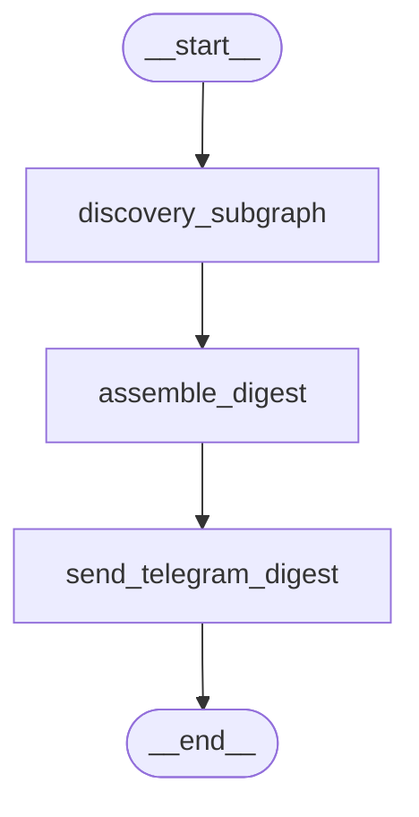
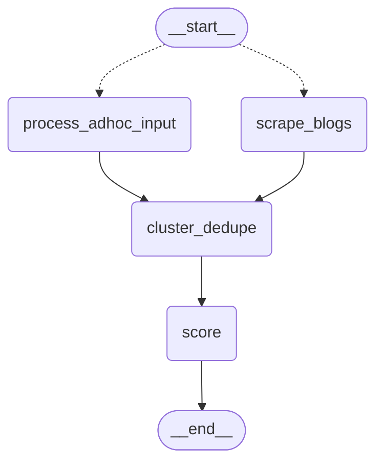
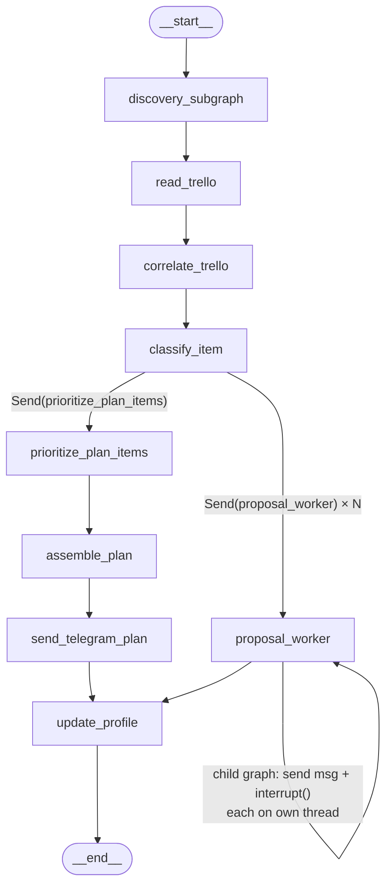
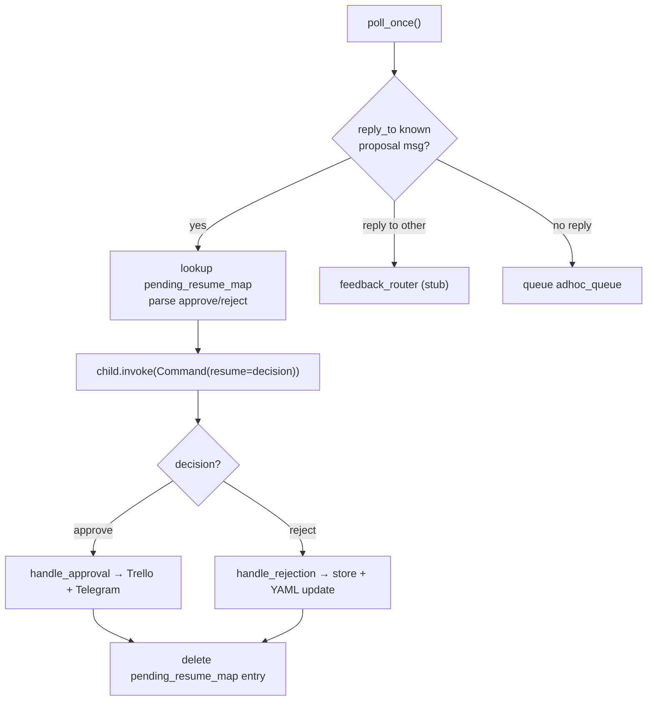

# Workflow Map

Last updated: daily.yml schedule-delay pattern documented (Scheduled runs section) -- see below

## Scheduled runs (GitHub Actions)

- **`.github/workflows/daily.yml`** — `30 1 * * 1-6` (01:30 UTC / 07:00 IST,
  Monday-Saturday; changed 2026-07-19 from the prior 02:30 UTC / 08:00 IST;
  Sunday is skipped since the Sunday workflow's discovery subgraph already
  covers that day). Runs `scripts/run_daily.py`.
- **`.github/workflows/sunday.yml`** — `30 5 * * 0` (05:30 UTC / 11:00 IST,
  Sunday only; changed 2026-07-19 from the prior 13:30 UTC / 19:00 IST).
  Runs `scripts/run_sunday.py`.
- **`.github/workflows/poll.yml`** _(new, Checkpoint 3)_ — `30 16 * * *` (16:30
  UTC / 22:00 IST, **every day including Sunday** — unlike `daily.yml`, which
  skips Sunday, this must run all 7 days since resumes/feedback/ad-hoc input
  can arrive any day; this line was stale -- corrected to match the real
  cron, which had already moved to 22:00 IST per an earlier commit not
  reflected here until now). Runs `scripts/run_poll.py`, which calls
  `telegram.polling.poll_once()`. Reuses the same secrets as `sunday.yml`
  (Trello + Telegram + Anthropic + `DB_URI`) — no new secrets needed, since a
  resume can trigger `handle_approval`/`handle_rejection`.
- All three also have `workflow_dispatch:` for manual triggering (Actions tab →
  select the workflow → "Run workflow"), and a `concurrency` group
  (`cancel-in-progress: false`) so a manual trigger can't stack with an
  already-running scheduled job — the newer run queues instead of
  cancelling the older one, since killing a run mid-Anthropic-call would
  waste the API cost already spent.
- The Sunday job does NOT stay alive waiting for Telegram approve/reject
  replies — each proposal pauses on its own dedicated checkpointer thread in
  Postgres (per-proposal `interrupt()`, verified in Parts 1-7), and the job
  itself exits normally once every proposal has been sent, whether or not any
  are still pending. Resuming a paused proposal happens later, in a separate
  process, via `telegram/polling.py`'s `poll_once()`, now scheduled daily via
  `poll.yml` (Checkpoint 3). `timeout-minutes: 20` on daily/sunday and
  `timeout-minutes: 10` on poll (lighter job, no LLM calls of its own beyond
  what a resume/feedback path triggers) are safety nets against a genuine
  hang, not a wait for replies.
- **Blocker found and resolved this session:** `.github/` had been added to
  `.gitignore` in an uncommitted working-tree change that predated Checkpoint
  3 (bundled with unrelated changes). `daily.yml` and `sunday.yml` had in
  fact **never been committed, in any commit, at any point in this repo's
  history** before now. Flagged to Pooja rather than silently edited; she
  chose to un-ignore `.github/` and commit all three workflows (commit
  `77bc623`). All three now show up under `git ls-files .github/` and will
  actually run on GitHub once their secrets are confirmed configured.
- All three workflows require these repo secrets to be configured under Settings →
  Secrets and variables → Actions (this workflow file only *references* them
  — adding the actual values is a manual step, not something committed code
  can do): `DB_URI`, `ANTHROPIC_API_KEY`, `TELEGRAM_BOT_TOKEN`,
  `TELEGRAM_CHAT_ID`, plus for Sunday/poll `TRELLO_API_KEY`, `TRELLO_TOKEN`,
  `TRELLO_BOARD_ID`. `LANGSMITH_TRACING`/`LANGSMITH_API_KEY`/`LANGSMITH_PROJECT`
  are passed through to all three if set, for tracing parity with local runs.
- **Known gap, not worked around:** `ingest_bookmarks` reads
  `TWILLOT_JSON_PATH` (default `data/tweets.json`), but `data/` is
  gitignored — that file doesn't exist in a fresh Actions checkout, so both
  workflows will currently fail at `ingest_bookmarks` until this is resolved
  (e.g. committing a bookmarks export despite the gitignore, fetching it from
  external storage in a workflow step, or making `ingest_bookmarks` tolerate
  a missing file in automated contexts). Flagged rather than guessed around.
- `requirements.txt` was missing `python-dotenv` and
  `langgraph-checkpoint-postgres` (both entrypoint scripts need the former;
  `core/checkpointer_config.py`/`sunday/memory_store_config.py` need the latter) — added
  both; `pyproject.toml` already listed them correctly, `requirements.txt` had
  drifted out of sync.
- **`daily.yml`'s `schedule` trigger runs consistently ~2.5-3h late — this is
  a known, evidenced pattern, not a broken workflow.** Real run history
  (Actions tab, checked 2026-07-20) against the pre-2026-07-19 cron
  (`30 2 * * 1-6`, target 08:00 IST):
  | Run | Target | Actual | Delay |
  |---|---|---|---|
  | #2, Jul 16 | 08:00 IST | 10:54 IST | 2h54m |
  | #3, Jul 17 | 08:00 IST | 10:56 IST | 2h56m |
  | #4, Jul 18 | 08:00 IST | 10:38 IST | 2h38m |

  All three real, separate days land in a tight 2h38m-2h56m band — too
  consistent to be one-off congestion noise; reads as a systematic
  scheduling lag for this workflow/account with GitHub Actions' `schedule`
  trigger (which GitHub documents as best-effort, no delivery SLA). The
  2026-07-19 change to `30 1 * * 1-6` (target 07:00 IST) had not yet been
  exercised by a real run at the time this was recorded, but the delay looks
  tied to GitHub's scheduling congestion, not the specific target time, so
  the same ~2.5-3h lag is expected to carry over: **treat ~9:30-10:00 AM IST
  as the realistic expected fire time, not 07:00 IST.** Don't re-investigate
  "it didn't fire" as a fresh mystery before that window has passed — only
  treat it as a real problem if nothing has appeared by roughly 10:30 IST.

## How data flows through this project

**Daily pipeline** — `python scripts/run_daily.py` ingests bookmarks, scores them,
formats a digest, and sends it to Telegram. No checkpointer; no interrupts.

**Sunday pipeline** — `python scripts/run_sunday.py` runs the full Sunday graph,
which:
1. Runs the discovery subgraph (ingest → cluster_dedupe → score)
2. Reads open Trello cards from the Brain board
3. Correlates scored items against Trello cards (filters to `keep=True` items only)
4. Classifies each kept item: `plan_item` or `project_proposal`
5. **Fans out** via `Send`: simultaneously assembles the plan and dispatches each
   proposal to a `proposal_worker` node
6. `assemble_plan` → `send_telegram_plan` sends the weekly plan to Telegram
7. Each `proposal_worker` invokes a **per-proposal child graph** on its own dedicated
   checkpointer thread (hash of proposal URL). The child graph sends a Telegram message
   and calls `interrupt()`. The parent completes normally — proposals sit paused on
   independent threads, fully decoupled from the parent run's lifecycle.
8. `update_profile` fires once all branches complete (fan-in): logs per-run cost summary
   to `data/cost_log.csv`.

**Proposal resume flow** (happens hours later, separate process) — `telegram/polling.py`:
1. Calls Telegram `getUpdates`, persisting the offset in the Postgres store
2. For each update that is a reply to a known proposal message:
   - Looks up `{thread_id, proposal_id, run_id}` from `pending_resume_map` in store
   - Parses "approve"/"reject" from reply text (case-insensitive + common synonyms)
   - Resumes the proposal's child graph with `Command(resume=decision)`
   - Calls `approval_actions.handle_approval` or `handle_rejection` with the resolved item
   - Deletes the `pending_resume_map` entry
3. Other replies → `feedback_router.handle_feedback` (stub — daily feedback path not yet built)
4. Non-reply messages → queued in `("weekly_intel", "adhoc_queue")` for next Sunday's
   `process_adhoc_input` node

State handoff: `DailyGraphState` and `SundayGraphState` share `run_id`, `scored_items`,
`costs`, and `errors` with `DiscoverySubgraphState` by key intersection. `raw_items`,
`clustered_items`, and `stage` stay internal to the subgraph.

---

## File-by-file reference

### `core/state.py`
- **What it does:** Defines all shared TypedDicts for LangGraph state.
- **Key schemas:**
  - `RawItem`, `ClusteredItem`, `ScoredItem`, `NodeCost`, `DiscoverySubgraphState`,
    `DailyGraphState`, `make_daily_initial_state()`
  - `SundayGraphState` — contains `pending_resumes: Annotated[list[dict], operator.add]`
    (populated by `proposal_worker` per fan-out branch: `{proposal_id, thread_id, message_id}`).
    Also `card_movements: list[dict]` (sub-phase 4, populated by `read_trello`) —
    real cross-week Trello movement per card, see `sunday/card_movement.py`'s entry.
    Also `prioritized_project_work: list[dict]` (sub-phase 5, populated by
    `prioritize_plan_items`) — bounded, priority-ordered Existing Project Work
    selection, not yet consumed by `assemble_plan`.
    `approval_results` removed — proposals now resolve async, outside the Sunday run.
- **Key exports:** all TypedDicts + `make_sunday_initial_state()`, `make_daily_initial_state()`
- **Depended on by:** every node file and both graph files

### `core/connection_pool.py`  _(added Parts 1-7)_
- **What it does:** Singleton `psycopg_pool.ConnectionPool` shared by both
  `core/checkpointer_config.py` and `sunday/memory_store_config.py`. Prevents each config
  module from opening its own raw connection. Pool kwargs: `autocommit=True`,
  `prepare_threshold=0`.
- **Key exports:** `get_connection_pool() -> ConnectionPool`
- **Depended on by:** `core/checkpointer_config.py`, `sunday/memory_store_config.py`

### `core/checkpointer_config.py`  _(updated Parts 1-7)_
- **What it does:** Creates a `PostgresSaver` using a connection borrowed from
  `get_connection_pool()` (was: raw `psycopg.connect`). Sets `LANGGRAPH_STRICT_MSGPACK=true`.
  `DEFAULT_RECURSION_LIMIT = 50`.
- **Key exports:** `get_checkpointer() -> PostgresSaver`, `DEFAULT_RECURSION_LIMIT`
- **Depended on by:** `sunday/graph.py`, `sunday/nodes/await_approval.py`, `scripts/run_sunday.py`

### `sunday/memory_store_config.py`  _(updated Parts 1-7)_
- **What it does:** Creates a `PostgresStore` using a connection borrowed from
  `get_connection_pool()` (was: raw `psycopg.Connection.connect`).
- **Key exports:** `get_store() -> PostgresStore`
- **Depended on by:** `sunday/nodes/update_profile.py`, `sunday/nodes/await_approval.py`,
  `sunday/nodes/process_adhoc_input.py`, `telegram/polling.py`

### `sunday/approval_actions.py`  _(added Parts 1-7)_
- **What it does:** Plain functions (no LangGraph) for writing proposal outcomes.
  Called from `polling.py` at resume time — NOT from the Sunday graph.
  - `handle_approval(item, thread_id)` — creates or updates Trello card + sends Telegram confirmation
  - `handle_rejection(item, run_id)` — writes `rejection_event` to Postgres store
    + calls `_update_yaml_for_rejection` (incremental Haiku-based taste profile update)
  Moved from `write_outputs.py` (approval path) and `update_profile.py` (rejection path).
  Per-resolution timing instead of batched-at-Sunday-end — a tighter fit with the
  project's incremental-update philosophy.
- **Key exports:** `handle_approval(item, thread_id)`, `handle_rejection(item, run_id)`
- **Depended on by:** `telegram/polling.py`

### `telegram/polling.py`  _(added Parts 1-7)_
- **What it does:** Standalone poller for Telegram updates. `poll_once()` fetches new
  updates since last stored offset, routes each:
  - Reply to known proposal message → resumes child graph via `Command(resume=...)`,
    calls `approval_actions`, deletes `pending_resume_map` entry
  - Reply to unknown message → `feedback_router.handle_feedback` (stub)
  - Non-reply → queued as ad-hoc in `("weekly_intel", "adhoc_queue")`
  Persists update offset in `("weekly_intel", "polling_state")` store.
  Unrecognized decision text → sends a re-prompt to Telegram (doesn't consume the update).
- **Key exports:** `poll_once()`
- **Depended on by:** `scripts/run_polling.py` (not yet built — needs a scheduler)

### `telegram/feedback_router.py`  _(added Parts 1-7 — stub)_
- **What it does:** Stub for routing non-approval Telegram replies to the daily
  feedback path. Currently logs only — daily feedback handling not yet built.
- **Key exports:** `handle_feedback(message: dict)`
- **Depended on by:** `telegram/polling.py`

### `sunday/nodes/await_approval.py`  _(rewritten Parts 1-7)_
- **What it does:** Per-proposal child graph with its own dedicated checkpointer thread.
  `thread_id_for(proposal_id)` hashes the proposal URL. `send_proposal_message` captures
  the real Telegram `message_id` from the API response. `proposal_worker` stores
  `pending_resume_map[str(message_id)] = {thread_id, proposal_id, run_id}` in the Postgres
  store so `polling.py` can look up resume targets by reply message ID.
  `ProposalState` now includes `run_id` so it flows through to the store entry.
- **Key exports:** `ProposalState`, `thread_id_for`, `get_proposal_graph()`,
  `route_to_approvals(state) -> list[Send]`, `proposal_worker(state) -> dict`
- **Depended on by:** `sunday/graph.py`, `telegram/polling.py`

### `sunday/nodes/write_outputs.py`  _(gutted Parts 1-7)_
- **What it does:** Empty — logic moved to `sunday/approval_actions.py`. Node removed
  from `sunday/graph.py`.
- **Depended on by:** nothing (no longer a graph node)

### `sunday/nodes/update_profile.py`  _(simplified Parts 1-7)_
- **What it does:** Cost-summing and `data/cost_log.csv` append only. Rejection writes
  and YAML preference update moved to `approval_actions.handle_rejection`. CSV schema
  change: `rejections` column removed (not knowable at Sunday-run time; rejections now
  resolve async via polling).
- **Key exports:** `update_profile(state) -> dict`
- **Depended on by:** `sunday/graph.py`

### `sunday/nodes/process_adhoc_input.py`  _(added Parts 1-7)_
- **What it does:** Node function — reads all queued ad-hoc messages from
  `("weekly_intel", "adhoc_queue")`, converts each to a `RawItem` (source `"adhoc_telegram"`,
  url `"adhoc:<key>"`), deletes each key after consuming. Zero-cost node (no LLM calls).
  **Graph wiring in `discovery/graph.py` is Pooja's** — this file provides the function only.
- **Key exports:** `process_adhoc_input(state) -> dict`
- **Depended on by:** `discovery/graph.py` (once wired — pending Pooja)

### `discovery/parsers/scrape_blogs.py`  _(scaffolding only — Parts 1-7)_
- **What it does:** Parser stub for RSS/Atom blog feed scraping. `BLOG_FEEDS` list is
  empty; `fetch_blog_entries()` raises `NotImplementedError` until confirmed blog URLs
  are added. Matches `bookmarks_json.py` pattern: no langgraph imports, returns
  `ParseResult(rows, errors)`.
- **Key exports:** `fetch_blog_entries(feed_urls) -> ParseResult`, `BLOG_FEEDS`
- **Depended on by:** `discovery/nodes/scrape_blogs.py`

### `discovery/nodes/scrape_blogs.py`  _(scaffolding only — Parts 1-7)_
- **What it does:** Node wrapper for `fetch_blog_entries`. Matches `ingest_bookmarks`
  pattern: maps rows to `RawItem`s (source `"blog_scrape"`), stamps `NodeCost`.
- **Key exports:** `scrape_blogs(state) -> dict`
- **Depended on by:** `discovery/graph.py` (once wired — pending Pooja + source confirmation)

### `discovery/parsers/search_web.py`, `discovery/nodes/search_web.py`  _(RETIRED 2026-07-16)_
- Deleted entirely (batch2-dedup-taste-spec.md Section 6). Never left
  NotImplementedError-stub state; blog_sources.yaml's live-verified
  sources cover the same ground with better signal, lower cost. No
  remaining reference anywhere in the graph.

### `discovery/__init__.py`
- **What it does:** Empty package marker.

### `discovery/graph.py`  _(current shape: see "Checkpoint 5" section below)_
- **What it does:** Compiles the discovery subgraph with a real
  `route_sources()` conditional entry point. See the Checkpoint 5 section
  of this file for the current fan-out shape and cluster_dedupe_node's
  full pipeline (URL dedup → seen_items → semantic dedup → taste
  pre-filter).
- **Key exports:** `build_discovery_subgraph()`, `route_sources()`, `make_initial_state()`
- **Depended on by:** `daily/graph.py`, `sunday/graph.py`

### `discovery/parsers/bookmarks_json.py`
- **What it does:** Standalone JSON parser for Twillot bookmark exports.
- **Key exports:** `parse_bookmarks_json(path) -> ParseResult`
- **Depended on by:** `discovery/nodes/ingest_bookmarks.py`

### `discovery/nodes/ingest_bookmarks.py`
- **What it does:** LangGraph node — reads bookmarks JSON, returns `raw_items` + `NodeCost`.
- **Key exports:** `ingest_bookmarks(state) -> dict`
- **Depended on by:** `discovery/graph.py`

### `discovery/nodes/cluster_dedupe.py`
- **What it does:** URL-heuristic deduplication node.
- **Key exports:** `cluster_dedupe_node(state) -> dict`
- **Depended on by:** `discovery/graph.py`

### `discovery/nodes/score.py`
- **What it does:** Scores `ClusteredItem`s against taste profile using Claude Haiku.
  `ALLOWED_TAGS` now includes `course` (added Sunday-plan-LLM-prioritization
  checkpoint, sub-phase 1) -- a format tag distinct from the pre-existing
  catch-all `learning-resource`: assigned only to structured, multi-lesson
  courses/bootcamps/certifications, not single articles/tutorials/essays.
- **Key exports:** `score_node(state) -> dict`, `ALLOWED_TAGS`
- **Depended on by:** `discovery/graph.py`, `discovery/taste_vectors.py` (imports `ALLOWED_TAGS`)

### `sunday/__init__.py`, `sunday/nodes/__init__.py`
- **What it does:** Empty package markers.

### `sunday/trello_client.py`
- **What it does:** Pure-stdlib HTTP wrapper for Trello REST API.
  `fetch_board_cards()` only fetches the `Dump` and `In Progress` lists
  (`RELEVANT_LIST_NAMES`) -- the real board has 6 lists total (live-checked
  2026-07-18: `Dump`, `In Progress`, `qs to ask`, `Future Ideas`, `so i dont
  lose track`, `Done`); the other 4, including the real `Done` list, are
  intentionally still not part of correlate_trello's matching pool (a
  Done-list card should never be offered as a match target for new
  content). Each card dict also carries `last_activity` (Trello's own
  `dateLastActivity`, ISO 8601 string) -- added sub-phase 2. `dateLastActivity`
  is already present in Trello's default card response (live-verified);
  no `fields` API param change was needed for that one.
  `fetch_list_id_to_name_map()` and `fetch_card_current_state()` -- **new,
  sub-phase 4** -- give cross-week movement detection what
  `fetch_board_cards()` deliberately doesn't: `fetch_list_id_to_name_map()`
  returns EVERY open list's `{id: name}`, including `Done` (`DONE_LIST_NAME`
  constant, live-confirmed); `fetch_card_current_state(card_id)` is a direct
  `GET /1/cards/{id}` for one card's real current `idList`/`closed` state
  regardless of which list it's in now, returning `None` only on a real
  404 (permanent deletion) -- other HTTP errors propagate rather than
  being misread as "card gone."
- **Key exports:** `fetch_board_cards`, `fetch_list_id_to_name_map`,
  `fetch_card_current_state`, `get_dump_list_id`, `create_trello_card`,
  `update_trello_card`
- **Depended on by:** `sunday/nodes/read_trello.py`, `sunday/approval_actions.py`

### `sunday/nodes/read_trello.py`
- **What it does:** LangGraph node — calls `fetch_board_cards()`, returns `trello_cards`.
  Also calls `detect_card_movement(state["run_id"])` (sub-phase 4) and returns
  its result as the new `card_movements` state field -- real cross-week
  movement since the most recent prior Sunday plan, computed before the plan
  itself is generated (item 4's requirement: "before generating each new
  plan"). `[]` when there's no prior `plan_history` entry to compare
  against yet (e.g. the very first real Sunday run under this checkpoint).
- **Key exports:** `read_trello(state) -> dict`

### `sunday/nodes/correlate_trello.py`
- **What it does:** LangGraph node — matches scored items against Trello cards via Haiku.
- **Key exports:** `correlate_trello(state) -> dict`

### `sunday/nodes/classify_item.py`
- **What it does:** LangGraph node — classifies items as `plan_item` or `project_proposal`.
- **Key exports:** `classify_item(state) -> dict`

### `sunday/nodes/prioritize_plan_items.py`  _(new, sub-phase 5)_
- **What it does:** LangGraph node, runs after `classify_item` and before
  `assemble_plan` (parallel to `route_to_approvals`/`proposal_worker` in the
  same fan-out `Send`). One real Haiku call combining this week's matched
  items (`classification=="plan_item"`, no `course` tag, real
  `matched_card_id`), the full real Trello board state (`state["trello_cards"]`
  -- every open Dump/In Progress card, including ones with no new content
  this week), and `state["card_movements"]` (sub-phase 4's real cross-week
  signal). Persona in the prompt: Pooja is an AI/ML engineer doing this as a
  side effort alongside a full-time job to reclaim time it doesn't give her
  -- the job is to identify what's genuinely worth her limited weekly hours,
  not list everything, weighing stale/idle cards honestly against new
  content, and explicitly acknowledging (never silently repeating or
  dropping) cards the movement signal marks `"unchanged"`. The prompt
  instructs the model not to surface `"completed"`/`"archived"` cards.
  `MAX_PROJECT_WORK_ITEMS = 5` is enforced twice: in the prompt (target
  3-5, fewer/zero is correct if nothing's worth it) AND as a hard
  post-response cap regardless of what the model returns.
  `_validate_selection()` drops any entry pointing at a `matched_card_id`
  or `item_url` the model invented (checked against the real
  `trello_cards`/matched-items sets), same defensive-validation pattern as
  `classify_item.py`'s `_validate_classification()`. JSON-parse-failure
  fallback (after one retry, same pattern as `correlate_trello`/
  `classify_item`): falls back to this week's matched items, unprioritized,
  capped at the same bound -- preserves at least the new-content candidates
  rather than surfacing nothing.
  Output (`prioritized_project_work`) is NOT yet consumed by `assemble_plan`
  -- that's the final sub-phase of this checkpoint ("assemble_plan
  rendering": bounding + priority-order rendering, items 6-7).
- **Key exports:** `prioritize_plan_items(state) -> dict`, `MAX_PROJECT_WORK_ITEMS`
- **Depended on by:** `sunday/graph.py`

### `sunday/nodes/assemble_plan.py`
- **What it does:** `format_plan()` + `assemble_plan` node wrapper. Produces weekly
  plan text with three sections in order: **Reading & Learning** (no `course` tag,
  no `matched_card_id`; unbounded), **Courses** (any plan item tagged `course`,
  regardless of `matched_card_id` -- sub-phase 1, reversing the earlier implicit
  fold into Reading & Learning; unbounded), **Existing Project Work** (**final
  sub-phase, rewritten**: rendered ENTIRELY from `state["prioritized_project_work"]`
  -- `prioritize_plan_items`'s bounded, priority-ordered selection -- via the new
  `_build_project_entries()` helper, NOT re-derived from `classified_items`'
  `matched_card_id` anymore. A `new_item` entry's title/url/tags/text come from the
  matching `classified_items` entry (looked up by `item_url`); a `stale_nudge` entry
  (no underlying scored content) renders from the Trello card itself (`name`/`url`).
  `priority_reasoning` is the displayed reasoning (replacing the old per-item scoring
  `reasoning`), with `movement_note` appended (`" — {note}"`) when present. Rendering
  order is exactly `prioritized_project_work`'s order -- that IS the priority order
  (item 7). A matched item `prioritize_plan_items` didn't select simply doesn't
  render anywhere (the bounding, item 6) -- not silently moved to Reading &
  Learning). Footer's plan-item count now reflects what's actually rendered
  (`len(reading) + len(courses) + len(project_entries)`), not the raw unbounded
  `plan_items` count. The node wrapper's `record_plan_history()` call (sub-phase 3,
  schema revised sub-phase 4) now also builds `surfaced_cards` from
  `state["prioritized_project_work"]` directly, not from `classified_items` --
  "surfaced" means "Pooja actually saw it in the plan," which only
  `prioritized_project_work` can answer correctly now that bounding exists.
  **2026-07-19:** the node wrapper now also calls
  `sunday/carry_forward.py`'s `get_carry_forward_items(run_id)` and merges
  the result into a LOCAL copy of `classified_items` (never into
  `state["classified_items"]` itself, so `plan_history`/
  `prioritize_plan_items` -- both already run earlier in the graph by this
  point anyway -- never see carried items) before calling `format_plan()`.
  Every `item_map` entry (all three sections) now also carries a `section`
  field (`"reading"`/`"courses"`/`"existing_project_work"`) -- added
  specifically so `carry_forward.py` can reliably tell a prior week's
  Reading/Courses items apart from Existing Project Work ones in
  `digest_item_map`, whose entries were otherwise identically shaped
  across all three sections.
  **2026-07-19, HTML rendering fix:** `format_plan()` now renders with
  Telegram HTML parse_mode -- `<b>`/`<i>`/`<a href="...">` real tags
  instead of `**`/`_`/`` Markdown syntax, every dynamic value
  (`title`, `reasoning`, `card_name`, `url`) escaped via
  `telegram/markdown.py`'s `escape_html()` at the point of interpolation,
  not before. `item_map` still stores RAW (unescaped) values -- only the
  rendered `lines` strings are escaped, so a carried-forward item fed
  back through `format_plan()` next week doesn't get double-escaped. Full
  investigation and real evidence in the dated entry below.
  **2026-07-19, length-budget fix:** the HTML fix alone pushed a real
  message to 4032/4096 chars (98.4%) -- `format_plan()` now renders via a
  new internal `_render()` helper (factored out of the three near-
  identical section loops) called first without a budget; if the result
  exceeds `MAX_PLAN_TEXT_CHARS` (3900, soft budget under Telegram's real
  4096 hard limit), it re-renders with every item's reasoning (and
  Existing Project Work's `card_name`, used in the "continues card"
  suffix) capped to `REASONING_CHAR_BUDGET` (150) raw characters via a new
  `_truncate()` helper (truncates raw text before escaping, appends `…`),
  with a shrinking safety net (`budget //= 2`, floor 20) for the rare case
  where even that fixed cap isn't enough. Item COUNT stays unbounded
  either way -- only per-item reasoning verbosity is capped, and only
  when needed. `item_map` always stores the FULL untruncated original
  text regardless -- truncation is a rendering-time-only concern, so a
  carried-forward item isn't permanently stuck with a truncated blurb
  just because one week's message happened to be near the limit. Also
  fixed a real related bug found during this investigation:
  `_build_project_entries()`'s `stale_nudge` title path (`title =
  card_name`) never applied the `[:80]` truncation every other title
  path already had -- a real card name observed at ~200 chars was
  rendering in full. Chosen over splitting into multiple Telegram
  messages: fully contained within this function, zero changes needed to
  `send_telegram_plan.py`, the `assemble_plan()` node wrapper, or
  `digest_item_map`'s one-entry-per-run shape that `carry_forward.py`'s
  lookup already assumes (a real correctness bug -- confirmed by reading
  the code, not assumed -- that splitting would have introduced: its
  `_load_prior_reading_and_course_items()` returns on the FIRST matching
  `digest_item_map` entry per `run_id`, so a second message's items would
  be silently missed).
- **Key exports:** `format_plan(...)`, `assemble_plan(state) -> dict`,
  `MAX_PLAN_TEXT_CHARS`, `REASONING_CHAR_BUDGET`

### `sunday/plan_history.py`  _(new sub-phase 3, schema revised + reader added sub-phase 4)_
- **What it does:** `record_plan_history(run_id, cards)` writes one entry per
  Sunday run to `("weekly_intel", "plan_history")`, keyed by `run_id`, recording
  which real Trello cards got surfaced as Existing Project Work plan items that
  week. **Schema revised in sub-phase 4:** each entry is now `{"run_id", "cards":
  [{"card_id", "list_name"}, ...], "generated_at"}` -- originally (sub-phase 3)
  `cards` was a bare `card_ids: list[str]`, but movement detection needs to know
  which list a card was in when it was LAST surfaced to tell whether it's since
  changed lists, which a bare ID can't support. No real production data existed
  under the old shape (only ever a smoke-test entry, deleted after verification),
  so this was a clean change, not a migration. Entries accumulate across weeks
  (never overwritten). `get_most_recent_prior_entry(current_run_id)` -- **new,
  sub-phase 4** -- returns the entry with the latest `generated_at`, excluding
  `current_run_id` defensively; `None` if no entry exists yet. Writes not wrapped
  in try/except -- unlike `core/observability.py`'s pure-observability writes, this is
  real domain data movement detection depends on, same distinction
  `discovery/seen_items.py`'s `mark_seen()` already makes.
- **Key exports:** `record_plan_history(run_id, cards) -> None`,
  `get_most_recent_prior_entry(current_run_id) -> dict | None`
- **Depended on by:** `sunday/nodes/assemble_plan.py` (writes), `sunday/card_movement.py` (reads)

### `sunday/card_movement.py`  _(new, sub-phase 4)_
- **What it does:** `detect_card_movement(run_id)` -- real cross-week Trello card
  movement, ground truth from Trello's actual API state, not a self-reported flag.
  Looks up the most recent prior `plan_history` entry; for each card in it, fetches
  the card's REAL current state (`fetch_card_current_state`) and classifies it:
  `"archived"` (Trello `closed=True` right now, checked first -- takes priority
  over list_name since a card can be archived while `idList` still points at its
  old list), `"not_found"` (real 404, permanent deletion, rare), `"completed"`
  (current list is the Done-equivalent list), `"moved"` (different non-Done list
  than last surfaced), `"unchanged"` (same list as last surfaced). Returns `[]`
  if there's no prior entry to compare against yet -- permissive, same "nothing to
  compare" default as `taste_vectors.py`'s `taste_prefilter`. No LLM call --
  purely a deterministic comparison against real API state; the LLM node that
  will consume this signal is sub-phase 5, not this one.
- **Key exports:** `detect_card_movement(run_id) -> list[dict]`
- **Depended on by:** `sunday/nodes/read_trello.py`

### `sunday/carry_forward.py`  _(new, 2026-07-19)_
- **What it does:** `get_carry_forward_items(run_id)` -- capped, one-time-only
  carry-forward for unfinished Reading & Learning / Courses items, reading
  `companion_item_completions` (a real Postgres table, NOT a LangGraph store
  namespace -- `url TEXT PK, checked BOOLEAN, run_id TEXT, updated_at
  TIMESTAMPTZ`, written externally by `companion_writer`; this module is
  SELECT-only against it, never INSERT/UPDATE/DELETE). Resolves "last week's
  Reading/Courses items" via `run_history` (most recent `status="success"`,
  `path="sunday"` entry, excluding the current run) and that run's
  `digest_item_map` entry, filtered by the `section` field (see
  `sunday/nodes/assemble_plan.py`'s entry below) to exclude Existing Project
  Work items entirely -- out of scope, Trello-tracked separately. An item
  with `checked=false` OR no completion row at all (never interacted with)
  AND not already in `("weekly_intel","carry_forward_log")` gets carried;
  logged to that namespace the same call so it can never carry a second
  time. `checked=true` -> never carried, at any point. Returns
  `classified_item`-shaped dicts (`classification="plan_item"`,
  `matched_card_id=None`, original `tags` preserved so a carried course item
  still lands back in Courses) built directly from last week's
  already-scored `digest_item_map` data -- never re-scored, never
  Haiku-charged, and structurally cannot be blocked by `seen_items`: called
  from `assemble_plan` (the last real node before rendering), a carried
  item never becomes part of this run's `raw_items`/`clustered_items`, so
  it never reaches `cluster_dedupe_node`'s `filter_unseen()` or
  `score_node`'s `mark_seen()` at all, this run or any run -- there is no
  code path connecting this module to either.
- **Key exports:** `get_carry_forward_items(run_id) -> list[dict]`
- **Depended on by:** `sunday/nodes/assemble_plan.py`

### `sunday/nodes/send_telegram_plan.py`
- **What it does:** Posts `state["plan_text"]` to Telegram.
- **Key exports:** `send_telegram_plan(state) -> dict`

### `sunday/graph.py`  _(updated Parts 1-7; sub-phase 5)_
- **What it does:** Builds and compiles the Sunday parent graph. `write_outputs` node
  removed — `proposal_worker` edges directly to `update_profile`. Sub-phase 5:
  `_fan_out_after_classify` now sends to `"prioritize_plan_items"` instead of
  directly to `"assemble_plan"`; a new edge `prioritize_plan_items -> assemble_plan`
  keeps the rest of the topology (including the parallel `route_to_approvals`/
  `proposal_worker` branch) unchanged.
- **Key exports:** `build_sunday_graph() -> CompiledStateGraph`
- **Depended on by:** `scripts/run_sunday.py`

### `telegram/__init__.py`
- **What it does:** Empty package marker.

### `telegram/bot_client.py`  _(default parse_mode + real error surfacing, 2026-07-19)_
- **What it does:** Stdlib HTTP wrapper for Telegram `sendMessage`. Default
  `parse_mode` changed from legacy v1 `"Markdown"` to `"HTML"` -- root-caused a
  real `send_telegram_plan` 400 (full investigation in the dated entry below).
  `parse_mode=None` omits the key entirely, sending plain unformatted text (used
  by `sunday/approval_actions.py`'s two confirmation messages, which have no
  formatting intent). `urllib.error.HTTPError` is now caught and its real
  response body read and both logged and included in the raised `RuntimeError`
  -- previously this propagated unread, so any failure only ever surfaced the
  generic `"HTTP Error 400: Bad Request"` string, never Telegram's actual
  description (e.g. `"can't parse entities: Can't find end of the entity
  starting at byte offset N"`). Returns full API response dict
  (`{"ok": true, "result": {"message_id": int, ...}}`) on success.
- **Key exports:** `send_message(text, parse_mode="HTML") -> dict`

### `telegram/markdown.py`  _(escape_html added, 2026-07-19)_
- **What it does:** `escape_markdown_v2` (pre-existing) -- used only where
  `parse_mode="MarkdownV2"` is passed explicitly (`sunday/nodes/await_approval.py`),
  NOT the project's default. `escape_html` (new) -- `&`/`<`/`>` escaping for
  Telegram's HTML parse mode, `&` replaced first to avoid double-escaping the
  `&` introduced by escaping `<`/`>`. Used by `assemble_plan.py`/
  `assemble_digest.py` for every piece of dynamic/free text (titles, reasoning,
  card names, tags, urls placed inside `href="..."`).
- **Key exports:** `escape_markdown_v2(text) -> str`, `escape_html(text) -> str`

### `daily/__init__.py`, `daily/nodes/__init__.py`
- **What it does:** Empty package markers.

### `daily/nodes/assemble_digest.py`  _(HTML rendering, 2026-07-19)_
- **What it does:** Formats the daily Telegram digest. Renders with Telegram
  HTML parse_mode now, not Markdown -- `<b>`/`<i>`/`<a href="...">`/`<code>`
  real tags instead of `*`/`_`/``/backtick syntax, every dynamic value
  escaped via `escape_html()` at the point of interpolation. `item_map` still
  stores RAW (unescaped) values -- only the rendered `lines` strings are
  escaped, same rationale as `assemble_plan.py`'s `format_plan()` (see its
  entry below).
- **Key exports:** `format_digest(...)`, `assemble_digest(state) -> dict`

### `daily/nodes/send_telegram_digest.py`
- **What it does:** Posts digest to Telegram.
- **Key exports:** `send_telegram_digest(state) -> dict`

### `daily/graph.py`
- **What it does:** Daily parent graph — discovery subgraph → assemble_digest → send_telegram_digest.
- **Key exports:** `build_daily_graph()`

### `scripts/run_daily.py`
- **What it does:** Daily run entry point.

### `scripts/run_sunday.py`
- **What it does:** Sunday run entry point. Prints pending proposals + resume instructions.

## Current state of the graph

**Daily parent graph:**

**Discovery subgraph** (shared) -- regenerated for real via
`graph.get_graph().draw_mermaid()` during Checkpoint 5's smoke-test fix
(the previous version of this diagram was stale, still showing the
long-removed `ingest_bookmarks` entry point). `route_sources` is a real
conditional entry point (`set_conditional_entry_point`), so both
`scrape_blogs` and `process_adhoc_input` show as reachable from
`__start__` in the compiled graph shape -- which one actually fires for a
given invocation is decided at runtime by `state["source_context"]`
("daily" -> `scrape_blogs` only; "sunday" -> both), not by two separate
compiled graphs:

**Sunday parent graph** (Parts 1-7 — `write_outputs` removed, `proposal_worker` → `update_profile` directly;
sub-phase 5 inserts `prioritize_plan_items` into the fan-out, between `classify_item` and `assemble_plan`).
Re-verified against the real compiled graph 2026-07-18 (`build_sunday_graph().get_graph().draw_mermaid()`):
`draw_mermaid()` cannot resolve the `Send()`-based dynamic fan-out from `classify_item` at all (confirmed
live -- the raw generated output only shows `classify_item --> __end__` as a placeholder for that edge, same
real limitation the pre-sub-phase-5 version of this diagram already had to annotate manually). Every other
node/edge below matches the real generated output verbatim; only the two `Send(...)`-labeled edges are manual
annotations of what the real (unresolvable-by-the-drawer) code actually does:

**Proposal resume flow** (separate process, driven by `telegram/polling.py`):

## Store-namespace registry

Every real `weekly_intel` store namespace, per `batch2-dedup-taste-spec.md`
Section 11 (Section 0's investigation confirmed this list against the
actual code, not assumed from the spec's prior draft).

| Namespace | Shape | Written by | Read by |
|---|---|---|---|
| `polling_state` | `{value: int}` (update_offset) | `telegram/polling.py` | `telegram/polling.py` |
| `pending_resume_map` | `{thread_id, proposal_id, run_id}` | `sunday/nodes/await_approval.py` | `telegram/polling.py` |
| `adhoc_queue` | `{text, queued_at}` | `telegram/polling.py` | `sunday/nodes/process_adhoc_input.py` |
| `digest_item_map` | `{run_id, items: {number: {url,title,tags,reasoning,section}}}` -- `section` (`"reading"`\|`"courses"`\|`"existing_project_work"`) added 2026-07-19, Sunday-plan entries only (daily digest entries don't set it) | `daily/nodes/send_telegram_digest.py`, `sunday/nodes/send_telegram_plan.py` | `telegram/feedback_router.py`, `sunday/carry_forward.py` (`_load_prior_reading_and_course_items`) |
| `feedback_events` | `{item_id, feedback_text, replied_at, run_id, tags, title, content_summary, sentiment}` | `sunday/approval_actions.py` (`handle_feedback`) | `sunday/nodes/update_profile.py` (Sunday consolidated rewrite) |
| `seen_items` | `{seen: true, seen_at}` (rolling 35-day expiry, 2026-07-18) | `discovery/seen_items.py` (`mark_seen`) | `discovery/seen_items.py` (`filter_unseen`, also runs `_expire_stale_entries`) |
| `recent_item_embeddings` | `{item_id, url, embedding_vector, fetched_at, scored_at}` -- `embedding_vector` is 2048-dim as of the 2026-07-19 NVIDIA swap (was 384-dim; the namespace was cleared, not migrated, at swap time -- see "Embedding provider: NVIDIA NIM swap" below) | `discovery/semantic_dedup.py` | `discovery/semantic_dedup.py` |
| `taste_topic_vectors` | `{tag, embedding_vector, updated_at}` -- same 2026-07-19 dimension change/clear, then immediately re-populated with real 2048-dim vectors from the real `data/taste_profile.yaml` content (not left empty) | `discovery/taste_vectors.py` (`recompute_topic_vectors`) | `discovery/taste_vectors.py` (`taste_prefilter`) |
| `prefilter_drops` | `{item_id, filter_type: "dedup"\|"taste", similarity_score, compared_against_item_id, compared_against_tag, run_id}` | `discovery/semantic_dedup.py`, `discovery/taste_vectors.py` | audit log only -- no reader yet |
| `same_day_adjustments` | `{tag, cumulative_adjustment, item_ids_contributing, week_of}` | `sunday/same_day_nudge.py` | `sunday/nodes/update_profile.py` (cleared weekly; not yet consumed to influence live scoring/pre-filter comparisons -- spec Section 7 scopes this namespace's build to storage/computation/clearing only, no consumer described) |
| `rejection_events` | **KNOWN-DEAD** -- orphaned, no schema in production use | `scripts/test_update_profile_rejections.py` only (manual test script) | none in production |
| `classification_log` | `{item_id, decision: "plan_item"\|"project_proposal", proposal_type, run_id}` | `sunday/nodes/classify_item.py` (every item, not just proposals) | future eval work (`classify_item` eval, not yet built) |
| `approval_log` | `{item_id, outcome: "approved"\|"rejected", run_id}` | `sunday/approval_actions.py` (`handle_approval`, `handle_rejection`) | future eval work (`classify_item` eval, not yet built) |
| `node_summary` | `{run_id, node_name, items_in, items_out, dropped, cost_usd, duration_seconds, langsmith_url, error_summary}` | `core/observability.py` (`record_node_summary`, called from `cluster_dedupe_node`, `scrape_blogs`, `score_node`, `correlate_trello`, `classify_item`) | manual query -- durable per-node aggregate + LangSmith pointer, no automated reader yet |
| `run_history` | `{run_id, path, started_at, finished_at, status: "in_progress"\|"success"\|"failed"\|"paused", total_cost_usd, items_in, items_out, duration_seconds, error_summary}` | `core/observability.py` (`record_run_started` writes the initial `in_progress` marker; `record_run_history` overwrites the same key with the final outcome -- called from `run_daily.py`/`run_sunday.py`/`run_poll.py`) | manual query -- durable per-run record, no automated reader yet. A record stuck at `status="in_progress"` with no overwrite means the run never finished (crashed harder than a Python exception could catch) |
| `plan_history` | `{run_id, cards: [{card_id, list_name}, ...], generated_at}` (one entry per Sunday run, keyed by `run_id`, never overwritten; schema revised sub-phase 4 -- was bare `card_ids: list[str]` in sub-phase 3) | `sunday/plan_history.py` (`record_plan_history`, called from `sunday/nodes/assemble_plan.py`) | `sunday/plan_history.py` (`get_most_recent_prior_entry`, called from `sunday/card_movement.py`, called from `sunday/nodes/read_trello.py`) |
| `carry_forward_log` | `{url, carried_in_run_id, carried_at}` (one entry per url, EVER -- keyed by url, never overwritten, never expired) | `sunday/carry_forward.py` (`_log_carried`, called from `get_carry_forward_items`) | `sunday/carry_forward.py` (`_already_carried`, same module) -- a url's mere presence here means it was already given its one carry-forward chance, regardless of outcome |

**Not a `weekly_intel` store namespace -- a real, separate Postgres table**, same `DB_URI` database: `companion_item_completions` (`url TEXT PK, checked BOOLEAN, run_id TEXT, updated_at TIMESTAMPTZ`), written externally by `companion_writer` (a separate app, not part of this repo). `sunday/carry_forward.py` is SELECT-only against it -- confirmed present and matching this exact schema via a live `information_schema.columns` query, 2026-07-19, before any code was written against it.

## What does NOT exist yet

- **Taste profile in LangMem** — currently a plain YAML file, read/written by
  `sunday/nodes/update_profile.py` (Sunday consolidated rewrite) and
  `sunday/approval_actions.py` (log-only as of Checkpoint 5).
- Numeric score field on `ScoredItem`, tag feedback loop — deferred.
- **`resume-live-check`** (Checkpoint 3) — a real Telegram approve/reject
  round-trip against a real paused Sunday proposal, confirming `poll.yml`'s
  next run actually resumes the graph and writes the correct Trello outcome.
  Human-only per `feature_list.json` — Claude Code must not and did not mark
  this passing.
- **None.** The Sunday plan LLM prioritization checkpoint (all 7 items /
  5 sub-phases) is complete as of 2026-07-19. See
  [Sunday plan LLM prioritization checkpoint](workflow/sunday-plan-rewrite.md)
  for what was built and what real evidence backs each piece.

## Checkpoint history

The full dated checkpoint-by-checkpoint history (what was built, phase-
specific hard rules, bugs found and fixed, real verification evidence)
used to live inline in this file. Split out by phase/topic into
`docs/workflow/` (2026-07-20, portfolio cleanup pass) since this file had
grown to 201KB/3300 lines -- nothing was deleted, only moved:

- [Checkpoint 3 and earlier](workflow/checkpoint-3-and-earlier.md) —
  Part 7 additions (cross-run dedup, daily/Sunday sources, source
  discovery, digest feedback), ownership-line pieces, Checkpoint 3
  (resume scheduling + ad-hoc test coverage)
- [Checkpoint 4-5](workflow/checkpoint-4-5.md) — Checkpoint 5 additions
  (semantic dedup + taste pre-filter + taste-profile update mechanism),
  Checkpoint 5 loose ends, scrape-blogs-node fix + Checkpoint 4 closeout,
  the local-main-ahead-of-origin incident
- [Sunday timeout fixes](workflow/sunday-timeout-fixes.md) (2026-07-17) —
  the real-root-cause investigation into the 45-minute Sunday timeout:
  batching, connection pooling, HF_HUB_OFFLINE, fine-grained checkpoints,
  missing psycopg timeouts, plus the public-repo security pre-flight
- [AgentMail and source cleanup](workflow/agentmail-and-sources.md)
  (2026-07-18 to 07-19) — seen_items rolling expiry, Hacker News
  (Show HN) re-added, AgentMail integration (superseded design) and its
  full 10-source consolidation, final log/artifact cleanup checkpoint
- [Sunday plan LLM prioritization checkpoint](workflow/sunday-plan-rewrite.md)
- [Embeddings and plan polish](workflow/embeddings-and-plan-polish.md)
  (2026-07-19) — the NVIDIA NIM embedding provider swap, capped
  carry-forward for unfinished items, the real send_telegram_plan 400
  root-cause fix, and the length-budget follow-up
